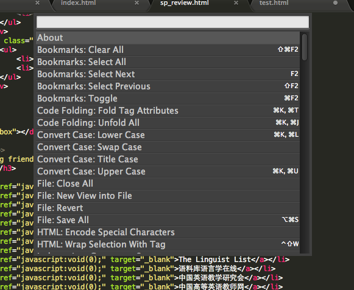
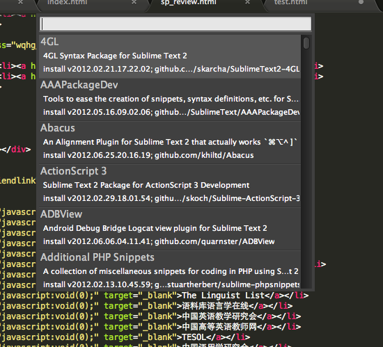
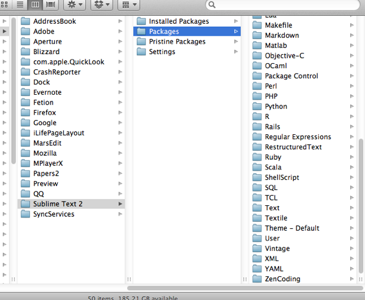
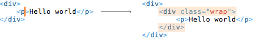

去年就知道了Sublime Text 2这款编辑器，当时就颇有好感，还用了一段时间来进行开发。最近，偶然知道了还有Zen Coding这样的一个插件之后，简直对这个插件以及可以支持插件的Sublime Text 爱不释手。

**先说什么是Zen Coding。**

如果你用过jQuery，那么一定会对选择器有深刻的印象。Zen Coding由两个核心组件构成：一个缩写扩展器；一个HTML标签匹配器。

使用Ctrl ＋ Alt ＋ Enter 呼出ZenCoding，我们可以用 div#content>ul>li*3>a[href="javascript:void(0);"]{Links$} 这样短短的一句话，生成下面一段代码：

<did id="content">
<ul>
<li><a href="javascript:void(0);">Links1</a></li>
<li><a href="javascript:void(0);">Links2</a></li>
<li><a href="javascript:void(0);">Links3</a></li>
</ul>
</did>

这样神奇的书写方式，配合Sublime Text 实时预览的功能，整个过程真是妙不可言。

**Zen Coding 插件的安装**

插件的安装过程在参考资料中说的非常清楚，这里摘录出来以备后用。

1、安装包控制 Package Control。

使用Ctrl ＋ ｀调出Console，然后输入以下代码并执行。

2、重启Sublime Text 2，在Preferences->Package Settings中看到Package Control这一项表示安装成功。

3、通过Command ＋ Shift＋ P调出包管理，输入 Install ，选择Install Package

4、之后再输入zen coding来找到要安装的包，安装后就可以使用了。

安装完成后，我们就可以使用Ctrol ＋ Alt ＋ Enter 来呼出ZenCoding了。实际上，所有的安装包的路径，我们也可以直接下载ZenCoding的代码包，放到这个路径下。

除了Sublime Text 之外，Zen Coding还支持其他众多的编辑器，列表如下，看看有没有自己平时喜欢的编辑器吧。

## Officially supported editors

* **Aptana/Zend Studio/Eclipse**(crossplatform)[https://github.com/sergeche/eclipse-zencoding](https://github.com/sergeche/eclipse-zencoding)
* **TextMate**(Mac). Available in two flavors: basic snippets (Zen HTML and Zen CSS) and full-featured plugin (ZenCoding for TextMate).Bundles > Zen Coding menu item
* **Coda**(Mac) —[external download](http://github.com/sergeche/tea-for-coda/downloads), via[TEA for Coda](http://onecrayon.com/tea/).Plug-ins > TEA for Coda > Zen Coding menu item
* **Espresso**(Mac) —[external download](http://github.com/sergeche/tea-for-espresso/downloads), via[TEA for Espresso](http://onecrayon.com/tea/). Zen Coding is bundled with Espresso by default, but you should upgrade ZC to latest version.Actions > HTML menu item
* **Komodo Edit/IDE**(crossplatform) —[external download](http://community.activestate.com/xpi/zen-coding).Tools > Zen Coding menu item
* **Notepad++**(Windows).Zen Coding menu itemAlso a Python version of NPP plugin is available:[http://sourceforge.net/projects/npppythonscript/files/](http://sourceforge.net/projects/npppythonscript/files/)
* **PSPad**(Windows).Scripts > Zen Coding menu item
* **<textarea>**(browser-based). See[online demo](http://zen-coding.ru/textarea/).
* **editArea**(browser-based). See[online demo](http://zen-coding.ru/demo/).
* **CodeMirror**(browser-based). See[online demo](http://zen-coding.ru/codemirror/).
* **CodeMirror2**(browser-based). See[online demo](http://media.chikuyonok.ru/codemirror2/).

## Third-party supported editors

* **Dreamweaver**(Windows, Mac)
* **Sublime Text**(Windows)
* **Sublime Text 2**(crossplatform) —[external download](https://bitbucket.org/sublimator/sublime-2-zencoding)
* **UltraEdit**(Windows)
* **TopStyle**(Windows)
* **GEdit**(crossplatform) —[Franck Marcia's plugin](http://github.com/fmarcia/zen-coding-gedit),[Mike Crittenden's plugin](http://github.com/mikecrittenden/zen-coding-gedit)
* **BBEdit/TextWrangler**(Mac) —[external download](http://www.angelwatt.com/coding/zen-coding_bbedit.php)
* **Visual Studio**(Windows) — at[Visual Studio Gallery](http://visualstudiogallery.msdn.microsoft.com/abd79254-b4f7-492d-95ae-d9fa38e0af48)
* **EmEditor**(Windows) —[external download](http://www.emeditor.com/modules/mydownloads/singlefile.php?cid=18&lid=281)
* **Sakura Editor**(Windows) —[external download](http://mwlab.net/zen-coding-for-sakuraeditor)
* **EditPlus**(windows) —[external download](http://www.editplus.com/),[release notes](http://www.editplus.com/trouble.html)
* **NetBeans**(crossplatform) —[download](http://github.com/lorenzos/ZenCodingNetBeansPlugin#readme)
* **Chrome Extension**—[external download](https://chrome.google.com/extensions/detail/iodhcpffklplnfaihoolhfbejbinhcgn)
* **Userscript for Greasemonkey**—[external download](http://userscripts.org/scripts/show/105015)
* **Geany**—[external download](https://github.com/codebrainz/geany-zencoding)
* **RJ TextEd**—[built in since v7.50](http://www.rj-texted.se/)
* **AkelPad**—[external download](http://akelpad.sourceforge.net/forum/viewtopic.php?p=8084#8084)
* **[WIODE web-based IDE](http://www.wiode.com/)**
* **[BlueFish](http://bluefish.openoffice.nl/)**— built-in in v2.2.1

**Zen Coding 的用法**

使用ZenCoding编写代码时，需要遵循一定的缩写规则：

* E
元素名（div、p）；
* E#id
带Id的元素（div#content、p#intro、span#error）；
* E.class
带class的的元素（div.header、p.error）,id和class可以连着写，div#content.column
* E>N
子元素（div>p、div#footer>p>span）
* E*N
多项元素（ul#nav>li*5>a）
* E+N
多项元素
* E$*N
带序号的元素

**Sublime Text 中使用Zen Coding的一些技巧**

1、缩写扩展（Expand Abbreviation）。

之前知道，通过Control ＋ Alt ＋ Enter可以在一个新行中输入ZC的缩写，来生成代码。同时，如果我们在编辑中直接书写了ZC缩写，比如 div#content>p 当光标放置在p之后时，可以通过Tab键来扩展，ZC会从光标处开始向左侧搜索到第一个空白处，之间的代码作为ZC缩写，这样不必每次打开新行输入，提高了效率，缺点就是不能够实时预览。

2、嵌套代码（Wrap with Abbreviation）

如上图所示，可以实现在已经写好的代码外面嵌套其他的代码，实现方式是将光标放置到想要嵌套的标签上，然后使用Control ＋ Alt ＋ Enter 呼出ZC的命令行，就可以了。

其实Zen Coding还提供了很多方便代码编写的操作，例如标签匹配、返回上一个/下一个编辑点、更新img标签、合并行等，但是因为在Sublime Text中没有提供完整的支持，所以这些特性还无法使用。

参考资料：
1、[Sublime Text 2 安装Zen Coding](http://blog.sina.com.cn/s/blog_7d892a670101302u.html)
2、[百度百科 Zen Coding](http://baike.baidu.com/view/3371595.htm)
3、[Zen Coding](http://code.google.com/p/zen-coding/)
4、[关于使用Sublime Text 2的那些事儿](http://www.jankerli.com/?p=1359)
5、[Sublime Text](http://www.sublimetext.com/)
6、[ZenCoding CSS Properties](http://code.google.com/p/zen-coding/wiki/ZenCSSPropertiesEn)
7、[Zen Coding in Sublime Text 2](http://lucifr.com/139231/zencoding-in-sublime-text-2/)
8、[Zen Coding 让NotePad＋＋代码书写健步如飞](http://rpsh.net/archives/zen-coding-npp/)
9、[Sublime Text 2 编辑器实用技巧](http://www.csser.com/board/4f59c2cb9c3694f227001cd7)

