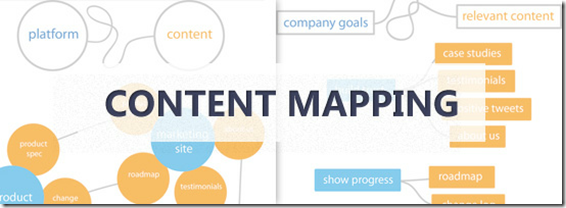
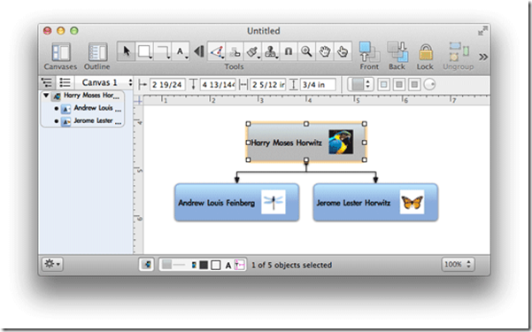
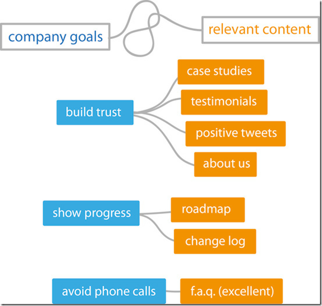
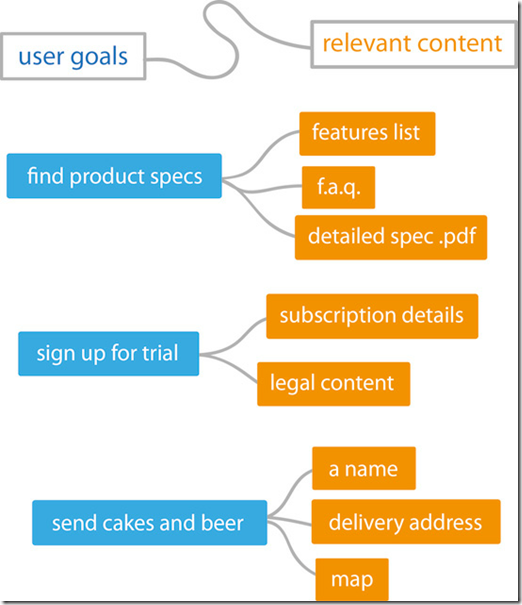
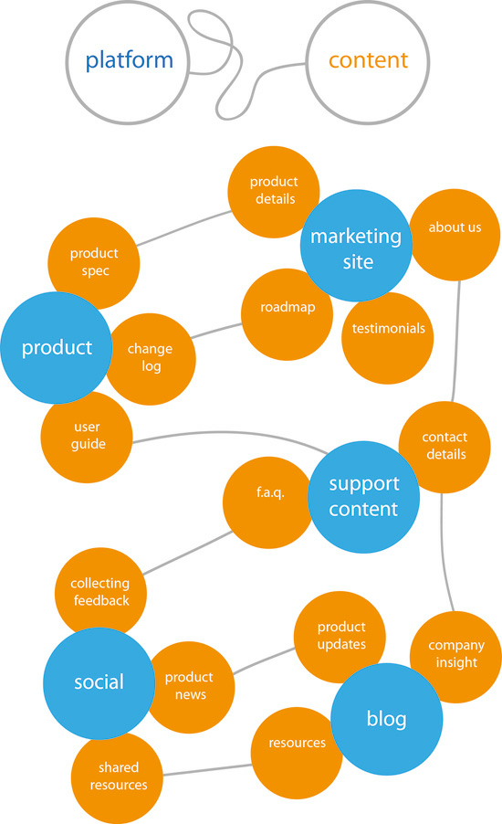

Content Mapping，翻译为内容映射也好，或者理解为内容图谱，实际上是一种帮助我们组织和理解网站所包含内容的数据可视化技术。这项简单的技术在我们的网站内容策略方面可以发挥非常有价值的作用，下面谈一谈如何应用这项技术。

**什么是内容映射？What is Content Mapping？**
这项技术与思维导图Mind Map非常类似，只不过这项技术的应用对象集中在网站的内容上。它帮助网站主发掘、可视化网站的内容。
更具体的来说，这项技术可以让站长们看到你的内容与目标客户、内容与网站用户以及网站内容其他方面的关系，帮助站长们找到网站内容策略中的空白点（或者是发现一些潜在的机会）。
本文将介绍两种内容映射的类型：
1、使网站的内容更加接近客户和用户的需求。
2、使网站的内容映射到其他内容上。
我们会集中精力，为所有参与网站建设的人员提供功能性的内容映射规则。**注意**：内容映射应当是协助站长在内容规划时避免过度复杂的，像头脑风暴的会议一样是一个放松、自然的过程。如果我们在内容规划时不断提到“信息单元”和“内容块”这些术语，往往表明我们偏离了预定的航道。
我们也并不是在规划网站地图，所以应当时刻提醒自己，所有的想法要高于网页和网站。我们应当对外部的内容（例如微博）和网站保持开放的心态。

**为要么要进行内容映射？Why Should You Create Content Maps？**
这项工作最主要的目的是让我们的精力始终集中在的网站的目标和我们希望生产的不同类型的内容上面。另外，这项工作可以帮助我们做一些技术选型的决定（如选择什么样的CMS）、帮助团队形成一致的愿景和共识、帮助我们发现一些空白的领域和潜在的机会。

**我们需要哪些准备工作？What You Need to Get Started with Content Mapping？**
开始之前，我们有几项事情需要做：
1、深刻理解我们的商业目标。包括我们的目标客户，要了解他们希望从我们网站上得到什么
2、理解我们的网站用户。理解用户访问我们网站的原因，知道哪些内容是用户需要的。
3、深刻理解网站内容的一些标准和要求，例如文章风格、类型、写作技巧等等。
如果正在为一个现存的网站工作或者做网站的重构项目，对网站现有的内容进行审计是非常必要的。尽管这并不是一个十分有趣的过程，但是长远来看，你会发现这样做的好处。

**工欲善其事，必先利其器 Content Mapping Tools**
工具并不是最重要的，但是一个好的工具会提高工作效率。基于Web的工具可以方便的产出易于共享的资料，还有很多画图或者思维导图的工具可以使用。例如OmniGraffle、[Balsamiq](http://www.balsamiq.com/products/mockups)、Microsoft Visio等等。

**开始工作吧 Mapping Content to Goals**

最开始，我们将内容的目标与我们的客户、我们的用户关联起来。也许看上去并不像一个地图，更像是一个个的键值对。

将内容与客户的目的映射起来，如下图所示。

将内容与网站用户的目的映射起来，如下图所示

如何使用这些图
由上面的图可以看到，每个目标都有两种或两种以上的结果，结果越多意味着我们用来满足用户需求的手段越多。

**与其他内容的映射 Mapping Content to Other Content**
先看一个示例。

这个映射图将不同类型的内容相互关联了起来，这样的话，通过其他类型的内容可以增强某一观点或者某一类型的内容。另外，也有助于我们发掘其他潜在的信息分组。

**接下来要做的 What's Next**
做出这些图来之后，我们要公布给全体成员，让他们始终清楚我们需要生产什么样的内容。同时我们需要不断地更新这些图，而不是一成不变的挂在那里。

参考资料：
1、[How to Create Content Maps for Planning Your Website's Content](http://sixrevisions.com/content-strategy/content-mapping/)
