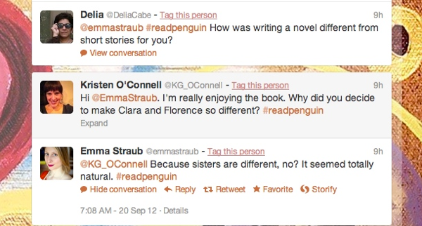
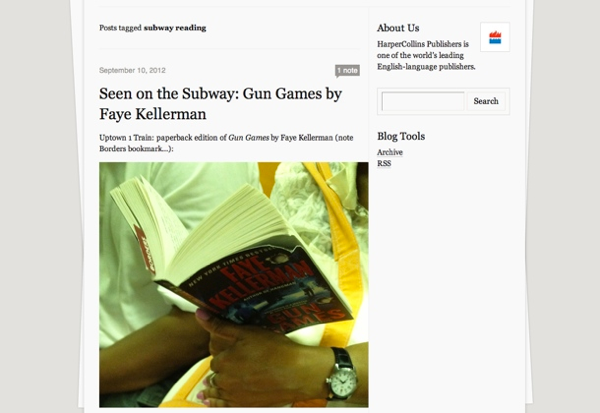

社交网络最近几年风靡全球，那么在老牌的出版业，是如何应对这股新型的社会化浪潮的呢？我们来看看国外同行的做法。

这里以北美六大图书出版做为例子，六大包括：[Hachette Book Group](http://www.hachettebookgroup.com/)、[HarperCollins](http://wenku.baidu.com/view/8044a67c27284b73f242506a.html)、[Macmillan](http://www.macmillan.com/)、[Penguin Group](http://www.penguin.com/)、[Random House](http://www.randomhouse.com/)、[Simon & Schuster](http://www.simonandschuster.com/)。对于他们使用的社交化媒体，主要选择了三个最主流的产品：Facebook、Twitter、Tumblr。

Twitter 图书俱乐部 Twitter Book Clubs

通过在Twitter上使用话题标签（Hashtags）并且@作者，企鹅美国（Pengui USA）与Twitter一同进行了一些创新。每个月，企鹅美国会选择他旗下的一位作者的图书，邀请Twitter上的用户通过#关键词#并且@作者的方式进行讨论，仿佛是在召开迷你的书友会。

在Facebook中使用的不同策略

六大出版商在Facebook中采取了不同的策略。Hachette不定期的更新其Facebook主页（九月份仅有3次更新），因此到目前为止仅仅收获了3998个喜欢。而Random House（兰登书屋）每天进行平均三到四次更新，收获了38369个喜欢。

Tumblr比前两者更受欢迎

博客广告公司Blogads在一月份做了一项调查，发现Tumblr在出版商中尤其受欢迎。HarperCollins就采用了多个Tumblrs帐号，他的员工每天发布不同主题的图片，例如“Seen On the subway”，鼓励大家分享在地铁上阅读HarperCollins图书的场景。

由以上的例子总结到，在社交媒体的时代，作者和读者的互动越来越重要。

Whether it's[helping promote](http://www.hachettebookgroup.com/publishing_facebook.aspx)an author's Facebook page,[blogging about an author](http://wwnorton.tumblr.com/post/13890658901/gza-at-mit)on Tumblr, or organizing[a Twitter discussion](https://twitter.com/#!/search/realtime/%23readpenguin)between an author and her readers, the publishing houses understand that the Social Web is all about authors engaging with their readers.

国内的的出版商在这方面做的如何？有时间值得做一些调研。

参考资料：
1、[How the big six Book Publishers Are Using Social Media](http://www.readwriteweb.com/archives/how-the-big-six-book-publishers-are-using-social-media.php)
2、[Wiki Hachette Book Group](http://en.wikipedia.org/wiki/Hachette_Book_Group_USA)
3、[HarperCollins Company](http://wenku.baidu.com/view/8044a67c27284b73f242506a.html)