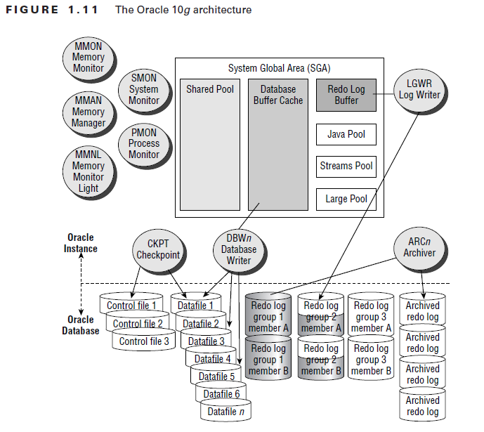
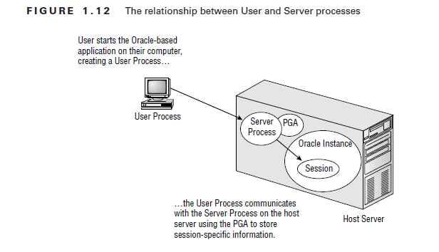
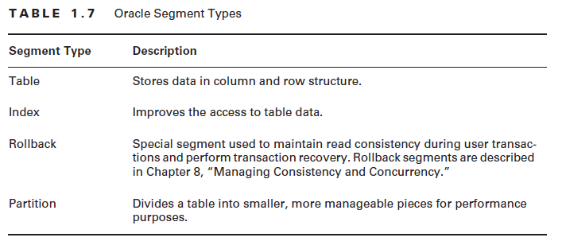
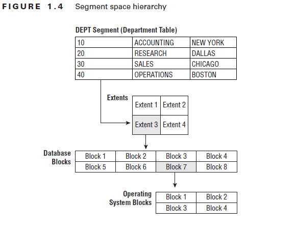
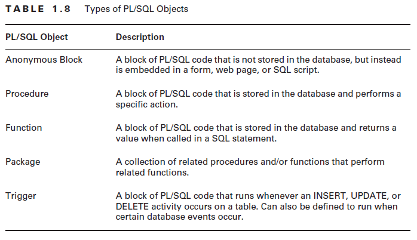

> 这是2012年刚进入银行IT系统工作时整理的Oracle学习笔记，时光划过了将近10年，Oracle在使用率上仍占有很大的比重，不过Mysql、国产数据库也开始逐步引入了。
>
> 重新整理记录于2021年6月19日

## Oracle数据库的历史

Oracle 10g发布于2004年，第一个版本是10.2.0.1。目前最新的Oracle版本是 Oracle 11g。

## Oracle 产品家族

Oracle 10g发行有五个版本：Enterprise、Standard、Standard Edition One、Personal、Lite。

## Oracle架构

Oracle的架构可以总结为下面三点：

* 用户相关的进程，User-related processes；
* Oracle 实例（Oracle Instance）所使用的逻辑内存结构；
* 物理文件结构，我们称之为 database；

### 用户进程与服务进程

用户想要连接Oracle数据库，必须通过User Process才能连接。User Process可以存在于客户端或者中间层上，对应User Process连接请求的是Server Process。用户进程与服务器进程建立连接（Connection）后，服务器上会有一个专门的Server Process来响应用户的请求。连接建立后，用户就创建了一个 Session。同时，会在内存区域创建一个PGA（Program Global Area）区域，存储一些用户相关的会话变量和信息。具体的结构如下图所示。

### Oracle Instance

Oracle Instance由SGA以及一些后台进程组成。SGA是Oracle的主要内存结构，全称为System Global Area。

### 物理文件结构

Oracle中的MetaData以及数据字典视图（Data Dictionary View）：除了用户的数据表之外，Oracle中包含了大量的系统表，这些表的名字多数为OBJ$、FILE$、X$KSMSP等难以记忆的名字。为了便于使用，Oracle中还包含很多视图，具体信息如下：

动态的性能视图，与Oracle安装的特性有关系，包括：V$DATABASE、V$VERSION、V$OPTION、V$SQL、V$SGA、V$SGA_DYNAMIC_COMPONENTS。

Oracle中Segment的类型：

Oracle中Segment、Extent、Blocks和System Blocks之间的关系。

## PL/SQL

PL/SQL是Oracle Procedural Language for SQL的缩写，是Oracle提供的一个SQL的变种，针对SQL的缺点，提供了循环、判断等众多的功能。

