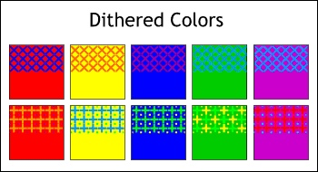
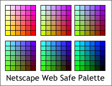
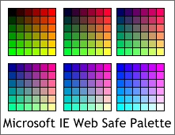
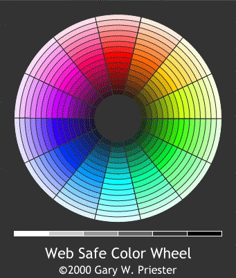

**一、关于颜色**

我们所看到的屏幕上所有的颜色都是由红、绿、蓝这三种基色调混合而成的。（在印刷上，颜色是四种颜色合成的，这个是表示方式上的不同。）每一种颜色的饱和度和透明度都是可以变化的，用0～255的数值来表示。如纯红色表示为（255，0，0），十六进制表示为#FF0000。按这种表达方式，理论上我们可以得到256*256*256=16777216种颜色。

网页中颜色的表示方式。

网页设计中，利用CSS指定颜色有四种表达方式：
1、使用十六进制方式，取值范围 #000000 ~ #FFFFFF （黑色到白色）。当颜色值为 #cc3300 时，也可以使用 #c30 这种简化的方式来表示。
2、RGB颜色表示法：RGB（x,y,z）。x、y、z是0 ～ 255之间的整数。
3、RB百分比颜色表示法：RGB（x,y,z）。x、y、z是 0% ~ 100% 之间的数值。
4、使用Windows关键字，共有十六种...

**二、什么是网页安全色？**

在1995年到1996年间，很多电脑的显示器仅支持8位共256种颜色（受限于Video RAM等硬件）。为了显示更多的颜色，采用了颜色抖动（Dithering）这样一个过程来表示更多的颜色。

颜色抖动

为此，软件专家 xxx 设计了一种216个颜色的调色板，称为安全颜色。这些安全色能够在任何显示器上显示一样的颜色，不会有任何抖动现象发生。为何不是256种安全色呢？这个是因为当时无法再找到40种更多的符合稳定（Solid）标准的颜色。

网页安全颜色（Web Safe Color）使用RGB表示法包括0，51，102，1153，204和255六种颜色，十六进制表示法为：00，33，66，99，cc，ff。这种分法即将 0 ～ 255 的颜色范围分成了五等份（255*1/5 ＝ 51）。

微软和Netscape最早开始在浏览器中指定安全色表（Safe Color Palettes）。下图是Netscape的安全色表，分为六组，每组36个颜色。从左上角开始，包含的红色从255逐渐将至0。同时在每个小组中，从左到右蓝色逐渐降低（255 ～ 0），从上到下绿色逐渐降低（255 ～ 0）。Netscape的安全色表从白色开始，以黑色结束。

微软的色表与Netscape不同，其从黑色开始，以白色结束。每个分组的蓝色逐渐递增（0 ～ 255），单个分组中，从左到右红色逐渐递增，从上到下绿色逐渐递增。

随着显示技术的进步，显示器支持的颜色范围，已经大大超出了完全颜色的范围。

**三、在现代的显示器和浏览器上还存在网页安全色问题吗？**

现代的网页设计师在网页设计中已经不需要顾虑网页安全色的问题了。不过由于不同的显示器在颜色的显示上还存在偏差，也可能是不同的显示器的颜色校准没有做好，也可能收观看角度、光环境的影响等等，人们对于同样的颜色在不同浏览、不同显示器上显示效果的感觉可能未必一致，这就需要设计师们发挥自己的聪明才智了。

四、网页种不同格式图片支持的颜色

4.1 Gif格式

支持256种颜色。
支持交错下载，节省等待时间。
可制作GIF动画。
多于256色时，不能准确完成平滑的颜色过渡。
在处理透明背景色的图片时，网页安全色特别重要！

4.2 PNG格式

只有支持PNG格式的浏览器中才能使用。

4.3 JPEG格式

支持16.8M种颜色。
支持无损压缩和有损压缩。
支持很高的压缩率，下载速度非常快。
有损压缩不能显示高清晰度的图像。

总结：

对于目前大部分的显示器来说，都可以支持数以百万计的颜色。所以在一般的网页设计和制作中，可以不必局限在网页安全色的范围内。但是，对于页面中的主要文字区域或者背景的颜色，我们最好要选用网页安全色，避免发生悲剧。

参考资料：
1、[网页安全色剩下22种颜色还安全](http://tangshunlailove.blog.163.com/blog/static/275977232010225115448740/)
2、[网页安全色的范围是多少](http://www.docin.com/p-20430306.html)
3、[Is the Browser Safe Color Palette Really Required?](http://webdesign.about.com/od/color/qt/tipcolorbrsrsf.htm)
4、[Color Wheel and Color Theory](http://webdesign.about.com/cs/color/a/aacolortheory.htm)
5、[Is it still necessary to use web only colors in web design?](http://answers.yahoo.com/question/index?qid=20080114191630AAin7it)
6、[CRT、LCD、LED](http://blog.sina.com.cn/s/blog_5ef79e710100fthu.html)
7、[Web安全色](http://www.dreamdu.com/css/color_websafe/)
8、[Consistent Colors For Your Site － All You Need To Know About Web Safe Colors](http://www.htmlgoodies.com/tutorials/web_graphics/consistent-colors-for-your-site-all-you-need-to-know-about-web-safe-colors.html)
9、[All you need to know about Web Safe Colors](http://www.brighthub.com/internet/web-development/articles/125452.aspx)
10、[Color Rendering Difference: Firefox Vs. Safari](http://css-tricks.com/color-rendering-difference-firefox-vs-safari/)

