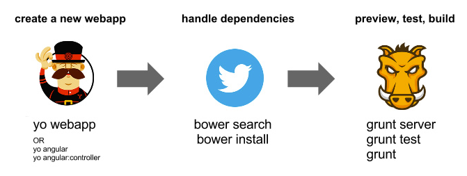
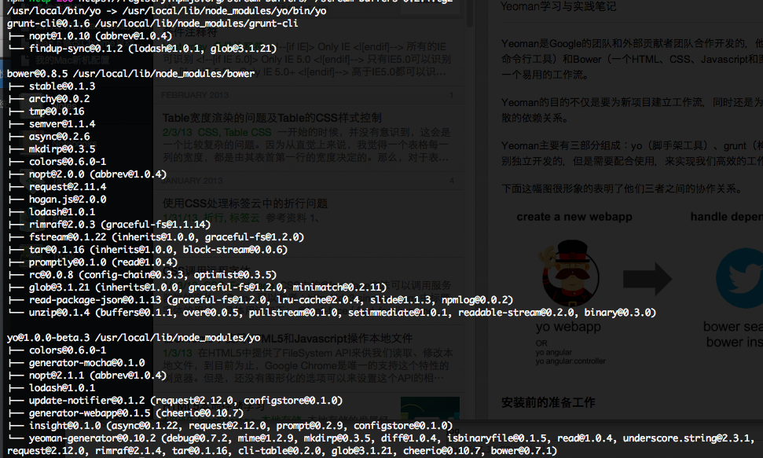
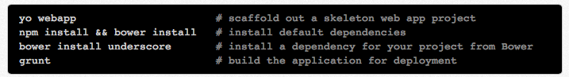
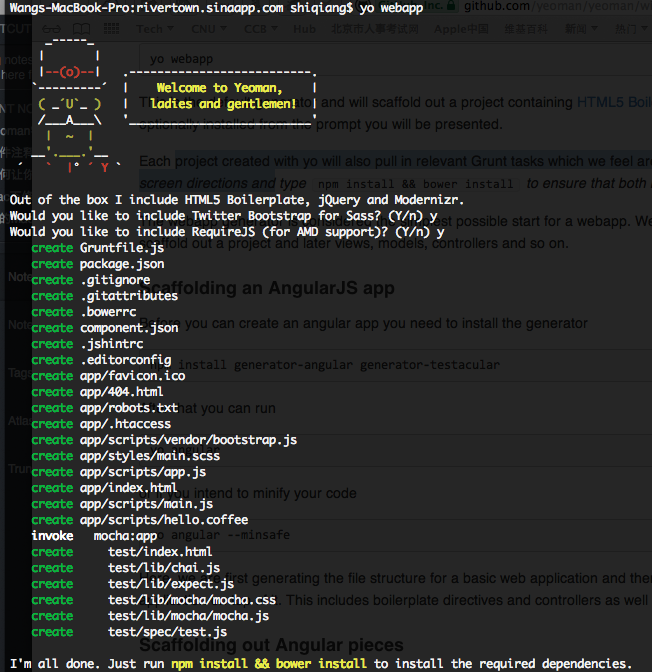
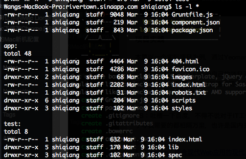
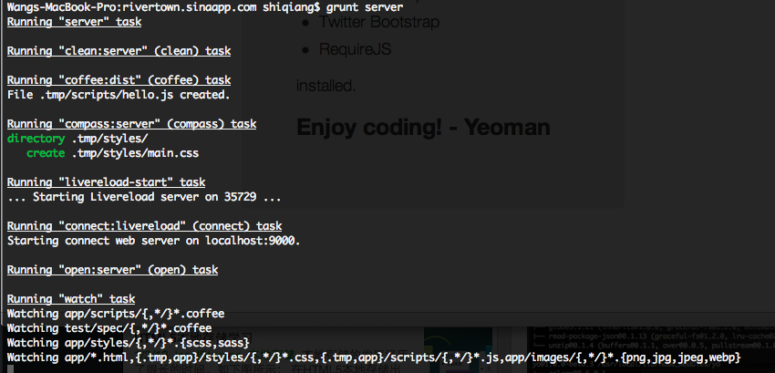
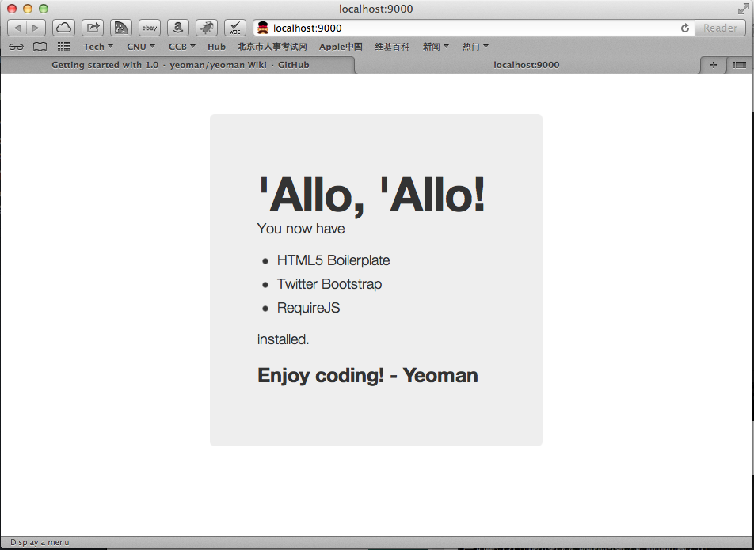
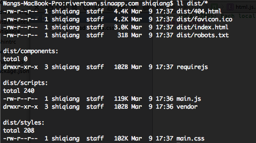
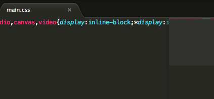

Yeoman是Google的团队和外部贡献者团队合作开发的，他的目标是通过Grunt（一个用于开发任务自动化的命令行工具）和Bower（一个HTML、CSS、Javascript和图片等前端资源的包管理器）的包装为开发者创建一个易用的工作流。

Yeoman的目的不仅是要为新项目建立工作流，同时还是为了解决前端开发所面临的诸多严重问题，例如零散的依赖关系。

Yeoman主要有三部分组成：yo（脚手架工具）、grunt（构建工具）、bower（包管理器）。这三个工具是分别独立开发的，但是需要配合使用，来实现我们高效的工作流模式。

下面这幅图很形象的表明了他们三者之间的协作关系。

### **YOMAN的特性**

闪电般的初始化：项目开始阶段，可以基于现有的模板框架（例如：HTML5 Bolierplate、Twitter Bootstrap）进行项目初始化的快速构建。

了不起的构建流程：不仅仅包括JS、CSS代码的压缩、合并，还可以对图片和HTML文件进行优化，同时对CoffeScript和Compass的文件进行编译。

自动编译CoffeScript和Compass：通过LiveReload进程可以对源文件发生的改动自动编译，完成后刷新浏览器。

自动Lint代码：对于JS代码会自动进行JSLint测试，确保代码符合最佳编程实践。
内置的预览服务器：不再需要自己配置服务器了，使用内置的就可以快速预览。
惊人的图片优化：通过使用OptiPNG和JPEGTran来优化图片，减少下载损耗。
杀手级包管理：通过bower search jQuery，可以快速安装和更新相关的文件，不再需要打开浏览器自己搜索了。
PhantomJS单元测试：可以非常方便的使用PhantomJS进行单元测试，一切在项目初始的时候都准备好了。

### **安装前的准备工作**

检查系统中是否安装了：Node.js、Ruby、Compass。

Mac下安装Node.js非常方便，首页提供了一个pkg下载，双击后可以默认安装node、npm到/usr/local/bin下，我们只需要确保/usr/local/bin包含在PATH变量中就可以。

Mac Mountain Lion 下自带了Ruby，所以也就不需要再单独安装了。

Compass安装需要依赖于Ruby Gems，执行下面的步骤：
sudo gem update --system
sudo gem install compass

### **安装**

环境准备好之后，就可以进行安装了，执行：
sudo npm install -g yo grunt-cli bower

安装成功后，会看到下面的提示：

### **使用**

执行 yo webapp 我们就可以快速的创建一个新的Web应用的框架，一个通常的工作流程如下：

### **项目实践**

本篇以一个实际项目为例，通过Yeoman来构建一个简单的Blog页面：

环境准备好之后，我们开始自己的项目开发了，首先为自己的项目准备一个目录，我这里是: rivertown.sinaapp.com。
然后第一步，使用 yo 进行快速的初始化，初始化时会询问我们是否使用Bootstrap和RequireJS框架，我这里都选择了是。完成后一个Web应用的基础框架就建立好了。

初始化的WebApp目录结构如下，app目录是我们项目的主目录，test目录中对应的一些JS的单元测试文件。

注意我们需要安装黄色字体的提示，将npm和bower安装到项目本地。

修改页面文件以及样式。

对页面进行预览和测试。当代码编辑到一定程度，我们就需要对页面进行测试了，这个时候需要Grunt派上用场，执行下面的命令：

很快，浏览器中就可以看到我们的页面了。

更神奇的是，一旦我们编辑了项目源文件之后，切换到Safari窗口，就马上能够看到修改所带来的变化，根本不用手工刷新页面！

如果我们想对JS进行测试，那么必须利用npm将PhantomJS安装到本地，然后执行grunt test。

最后的步骤就是编译生成项目了，执行 grunt 就可以将项目编译生成在 dist 目录下，有可能生成的时候会提示 phantomjs 没有的错误，这个时候执行 grunt --force 强制跳过这一步就可以了。

查看具体的main.css和main.js中的内容，可以发现里面的内容都是经过优化之后的。

**使用体验**

经过一下午的试用，第一对于有这么一个集成化的构建、开发、编译流程，感觉非常新奇，相比于传统的开发方式。我需要首先确定用哪些框架，然后各个网站收集源代码，进行整合，还要部署一个测试的Web服务器，不管是用（Apache、Nginx还是Xampp），最后还要做代码的优化。而现在使用了Yeoman之后，所有的这些工作都被自动化、流程化了，我只需要按照既定的步骤来做，很多事情Yeoman都帮我做好了，对于前端开发来说，节省了非常多的力气。而且，生成项目的代码质量也都很不错。

遗憾的地方在于目前Yeoman的相关资料还比较少，中文的资料也非常少，对于如何深入的学习和定制化，还需要继续的钻研。

PS：吐槽一下百度，不得不说对于IT工作者来说，百度真的不是一个好的选择，输入Yeoman，除了Infoq的两篇介绍性的内容，其他的内容几乎与我需要的都相隔万里，也许是国内关注Yeoman太少的原因，但愿如此。

参考资料：
1、[Yeoman：适合现代Web应用的现代工作流](http://dl.cdn.chip.eu/downloads/224463/Snow_Leopard_EN.zip?cid=5721758&platform=dcu&1362754176-1362761676-1c6561-B-a3c135af25f380ada9886c5071a2a788)
2、[Yeoman.io](http://yeoman.io/)
3、[Nodejs.org](http://nodejs.org/)
4、[Compass](http://compass-style.org/install/)
5、[Yeoman Get Started with 1.0](https://github.com/yeoman/yeoman/wiki/Getting-started-with-1.0)

[前端](http://technorati.com/tag/%E5%89%8D%E7%AB%AF),[工作流](http://technorati.com/tag/%E5%B7%A5%E4%BD%9C%E6%B5%81)

