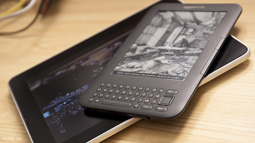
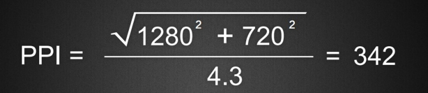

目前在为移动设备设计界面时，最头疼的问题莫过于尺寸的问题。我们无法使用固定的尺寸来进行设计，因为不同设备的大小千变万化。但是如果我们了解了设备的物理特性后，这将有助于我们进行更好的设计。



不同的设备可能具有相同的屏幕分辨率，但是他们的物理特性差别却非常大。一代iPad的屏幕尺寸是9.7寸，分辨率为1024*768、132dpi。Kindle Kyeboard 3G的物理尺寸只有6寸，同样是768*1024的分辨率，像素却是212dpi。

获取屏幕的尺寸有很多种办法，包括" Resolution Media Query "，这种办法作为 Media Queries的规范已经存在很长时间，但是在还没有正式发布之前，不是所有的浏览器都支持。但是很幸运，WebKit在这方面已经迈出了重要一步，下面是基本的用法：

```css
@media ( min-resolution: 250dpi ){

}
```

这句话可以将低分辨率图片过滤掉，只保留高分辨率的图片。

实际上对于设计师来说，他们对分辨率并不是那么感兴趣。因为他们是为人类而设计，所以最好有 width: 1寸，这样的单位。可惜的是，当今的社会是电子化的社会，物理的尺寸和电子像素不完全一致，做为设计师，我们需要来填补这两个不同之间的鸿沟。

来比较一下下面的两段代码：

```css
@media (min-resolution:341dpi) and (min-width: 767px) > {

}

@media (max-resolution:131dpi) and (min-width: 767px) > {

}
```

粗看上去，这两段代码非常相似，实际上是用来区分不同设备的，第一个适用于 HTC Windows Phone 8X，第二个适用于 iPad2。通过使用 Resolution Query，可以将小设备同大设备区分开。两个设备的的宽度都是768px，物理尺寸一个是10英寸（iPad），一个却是4.3英寸（HTC）。更重要的是，iPad的分辨率比较低（1024*768），而HTC的分辨率比较高（1280*768）。通过 Resolution Media Query 和 Width Query 的配合使用，我们能够将具有同样宽度的不同大小的设备区分开，从而来相应的调整设计中的元素布局。

之前说过，实际上我们对于各个设备的分辨率并不是很关心，我们更加关心的是，这个界面是显示在一个（物理尺寸上）较大的设备还是较小的设备上。那么，我们又该如何定义大设备和小设备呢？实际上并没有明确的分割，我们必须从每个项目的实际出发，这个设备在这个项目中是小设备，但在另外一个项目中，可能被归类为大设备。

**The Physical Size Inquiry Non-Exhaustive Theorem**

理论：在一个组合的查询中，如果 分辨率 Resolution 与 宽度和高度中的较小的一个的比值大于5，那么基本上可以归属为大设备，如果小于5，基本上可以归属为小设备。如果得分接近于5，那么是一个中等的设备，物理上的尺寸接近于1张A4纸的大小（21*29.7cm）。

下面是一个验证这个理论的表格：

使用PSINET判断设备的尺寸只是一个假设，这个假设在设备的长宽相差不大的情况下还比较准确，如果长宽差别太大，这个数字就不准确了。

PPI的计算公式，如果一个屏幕宽1280px，高720px，对角线尺寸为4.3inches，那么PPI的计算方式为：



参考资料：
1、[Device Size Matters: Responsive Web Design With Physical Units](http://mobile.smashingmagazine.com/2013/03/21/responsive-web-design-with-physical-units/)
2、[学习Media Query](http://rss.9ria.com/?p=4414)
3、[Logical Breakpoints in responsive design](http://www.smashingmagazine.com/2013/03/01/logical-breakpoints-responsive-design/)
4、[Media Type 与 Media Query](http://www.cnblogs.com/anjey/archive/2012/08/14/2638066.html)