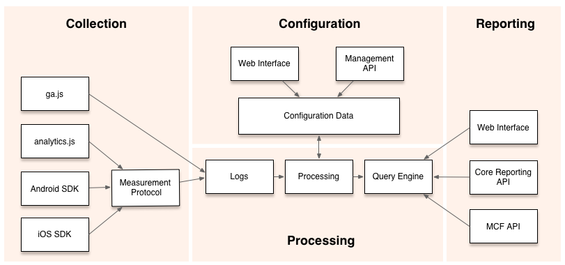

为什么要进行数据统计分析，我觉得 Talking Data 的于洋有个比喻非常好“渠道存在海量的用户资源，并服务于开发者。渠道本身聚合了大量的用户，进而形成平台，成为了平台，就必然存在“货架”，而这些货架的位置是有限的资源，但是开发者对于资源争夺和需求确实强烈，这点使得渠道货架的位置变得无比重要，再者，开发者也一直认为获得了最佳的位置，就会带来不错的收益，基于此点认识，导致了渠道投放成本的增加，而渠道在寻找最佳适合渠道的产品征途上变得异常艰难。其实，开发者没有找到适合自己的最佳渠道，渠道没有寻找到最适合自己用户资源的最佳产品。”。

综上，我们运营Web需要对Web用户数据进行统计分析，运营移动App，则需要对移动App用户进行统计分析。知己知彼，才能做到百战不殆。

目前比较流行的几个移动应用统计平台：

**Google Analytics**

Google Analytics 以收集网页浏览中用户的行为而著名，现在这个工具已经开始支持多种平台。见下图：

Google analytics 的 android 和 iOS 版本提供了以下功能：
1、统计应用的活跃用户数量
2、用户的地理位置
3、特殊特性的应用数量
4、App内购数量
5、程序的意外终止数据收集
Android版本的SDK另外还提供了与移动市场相关的特性，Google Play下载数量，关联的付费广告等特性。

同时，Google Analytics提供了Measurement Protocol供开发人员自己定制需要统计的用户在应用内的行为，可以统计包括：屏幕尺寸、Viewport尺寸、文件编码、屏幕颜色、用户语言、用户的点击行为、用户使用时间等众多特性。基本上能够满足我们对应用统计的需要。

**百度移动统计**

百度也提供了移动统计，支持Android和IOS版本，相对于Google Analytics，个人感觉更适合中国用户的习惯。指标方面提供了：启动用户、启动次数、新用户、老用户、累计用户、累计启动次数、日活跃度、使用时长、页面访问次数、

国内做移动统计的公司还有：[友盟](http://www.umeng.com/)、[魔方](http://www.imofan.com/)、CNZZ统计、Talking Data等。这方面也不乏开源解决方案，如[Countly](http://www.open-open.com/lib/view/open1338884397047.html)。

参考资料：
1、[Talking Data Blog](http://blog.talkingdata.net/)
2、[CNZZ移动统计](http://mobile.cnzz.com/)
3、[G](http://www.36kr.com/p/123482.html)oogle Analytics SDK for Android
4、[Google analytics for Android － EasyTrack](http://blog.kenyang.net/2012/11/google-analytics-for-android-easytrack.html)
5、[Google Analytics SDK for Android V2（Beta）](https://developers.google.com/analytics/devguides/collection/android/v2/)
6、[百度移动统计](http://mtj.baidu.com/web/welcome/login)
7、[2012Q3移动统计报告](http://mtj.baidu.com/industry/2012Q3.pdf)
8、[友盟](http://www.umeng.com/)
9、[开源移动App统计 Countly](http://www.open-open.com/lib/view/open1338884397047.html)
10、[三款移动应用数据统计平台对比](http://www.leiphone.com/3-mobile-a.html)