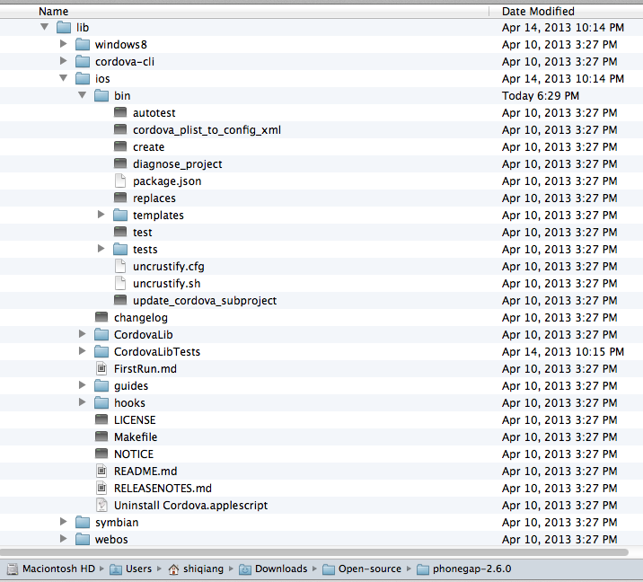
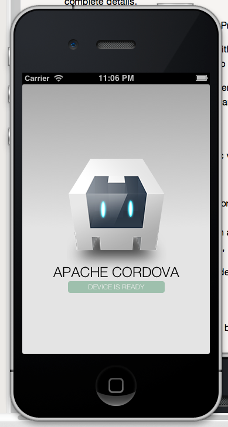

Phonegap自从捐赠给Apache基金会后，改名字为Cordova了，文章发表时的稳定版本是 2.6.0 。

Apache Cordova提供了使用Web技术来开发Mobile应用的方式，目前支持Android、IOS、Windows Phone、Blackberry等近十种平台。通过使用Javascript API的方式，使得Web应用能够访问设备的各种特性，下面来介绍下如何用它来开发iOS应用。

**必要条件：**
Mac OS X操作系统（10.7.4+）、Xcode 4.5和iOS6 SDK、Xcode命令行工具、iOS设备。

**安装Cordova：**
从 这里 下载最新版本的Phonegap，我下载的是2.6.0。下载后对压缩包进行解压缩。

**创建工程：**
在早期的Phonegap版本中，会提供一个dmg安装包，安装后就会在Xcode中添加一个Phonegap的工程模板。但是新的2.6.0不再采用这种方式，而是使用了命令行的创建方式。
解压缩后，我们可以在lib目录下看到众多的平台类型，找到ios然后使用Terminal进入到bin目录下。



执行：

```sh
./create ~/Documents/ProjectDestination/Helloworld cn.blogs.cocowool HelloWorld
```

整个命令有三个主要参数：
1、项目存放路径（Project Location）。通过create方法创建的路径将保存在这个路径中。
2、包名（Package Name）。
3、项目名称（Project Name）。

可选的参数：
使用默认的方式创建工程会将必要的库文件从Cordorva的发布文件夹拷贝到你的项目文件夹中。存放在CordovaLib目录下。但是有些开发人员喜欢在多个项目中公用一个CordovaLib，这样当Lib更新时所有项目都会更新。使用--share参数，可以将CordovaLib作为一个软链接，链接到create所在的位置。

执行程序：
使用Finder定位到项目目录，双击 HelloWorld.scodeproj 就会在Xcode中打开项目。默认的模拟器是iPad，修改为你需要的模拟器。执行 Command + R 就可以运行项目，效果如下：



现在，我们就可以利用Cordorva的API来编辑 www 目录下的文件，来实现自己想要的功能了。


参考资料：
1、[Getting Started with iOS](http://docs.phonegap.com/en/2.6.0/guide_getting-started_ios_index.md.html#Getting%20Started%20with%20iOS)
2、[百度百科 Phonegap](http://baike.baidu.com/view/4157600.htm)
