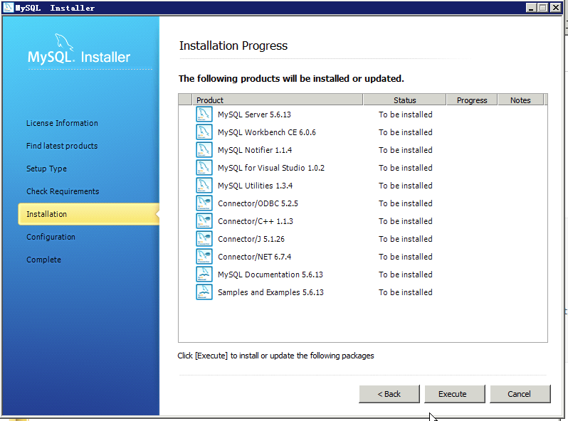
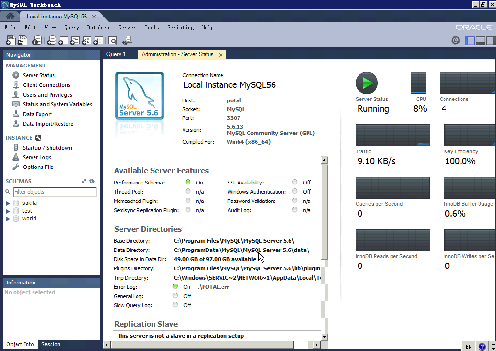
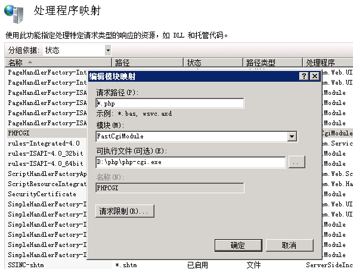
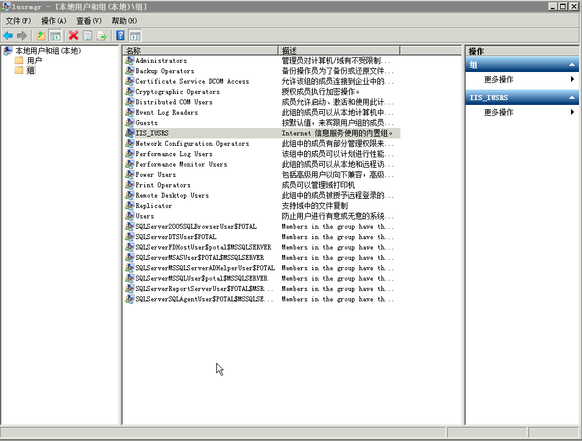
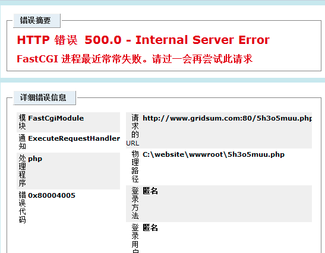

IIS7也可以作为PHP运行的Web服务器，本文介绍如何进行配置。

一、准备PHP安装文件

在PHP官方网站下载对应的版本。

http://windows.php.net/download/#php-5.5

二、Mysql配置

从Mysql官方网站MSI的安装包，这样就不用自己再做自启动方面的配置了。

安装后，打开Workbench可以看到一些信息。

三、配置PHP

1、登录 http://phpmanager.codeplex.com/releases/view/69115 下载PHP Manager。

2、在Windows 2008 Server中，选择程序和功能->打开和关闭Windows特性->角色->添加角色服务->增加CGI支持。

3、将下载的PHP，解压缩放到 C:\php 下。修改PHP的配置文件，我将php-production.ini拷贝为php.ini，然后修改如下内容：

fastcgi.impersonate = 1

fastcgi.logging = 0

cgi.fix_pathinfo = 1x

cgi.force_redirect =0

4、在IIS7中，使用PHP Manager配置PHP。我在处理的时候，选择“Register new PHP version”，遇到了“该对象的状态使当前处理无效”的错误。我查看“处理程序映射”中的设置，发现CGI-exe的功能显示为被禁用。

然后，按照“[How to create a global fastcgi handler mapping for php](http://www.iis.net/ConfigReference/system.webServer/fastCgi)”中的步骤，添加一个映射。安装成功后，打开IIS服务器，双击“处理程序映射”

然后点击右侧的“添加模块映射”，按照下图进行配置。

这之后，就能能够成功的看到phpinfo()熟悉的界面了。

四、IIS7权限配置中的问题。

配置完成后，发现PHP对于文件夹没有写权限。

五、其他问题

检查phpinfo时报错。

参考资料：

1. [让IIS7支持PHP（5.2.17及5.3.5）](http://www.jzxue.com/fuwuqi/http-iis-apache/201102/27-6390.html)
2. [Win7 IIS7.5+PHP Manager安装配置PHP5+Mysql教程](http://blog.csdn.net/senophen/article/details/6185494)
3. [PHP环境搭建：WIndows 7下安装配置PHP+Apache+Mysql](http://www.leapsoul.cn/?p=695)
4. [Windows Server 2008 R2 X64安装PHP](http://blog.sina.com.cn/s/blog_5546342701013kac.html)
5. [Microsoft FastCGI](http://www.iis.net/configreference/system.webserver/fastcgi)