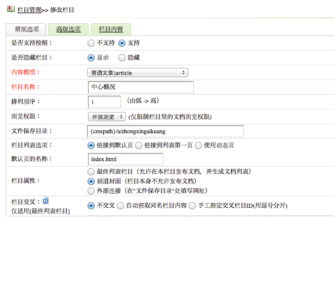
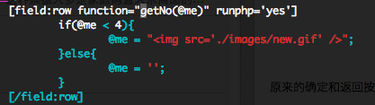

Dede CMS 5.5 的漏洞实在是太多了，三天两头被Hacker们挂马。话说挂这些破网址真的能带来丰厚的回报吗？做人要厚道啊。

闲话少说，我按照网上的[升级到5.5升级到5.7不出错的方法](http://www.moke8.com/article-9011-1.html)，升级后编辑文章看起来没什么问题。但是在编辑栏目属性时，发现了以下问题：

原来的**确定和返回**按钮不见了。不知道什么原因，后来也没有再仔细查找原因。

所以开始考虑从5.5一路升级到5.7。

升级过程，还比较顺利。升级后，[http://www.sinotefl.ac.cn/cnadmin/catalog_do.php?cid=37&dopost=listArchives](http://www.sinotefl.ac.cn/cnadmin/catalog_do.php?cid=37&dopost=listArchives)这个链接点击后页面空白。定位代码，原来是一个 header 调用出了问题，页面不能够正常跳转。

查了下原因，可能是由于[文件编码的问题](http://zhidao.baidu.com/link?url=C4ffLz-jJKc9apwjiP_nUAV-NRiqGP8EEXtdemcWBfjHmlhC1THnKFa97Tr3aDVprzuKbt9XU13YYBrXCThj-a)。哎，DedeCMS的问题真的是很多啊。

在登录后台时，又发现验证码不能够正常显示，问题真是多，按照网上的方法搜索一遍都没什么效果，最后重新覆盖了后台文件后，才能够正常显示。

2013-10-8 又发现了新情况，后台生产文件时无法生成首页文件，最后排查代码，终于发现是因为模板问题导致。

DedeCMS 5.7中，不再支持下面的这段代码：

这个问题在于5.7的标签进行了更新。

参考资料：
1、[5.5升级到5.7怎么办？](http://bbs.dedecms.com/simple/?t359612.html)
2、[DedeCMS V5.6正式版发布（含升级说明)](http://bbs.dedecms.com/232740.html)
3、[织梦DEDECMS网站5.5升级到5.7 SP1不出错的方法](http://www.moke8.com/article-9011-1.html)
4、[5.5有漏洞 我怎么升级到5.7](http://bbs.dedecms.com/simple/?t435947.html)
5、[Dede5.5升级5.6成功演示](http://bbs.dedecms.com/simple/?t233022.html)
7、[DedeCMS 你所选择的栏目与当前模型不相符,请选择白色的选项!完美解决方法](http://www.jb51.net/cms/54979.html)
8、[Dedecms 5.7的后台验证码不显示的解决办法](http://www.weste.net/2011/6-15/75525.html)
9、[Dede后台验证码不显示解决方法详解（5.7）](http://www.jb51.net/cms/68157.html)
10、[UTF8白屏问题有没有人管啊](http://bbs.dedecms.com/simple/?t394825.html)
11、[Dede5.7标签大全](http://jingyan.baidu.com/article/29697b91c8c118ab21de3c54.html)

