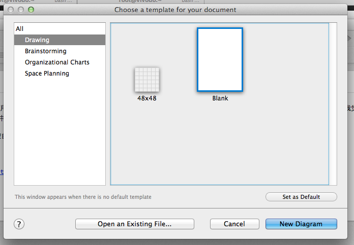
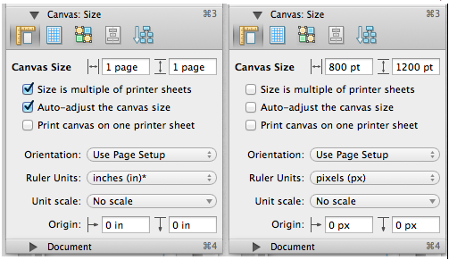
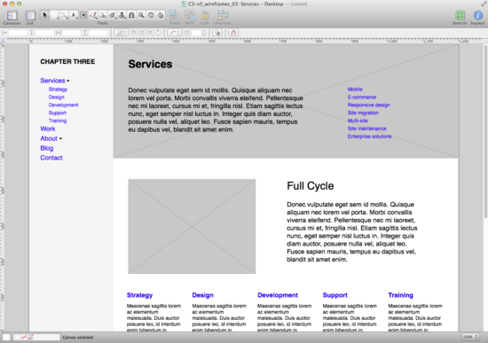
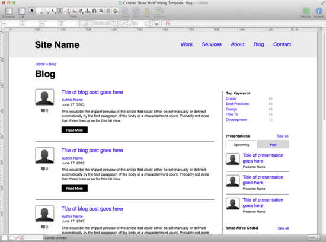
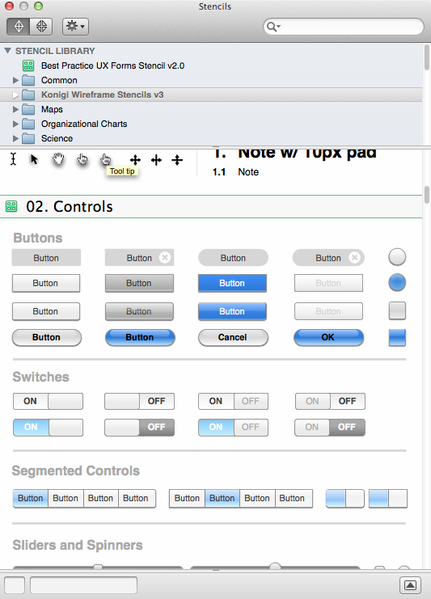

原型图设计是一个艺术创作的过程，所以我们应当使用能够提高工作效率、激发创作灵感的工具，让工具为创作服务，而不是为创作去学习如何使用工具。从这一点上说，我觉得Mac下的很多软件做的非常好，OmniGraffle就是其中一个。下面就介绍一下使用OmniGraffle制作移动应用原型图的设计。

启动 OmniGraffle 后，可以选择模板，这里选择空白模板。

OmniGraffle的默认参数设置有些奇怪，所以一般需要修改一下页面的设置。选择Inspectors->Canvas->Size。

修改默认设置后，避免了文档随着文档中对象的拖动而自动改变页面的尺寸。另外，使用像素作为单位，也是因为我们是在为桌面或者手持设备在进行设计。我们可以打开标尺，同时从标尺中拖出两个参考线来，和Photoshop中的操作一样。

做好上面的步骤后，我们就可以开始“解放思想，激发灵感”了。我们不必担心原型不够漂亮，毕竟这是一个初步的模型，更多的是关注功能的布局。

**从最关键的着陆页开始**。 这是因为着陆页页面会包含整个网站的多个基本元素，包括头部导航、底部信息等。这样在做其他页面时，就能够比较方便的复制粘贴。

**保持原型简洁**。我们不必急于马上开始原型的设计，我们需要静下来想一想，页面到底需要什么元素，应当如何布局。原型不必像最终网站一样，如果你朝着这个方向工作，那么会吃力不讨好。原型是用来帮助我们规划页面、网站的布局和层级设置，协助我们考虑布局在可用性方面存在的问题。

原型中的字体，可以一直使用Helvetica和宋体，并且不要使用太多不同的尺寸。对于图片，使用一个灰色的占位框代替就可以了。OmniGraffle有非常智能的对齐提示，所以在进行多列布局和水平对齐时，完全不需要担心。这一点真是比原来的Photoshop方便太多了。

**最小化调色板**。最小化调色板中的颜色，有助于我们将注意力集中在那些重要的事情上面。文本一律使用白底黑字，一些辅助性的元素使用一点轻微的阴影。唯一需要特别处理的是链接文字，我们可以使用蓝色来表示这些文字具有其他的功能性。对于一些错误信息提示或者删除、取消操作，可以使用红色让他看起来比较明显。

**制作符号**。对于页面中重复存在的元素，例如Header、Footer或者Sidebar，可以将这些元素转换成符号。这样，如果需要更新时，只需要在一个地方编辑就可以了。OmniGraffle在这一点上不如Axure方便，但也不是没有办法。下面是TODD MOY的方法是使用了[LinkBack](http://www.linkbackproject.org/)，具体方法如下：首先选中需要制作成符号的元素，点击Edit->Copy As …->PDF 也可以使用右键，然后将元素复制到需要的地方。

Stencils是OminiGraffle中的重要特性，可以帮助我们节省大量的时间。Stencils是我们可以拖动摆放的图片，多数是矢量图片。

[Graffletopia](https://www.graffletopia.com/)是崔出名的分享Stencils的网站。

参考资料：
1、[Wireframing with OmniGraffle, Part 1:Setting up your file](http://www.chapterthree.com/blog/garret-voorhees/wireframing-omnigraffle-part-1-setting-your-file)
2、[OmniGraffle 5 manual（PDF）](http://downloads2.omnigroup.com/software/MacOSX/Manuals/OmniGraffle-5-Manual.pdf)
3、[How to Make Master Objects in Omnigraffle](http://viget.com/inspire/how-to-make-master-objects-in-omnigraffle)