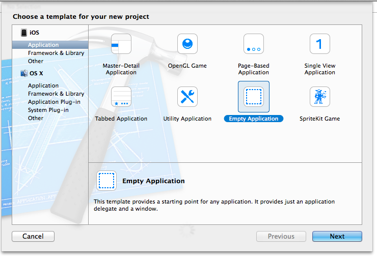
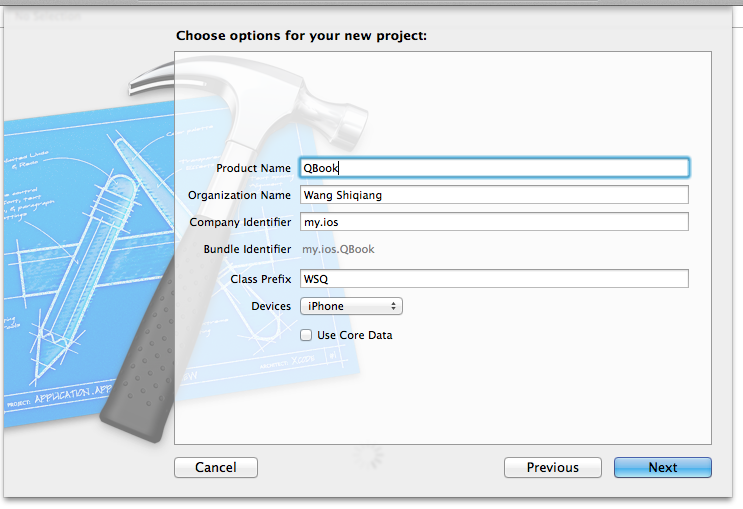
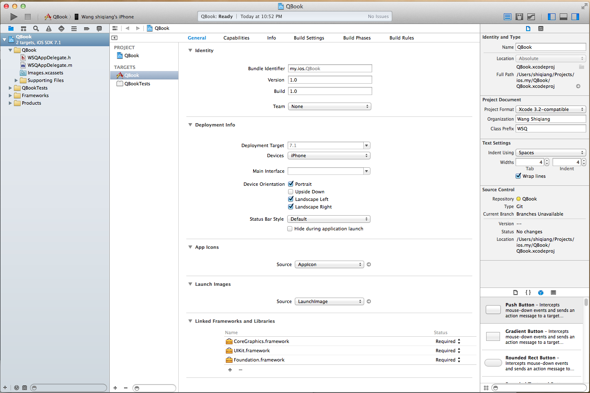
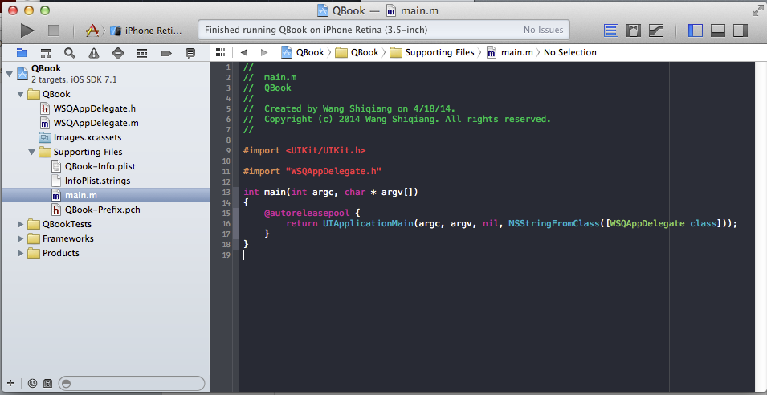
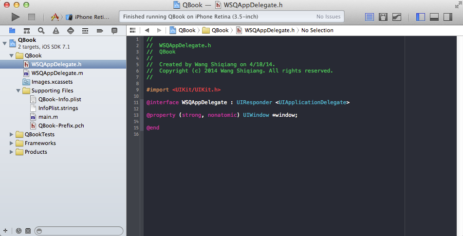
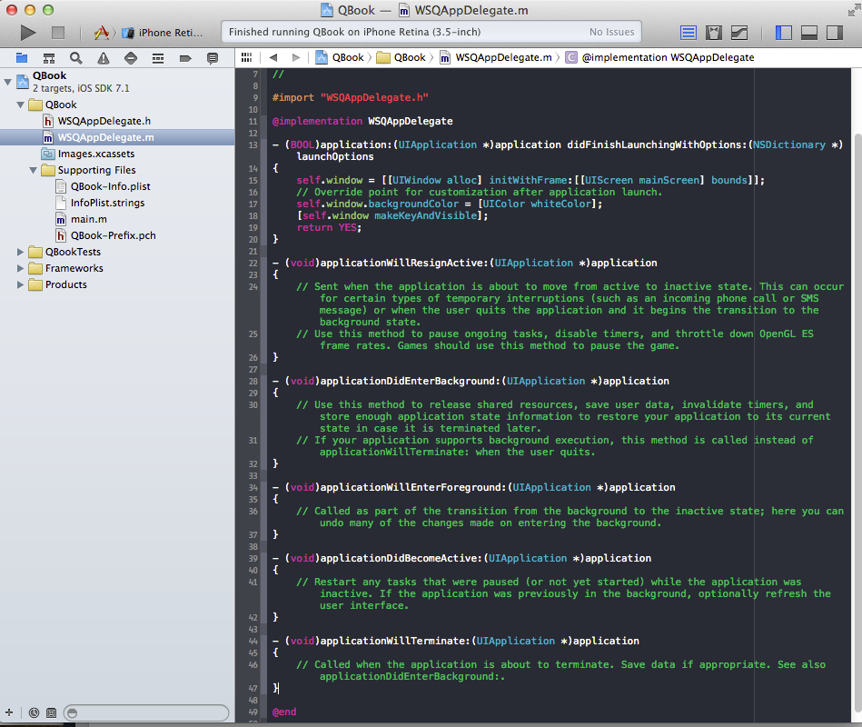
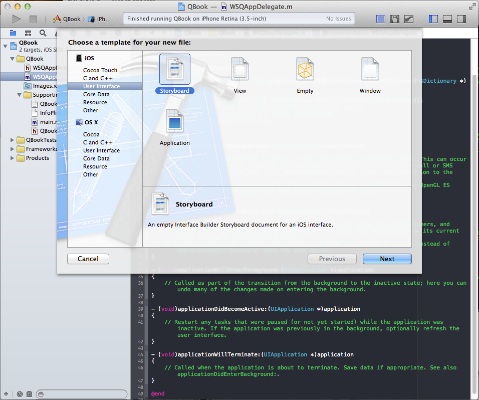
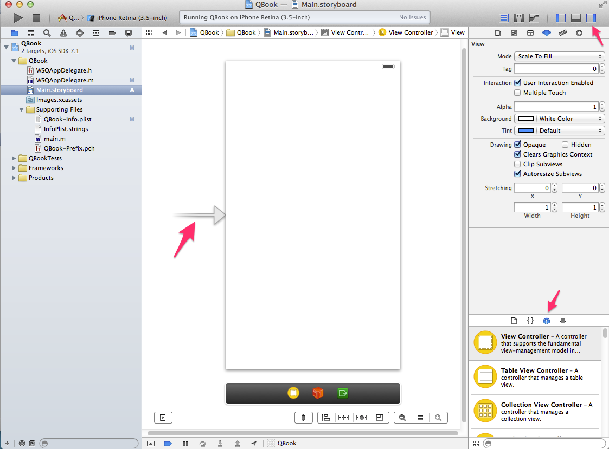

iOS开发需要一台Mac电脑、Xcode以及iOS SDK。因为苹果设备都具有自己封闭的环境，所以iOS程序的开发必须在Mac设备上完成（当然，黑苹果应该也是可以的，但就需要花很多的精力去折腾基础环境），Xcode是一个集成开发环境，包括了编辑器、调试、模拟器等等一系列方便开发和部署的工具，iOS SDK则是开发应用所必需，不同的SDK分别对应不同的iOS版本或设备，通常我们需要下载多个iOS SDK以确保我们开发的程序能够在不同版本的iOS上正常运行。

**创建新工程**

Xcode提供了很多种工程模版，包括Master-Detail Application、OpenGL Game、Page-Based Application、Single View Application、Tabbed Application、Utility Application、Empty Application等。选择“File->New->Project”弹出下面的对话框。我们这里选择一个Empty Application，通过这个来学习了解iOS程序的结构。

点击Next后，继续到下一个界面。填写产品名称和类前缀、公司标识等信息。

点击Next，会提示选择工程存放的文件夹，选择完成后，就会弹出下面的界面。这个界面就是Xcode的工作界面。Xcode作为一个IDE开发环境，为我们提供了iOS程序开发所需要的一切。编译器、调试工具、模拟器、编辑器、版本控制等等。像所有的IDE工具一样，我们应当花一些时间来了解自己的工具，可以通过帮助或者其他的一些途径。本文就不再涉及Xcode的使用了。

因为我们的工程是基于模板创建的，所以基本的app环境已经设置好了。即便我们此时还没有输入任何代码，我们的空白程序已经可以运行了。要运行App，可以选择使用iOS Simulator（iOS模拟器）。模拟器可以提供不同类型的硬件的模拟，iPad、iPhone等等。可以通过点击工具栏左侧的运行图标，或者从菜单Product->Run，或者快捷键Command+R运行你的程序。

**********代码概览**

使用Empty Application创建的应用，会默认创建一些源代码文件来建立App运行的基础。大多数工作是在 UIApplicationMain 这个函数中完成的，这个函数通过 main.m 文件自动调用。UIApplicationMain 函数创建一个应用对象来创建App运行的基础环境，包括一个无限循环来响应程序中的事件。

下面来看看Main.m文件的主要内容。UIApplication使用了 @autoreleasepool 声明来支持App的内存管理。自动计数器Automatic Reference Counting（ARC）来跟踪对象的使用情况。

UIApplicationMain 的调用创建了App的两个重要对象。1、一个UIApplication类的实例，也叫做 application object；2、一个WSQAppDelegate实例，也叫做app delegate。app delegate创建了一个空白的窗口来展示应用的内容，这就是我们定义应用的地方。图中的WSQAppDelegate的接口定义在 WSQAppDelegate.h中，实现定义在WSQAppDelegate.m中。

当应用启动的时候，application object 会调用app delegate中定义的方法，来完成特定的任务。app delegate的接口文件中，仅定义了一个UIWindow的属性。

WSQAppDelegate.m中定义了多个响应系统行为的函数，包括应用启动、激活、进入后台等等。我们也可以在这些方法中加入自己的处理逻辑。

**创建Storyboard**

Storyboard是App用户界面的可视化表现，现实屏幕内容以及各种过度效果。选择File->New->File(或者使用Command-N快捷键），选择下一步后在Device Family中选择iPhone，然后继续下一步选择文件保存的位置。Storyboard文件创建完成后，在工程的属性中指定Main Interface为创建的Storyboard。Storayboard只是一个空的容器，此时执行程序的话，并不能够获得任何界面，接下来需要在Storyboard中添加场景Scence。

选择Main.Storyboard，Xcode会打开Interface Builder，展现出一个空白的画布。然后打开Object Library，找到View Controller，拖拽到Storyboard中就可以了。可以看到View Controller左侧有一个箭头，这个表示当前的Scene是App的初始化界面，这个时候我们可以运行程序，在模拟器中看到这个空白的界面，表明我们所有的配置都是成功的。

接下来，我们就可以选择把Label、Input等各种控件拖到View Controller上来为自己的应用进行布局了，还可以调整字体大小、颜色等等选项，初级的App创建就这样完成了。
****

参考资料：
1、[Start Developing iOS Apps Today](https://developer.apple.com/library/iOS/referencelibrary/GettingStarted/RoadMapiOS/FirstTutorial.html#//apple_ref/doc/uid/TP40011343-CH3-SW1)

