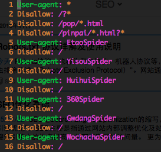
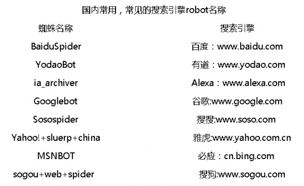

一、Robots.txt协议
Robots协议，也称为爬虫协议、机器人协议等，其全称为“网络爬虫排除标准（Robots Exclusion Protocol）”。网站通过Robots协议告诉搜索引擎哪些页面可以抓取，哪些页面不能抓取。也既是Robots的用法有两种，一种是告诉搜索引擎哪些页面你不能抓（默认其他的就可以抓）；一种是告诉搜索引擎你只能抓取哪些页面（默认其他的不可以抓）。

当一个搜索机器人（蜘蛛）访问一个站点时，它会首先检查网站根目录下是否存在robots.txt，如果存在，就会按照文件中的内容确定访问范围，如果不存在，则沿着链接抓取。

**协议的历史**

Robots Exclusion Protocol协议是由[Martijn Koster](https://en.wikipedia.org/wiki/Martijn_Koster)在1994年2月，于Nexor工作期间在 www-talk 邮件列表中提出的。该协议提出后，Koster的服务器甚至遭到了反对者的拒绝服务攻击。而该协议迅速成为事实上的标准，为大多数的人所接受。

**文件的写法：**

User-agent:*
*是一个通配符，表示所有的搜索引擎种类
Disallow:/admin/
这表示禁止搜索引擎爬寻admin目录下的内容
Disallow:*?*
这表示禁止搜索引擎爬寻包含?的网页
Sitemap:sitemap.xml
这里通过Sitemap指定固定的网站地图页面。目前对此表示支持的搜索引擎公司有Google, Yahoo, Ask and MSN。而中文搜索引擎公司，显然不在这个圈子内。这样做的好处就是，站长不用到每个搜索引擎的站长工具或者相似的站长部分，去提交自己的sitemap文件，搜索引擎的蜘蛛自己就会抓取robots.txt文件，读取其中的sitemap路径，接着抓取其中相链接的网页。

**京东的Robots.txt。（时间：2015-11-25）**

二、Robots.txt以外的内容

除了Robots.txt以外，还可以使用Robots Meta来向搜索引擎传递信息，先看示例如下：
＜META NAME="ROBOTS" CONTENT="INDEX,FOLLOW"＞
content部分有四个选项：index、noindex、follow、nofollow，指令间用“,”分隔。

共有四种组合：
＜META NAME="ROBOTS" CONTENT="INDEX,FOLLOW"＞
＜META NAME="ROBOTS" CONTENT="NOINDEX,FOLLOW"＞
＜META NAME="ROBOTS" CONTENT="INDEX,NOFOLLOW"＞
＜META NAME="ROBOTS" CONTENT="NOINDEX,NOFOLLOW"＞

其中：
＜META NAME="ROBOTS" CONTENT="INDEX,FOLLOW"＞可以写成＜META NAME="ROBOTS" CONTENT="ALL"＞；
＜META NAME="ROBOTS" CONTENT="NOINDEX,NOFOLLOW"＞可以写成＜META NAME="ROBOTS" CONTENT="NONE"＞

目前看来，绝大多数的搜索引擎机器人都遵守robots.txt的规则，而对于Robots META标签，目前支持的并不多，但是正在逐渐增加，如著名搜索引擎GOOGLE就完全支持，而且GOOGLE还增加了一个指令“archive”，可以限制GOOGLE是否保留网页快照。例如：
＜META NAME="googlebot" CONTENT="index,follow,noarchive"＞
表示抓取该站点中页面并沿着页面中链接抓取，但是不在GOOLGE上保留该页面的网页快照。

三、Robots.txt使用上应注意的一些问题

1、每当用户试图访问某个不存在的URL时，服务器都会在日志中记录404错误（无法找到文件）。每当搜索蜘蛛来寻找并不存在的robots.txt文件时，服务器也将在日志中记录一条404错误，所以你应该在网站中添加一个robots.txt。

2、如果后台和前台在一个域名下，不希望爬虫抓取后台程序的，可以在Robots.txt明确不让爬虫抓取的目录。但这会不会被某些恶意分子一下子就能够知道后台目录呢？

3、国内常见搜索机器人的名字

参考资料：
1、[Robots协议](http://baike.baidu.com/link?url=4bmJ0pVWcEcXFXr12RhSUQUErwFXlnBDTwTdoBgzln5Z7_f4w17iak5F1lARYjiqIg8oKP0j5wjvdNRTTbYNUPWqWShsXPG1UtmtrMgZq05FcchgcTsngyfrwLUKCLJ9)
2、[如何使用Robots及其详解](http://www.cnblogs.com/yuzhongwusan/archive/2008/12/06/1348969.html)
3、[详细的Robots.txt学习方法](http://www.chinaz.com/web/2011/1117/221058_2.shtml)
4、[Robots Exclusion standard](https://en.wikipedia.org/wiki/Robots_exclusion_standard)
5、[The web robots page](http://www.robotstxt.org/)
