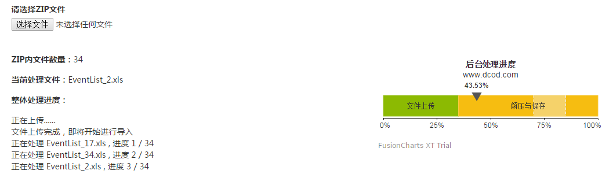

本文要解决两个问题：
1、在ajax的数据交互中，如何获得后台的处理进度？
2、在前台界面中，如何使用图形化的方式展示后台处理进度？

关于第一个问题，不是本文的重点，简单说一下思路。因为HTTP协议实际上是无状态的协议，前台的请求提交给后台之后，一般情况下都是后台处理完成才会向前台返回处理结果。如果想前台展示处理进度，有三个方法：

**一、使用flush()函数**。PHP中提供了 flush() 和 ob_flush() 函数，允许用户将缓存的内容输出，但是如果在服务器端使用了gzip压缩，这种方法常常会失效。另外，这种办法实际上是一个流式的结果输出，在形式上很难有美观的展现。

二、**使用JS控制任务进度**。更好的办法我觉得应该是使用JS在前端来控制多个任务提交的顺序，从而在前端计算整体的进度来用图形化的方式展现。

三、**后台实现进度记录，前台进行展现**。也可以采用后端使用持久化数据来记录整体计划于当前进度，前端JS定时异步调用查询结果的方式来实现前端的展示。我在一个Zip文件包解压并处理的程序中采用了第二种方式，大家可以根据项目的具体情况来选用。

下面来说如何用 Fusion charts 实时展现后台进度，本文只实现简单的有一个任务进度展示的情况。实际上 Linear Gauge 非常强大，可以支持多个指示标志，本文就不做考虑，只考虑实现一个简单的进度指示标志的情况。

完成后的效果如下图，用户选择一个Zip文件包进行上传，JS完成后台上传、解压缩与文件处理的操作。使用FusionCharts进行图形化的进度显示。


其中文件上传使用了jQuery的AjaxUpload插件，文件上传部分的JS代码如下：

```javascript
$('#userfile').AjaxFileUpload({
  action: '/tool/uploadZip',
  onChange:function(filename){
    //console.log("Change");
    $('#tip_text').text("正在上传");
    interval = window.setInterval(function() {
      vartext = $("#tip_text").text();
      if(text.length < 13) {
        $('#tip_text').text(text + ".");
      }else{
        $('#tip_text').text("正在上传");
           }
      
      $.cookie('progress', 20);
    }, 200);
    //$("#tip_text").append("文件上传开始");
  },
  //secureuri: false,
  //fileElementId:'test',
  onSubmit:function(filename) {
    returntrue;
  },
  onComplete:function(filename, response) {
    window.clearInterval(interval);
    
    $("#file_count").html( response.zip_info.file_list.length );
    $("#tip_text").append("<br />
```


文件上传完成，即将开始进行导入");28$.cookie('progress', 40);2930zip_import(response, 0, response.zip_info.file_list.length);31}32});

文件上传后，使用JS记录下上传的文件以及Zip包内文件的数量，然后开始使用JS控制逐个文件的提交。这一部分处理的难点主要在于Zip的解压和进度控制。Zip的解压有PHP的ZipArchive类，可以很方便的获取Zip内的文件列表，以及指定读取某个文件。当获取了Zip文件包的列表数量之后，我就可以在前台使用JS控制逐个文件的读取。


最后就是整个过程的图形化界面显示，FusionCharts部分的代码如下：
```javascript
1FusionCharts.ready(function(){2varfusioncharts =newFusionCharts({3type: 'hlineargauge',4renderAt: 'realchart',5id: 'realtime-chart',6width: '400',7height: '170',8dataFormat: 'json',9dataSource: {10"chart": {11"theme": "fint",12"caption": "后台处理进度",13"subcaption": "www.dcod.com",14"lowerLimit": "0",15"upperLimit": "100",16"numberSuffix": "%",17"chartBottomMargin": "40",18"valueFontSize": "11",19"valueFontBold": "0"20},21"colorRange": {22"color": [{23"minValue": "0",24"maxValue": "35",25"label": "文件上传",26}, {27"minValue": "35",28"maxValue": "100",29"label": "解压与保存",30}]31},32"pointers": {33"pointer": [{34"value": "0"35}]36},37"trendPoints": {38"point": [39//Trendpoint40{41"startValue": "70",42"displayValue": " ",43"dashed": "1",44"showValues": "0"45}, {46"startValue": "85",47"displayValue": " ",48"dashed": "1",49"showValues": "0"50},51//Trendzone52{53"startValue": "70",54"endValue": "85",55"displayValue": " ",56"alpha": "40"57}58]59}60},61"events": {62"rendered":function(evtObj, argObj){63evtObj.sender.intervalVar = setInterval(function(){64console.log("Txt x");65//定时获取服务端的数据66varprcnt = $.cookie('progress');6768//将数据提交给图表69FusionCharts.items["realtime-chart"].feedData("value=" +prcnt);70}, 5000);71},72"disposed":function(evtObj, argObj){73console.log('disposed');74clearInterval(evtObj.sender.intervalVar);75}76}77}78);7980fusioncharts.render();81});
```

FusionCharts设置了一个轮训间隔，不断地从后台查询数据。因为我的后台处理过程都是在领带的ajax请求中完成的，所以采取了一个折衷的办法，ajax请求完成后，将进度写入到cookie中，然后FusionCharts定时从cookie中读取进度来进行展示。


注：我使用的版本是Fusion Charts Suite XT

参考资料：
1、[Fusion Charts Linear Gauge](http://www.fusioncharts.com/dev/gauge-and-widgets-guide/linear-gauge/introduction.html)
2、AjaxFileUpload
3、[实现jQuery的Ajax文件上传](http://blog.163.com/zhou_shj/blog/static/6555644420104503138229/)
4、[jQuery Cookie](https://github.com/carhartl/jquery-cookie)


