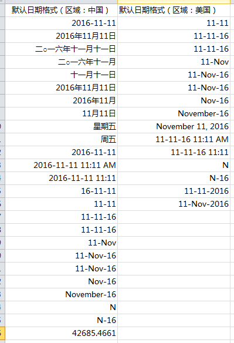
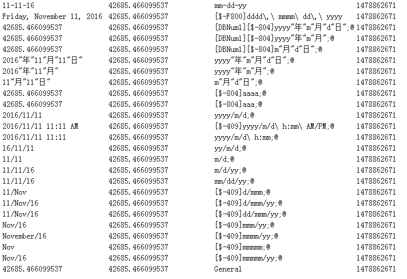
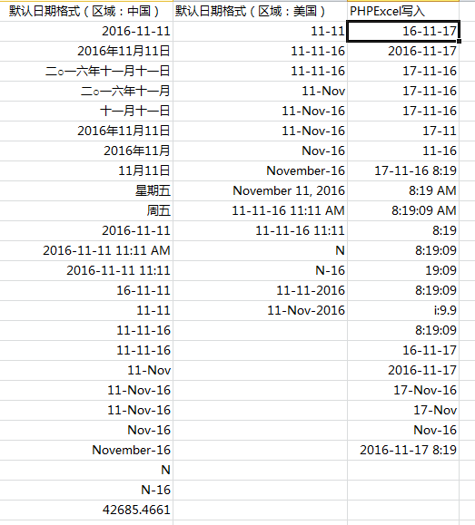

PHPExcel是一款优秀的处理Excel文件读写的开源PHP Library，能够给我们提供强大的Excel读写能力，本文针对Excel处理过程中关于日期和时间类型的处理进行深入的讨论。PHPExcel最新的版本是2014年3月2日发布的[1.8.0](http://phpexcel.codeplex.com/)版本，后来项目迁移到了GitHub，后续的版本已经更名为[PHPSpreadSheet](https://github.com/PHPOffice/PhpSpreadsheet#want-to-contribute)。

一、Excel中的日期和时间类型
Excel中的日期存储的是数值类型，计算的是从1900年1月1日到现在的数值。例如2008-12-31实际上存储的是39813。可以在Excel中验证，首先在一个单元格中输入2008-12-31，然后将单元格格式修改为“常规”，然后就会看到单元格内容变成了39813。

Excel中的时间是一个从0到0.99999999之间的小数值，表示从00:00:00（12:00:00 AM）到23:59:59（11:59:59 PM）之间的时间。例如12:00 PM的数值是0.5，表示一天的一半。

Excel 2007版本中提供了24种默认的日期类型格式，其中带星号的两个会和系统时区绑定（这样在不同时区的电脑之间传递文件时，时间会发生变化）其他的则不会根据时区发生变化。时间则提供了11种格式。

二、使用PHPExcel读取Excel中的日期和时间类型

我制作了一个模板Excel文件，按照中文日期类型输入了24个日期值，如下所示：

使用下面这段代码来读取数据，可以看到，在PHPExcel预置了格式的可以正常显示，否则会显示数值。注意如果打开了setReadDataOnly这个选项，则getFormattedValue函数将总是返回数值。

require_once '/libs/PHPExcel-1.8.0/Classes/PHPExcel.php';
require_once '/libs/PHPExcel-1.8.0/Classes/PHPExcel/IOFactory.php';
require_once '/libs/PHPExcel-1.8.0/Classes/PHPExcel/Shared/Date.php';

$filename = "PHPExcel_Date.xlsx";
$objReader = PHPExcel_IOFactory::createReaderForFile($filename);
//$objReader->setReadDataOnly(true);
$objPHPExcel = $objReader->load($filename);
$data['sheetsinfo'] = $objReader->listWorksheetInfo($filename);
$objWriter = '';

$objPHPExcel->setActiveSheetIndex(0);
$worksheet = $objPHPExcel->getActiveSheet();
$columnCount = PHPExcel_Cell::columnIndexFromString( $worksheet->getHighestColumn() );
$rowCount = $worksheet->getHighestRow();

echo "<table>";
for($row = 1; $row <= $rowCount; $row++){
$cell = $worksheet->getCellByColumnAndRow(0, $row);
$cellstyleformat = $worksheet->getStyle($cell->getCoordinate())->getNumberFormat();
$formatcode = $cellstyleformat->getFormatCode();

$f_value = $cell->getFormattedValue();
$value = $cell->getValue();
$p_value = PHPExcel_Shared_Date::ExcelToPHP($value);

echo "<tr><td>$f_value</td><td>$value</td><td>$formatcode</td><td>$p_value</td></tr>";
}
echo "</table>";

返回的结果：

第一列是读取格式化之后的数据，可以看到部分格式没有能够正常显示，是因为PHPExcel预置的日期格式没有匹配到，导致按照数值进行显示。第二列是直接获取数值。第三列是格式化代码。最后一列是转化为PHP格式的时间。

三、使用PHPExcel写入格式化后的日期和时间数据

PHPExcel中提供了22种默认的日期格式，我们可以将日期进行格式化后写入，这样Excel打开的时候看到的就是格式化后的时间，运行以下代码（接上面的部分）。

$objWriter = PHPExcel_IOFactory::createWriter($objPHPExcel,'Excel2007');
$worksheet->setTitle("Date Test");
$phpexcel_date_format = array(PHPExcel_Style_NumberFormat::FORMAT_DATE_YYYYMMDD, PHPExcel_Style_NumberFormat::FORMAT_DATE_YYYYMMDD2, PHPExcel_Style_NumberFormat::FORMAT_DATE_DDMMYYYY, PHPExcel_Style_NumberFormat::FORMAT_DATE_DMYSLASH, PHPExcel_Style_NumberFormat::FORMAT_DATE_DMYMINUS, PHPExcel_Style_NumberFormat::FORMAT_DATE_DMMINUS, PHPExcel_Style_NumberFormat::FORMAT_DATE_MYMINUS, PHPExcel_Style_NumberFormat::FORMAT_DATE_DATETIME, PHPExcel_Style_NumberFormat::FORMAT_DATE_TIME1, PHPExcel_Style_NumberFormat::FORMAT_DATE_TIME2, PHPExcel_Style_NumberFormat::FORMAT_DATE_TIME3, PHPExcel_Style_NumberFormat::FORMAT_DATE_TIME4, PHPExcel_Style_NumberFormat::FORMAT_DATE_TIME5, PHPExcel_Style_NumberFormat::FORMAT_DATE_TIME6, PHPExcel_Style_NumberFormat::FORMAT_DATE_TIME7, PHPExcel_Style_NumberFormat::FORMAT_DATE_TIME8, PHPExcel_Style_NumberFormat::FORMAT_DATE_YYYYMMDDSLASH, PHPExcel_Style_NumberFormat::FORMAT_DATE_XLSX14, PHPExcel_Style_NumberFormat::FORMAT_DATE_XLSX15, PHPExcel_Style_NumberFormat::FORMAT_DATE_XLSX16, PHPExcel_Style_NumberFormat::FORMAT_DATE_XLSX17, PHPExcel_Style_NumberFormat::FORMAT_DATE_XLSX22);

foreach ($phpexcel_date_format as $key => $value) {
//$cell = $worksheet->getCellByColumnAndRow(2, $key + 1);
//$cell->setValue(time())->setFormatCode($value);
$worksheet->setCellValue('C'.($key+2), PHPExcel_Shared_Date::PHPToExcel(time()));
$worksheet->getStyle('C'.($key+2))->getNumberFormat()->setFormatCode($value);
echo time() . "-" . $value;
}

$objWriter->save($filename);

可以看看文件保存后的结果。

至此，我们基本上可以自如的处理Excel的日期字段的读取和写入了。

参考资料：
1、[https://github.com/PHPOffice/PHPExcel](https://github.com/PHPOffice/PHPExcel)
2、[Codeplex PHPExcel](http://phpexcel.codeplex.com/)
3、[Github PHPSpreadsheet](https://github.com/PHPOffice/PhpSpreadsheet)
4、[http://stackoverflow.com/questions/16708471/phpexcel-getcalculatedvalue-returns-value](http://stackoverflow.com/questions/16708471/phpexcel-getcalculatedvalue-returns-value)
5、[http://phpexcel.codeplex.com/discussions/371418](http://phpexcel.codeplex.com/discussions/371418)
6、[http://stackoverflow.com/questions/17601417/phpexcel-date-being-parsed-incorrectly](http://stackoverflow.com/questions/17601417/phpexcel-date-being-parsed-incorrectly)

