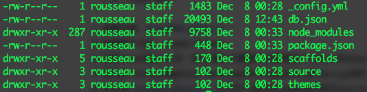

很久之前就知道Github可以发布自己的博客，因为仅支持静态文件，一直懒于动手自己进行编辑。再了解到还存在[JekyII](https://hexo.io/)和[Hexo](https://hexo.io/)这样的内容生成框架后，终于决定体验一下。

### 一、本地环境准备。
[Github Pages](https://pages.github.com/)的申请过程就不再搬砖，Github的[页面](https://pages.github.com/)上说的很清楚，注意每个用户只能创建一个与自己用户名相同的Pages。
Pages申请好之后，可以克隆到本地的文件夹，这样 hexo 运行的文件夹就准备好，可以开始准备本地的hexo环境。
hexo需要有nodes和nam的支持，我先安装了[6.9.2版本的node](https://nodejs.org/dist/v6.9.2/node-v6.9.2.pkg)，使用的是安装包，当然也可以使用[homebrew](http://brew.sh/)等工具。安装hexo很简单：
```bash
$ npm install hexo-cli -g
```
然后进入到 github Pages 的本地目录执行：
```bash
hexo init blog
cd blog
nam install
hexo server
```
当看到Hexo is running的提示之后，就可以按照提示的地址在浏览器中预览博客效果了。



_config.yml 是博客的配置文件，能够定义博客名称、作者等各种全局的参数。
package.json 应用数据，EJS、Sylus、Markdown三个渲染工具是默认安装的，如果不需要刻意卸载。但是对于最终要是使用 Markdown 来编辑博客的我来说，那是必不可少的。
source 文件夹，文章原始的 md 文件都放在这个文件夹下面。通过生成器会对该文件夹下的 markdown、html 文件进行解析，其他的文件只做拷贝，放入 public 文件夹。
themes 主题文件夹，默认的主题为 landscape。

### 二、主题更换。
默认的主题美观性基本上没有，hexo 支持自己开发博客主题，但是刚开始的时候最好还是选择一个比较成熟的主题先上手。hexo 官方有一个提供预览图的[列表](https://hexo.io/themes/)，也有一个更完整的[列表](https://github.com/hexojs/hexo/wiki/Themes)，我这里要使用的是[yilia](https://github.com/litten/hexo-theme-yilia)，后续考虑自己定义一个。
更换theme的步骤包括获取 theme 文件，修改配置，可以参考 yilia 的文档进行。

### 三、生成与发布
编辑完自己的文章后，本地预览觉得效果还可以的话，就可以生成等待发布的页面了。
```bash
hexo generate
```
执行完成后，可以在 public 文件夹下看到生成的文件。由此可以看到，hexo 中有原始的文档文件，也有发布后生成的网页文件。
修改 hexo 配置文件中关于部署的部分
```# Deployment
## Docs: https://hexo.io/docs/deployment.html
deploy:
type: git
repo: https://github.com/yourname/yourname.github.io.git
branch: hexo
```
至此，使用 hexo 搭建环境发布内容的工作就完成了，你可以通过[http://yourname.github.io](http://yourname.github.io)访问页面，查看效果。
为了让这两部分文件都保存下来，我们利用 git 中的分支功能。在本地环境查看有多少分支 git branch -a，一般只有一个 master。创建一个新的分支 git branch hexo
将分支推送到远程服务器 git push origin hexo，在 hexo 的配置文件中选择将内容发布到 hexo 而本地的源码提交到 master 中。
