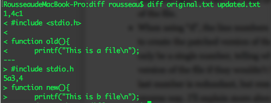
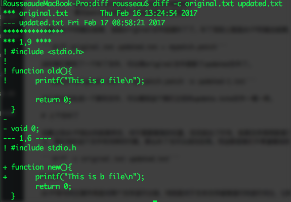
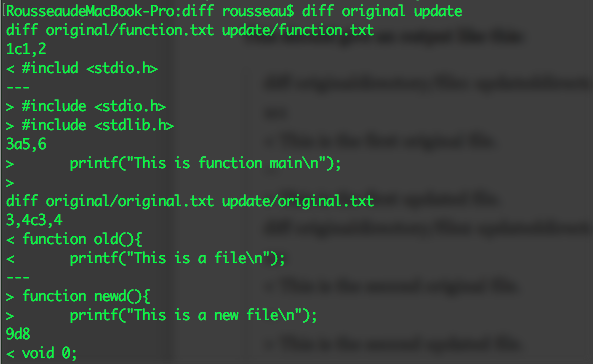
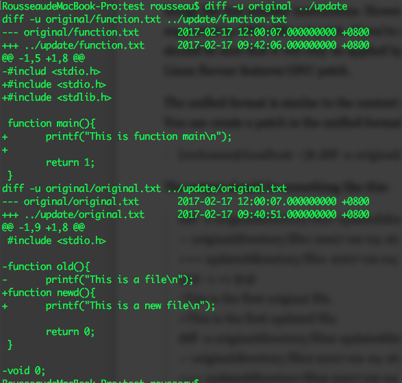

本文主要记录两个命令的学习情况：diff 和 patch。diff 和 patch 是一对工具，使用这对工具可以获取更新文件与历史文件的差异，并将更新应用到历史文件上。在数学上说，diff就是对两个集合的差运算，patch就是对两个集合的和运算。

# 简单的例子
使用这个例子来说明如何进行文件的对比和打补丁。
这里有两个文件 original.txt 和 updated.txt，如下：
```c
#include <stdio.h>

function old(){
        printf("This is a file\n");

        return 0;
}
```
```c
#include stdio.h

function new(){
        printf("This is b file\n");
        return 0;
}
```
执行```diff original.txt updated.txt```的结果为

下面先对结果中出现的一些符号做一些解释。```1,4c1```，这个内容输出实际上是给patch看的，表示告诉patch在original.txt文件中的1到4行应当被updated.txt中的内容替换，替换的内容是updated.txt的第1行。这里可能会出现三个字母表示不同的意义，分别是c表示更新、a表示追加、d表示删除。

> c表示在original文件中的m,n行的内容将要被updated文件中的内容替换。
a表示追加，这时左边的数字只能是一个数字，而不会是一个范围，表示向original文件中追加右侧数字表示内容。
d表示删除。左侧的数字可能是一个范围，表示要删除的内容，右侧是一个数字，表示如果没有被删除应该出现在updated文件的什么位置。也许有人觉得后边的数字是多余的，保留这个数字是因为补丁可以反向使用。
```<```表示patch应当将这个标志后面的内容删除。
```>```表示patch应当将这个标志后面的内容添加。

了解了diff的输出结果，该给original文件创建补丁了。补丁实际上就是diff的输出结果，我们可以直接将输出结果保存成文件，也可以使用管道符号做这件事，如下：
```diff original.txt updated.txt > mypatch.patch```
这时我们就有了一个补丁文件，可以将original文件更新了updated文件了。
```patch original.txt -i my patch.patch -o updated-1.txt```
这个命令会生成一个新的文件，可以看到这个我们之前的update.txtw文件一模一样。

# 上下文补丁
观察之前diff给出的结果样式，对于需要替换的位置，仅仅给出了行号，如果文件突然新增了一个空行，补丁应用的时候就会发生问题。另外一种情况，如果将补丁文件应用到了一个错误的源文件上，假如恰好这个文件有同样的行数，那么补丁也可以成功应用。而这都是我们不希望看到的结果。幸好，diff提供了一种不同的结果样式来避免上面的这些问题。
```diff -c original.txt updated.txt```

比较结果中包含了文件名，这样我们在应用补丁的时候，就不用输入文件名，从而节省了时间，避免了文件名输入错误的可能。文件名后都跟着文件的修改时间。再往下就是15个星号 * 表示后面的内容为文件替换、更新、删除等。```*```和```-```包含的数字或者数字范围表示行号，```!```开始的内容表示需要替换的内容，```-```表示需要删除的内容，```＋```表示需要增加的内容，patch会依据这个上下文关系对文件进行更新。
```patch -i mypatch2.patch -o updated.txt```
注意，这里如果不指定输出文件的话，源文件就会被更新（这本来就是补丁文件的作用）。通常我们都会对源文件应用补丁，通常需要对多个文件进行处理。

# 比较多个文件并应用补丁
比较多个文件最简单的办法就是直接在命令后面跟文件夹，例如，如果包含子文件夹，记得加上 -r 参数。
```bash
diff originaldirectory updateddirectory
```

也可以看看上下文比较的结果

```bash
RousseaudeMacBook-Pro:diff rousseau$ diff -c original update
diff -c original/function.txt update/function.txt
*** original/function.txt     Fri Feb 17 09:41:26 2017
--- update/function.txt     Fri Feb 17 09:42:06 2017
***************
*** 1,5 ****
! #includ <stdio.h>

  function main(){
       return 1;
  }
--- 1,8 ----
! #include <stdio.h>
! #include <stdlib.h>

  function main(){
+      printf("This is function main\n");
+
       return 1;
  }
diff -c original/original.txt update/original.txt
*** original/original.txt     Fri Feb 17 09:40:29 2017
--- update/original.txt     Fri Feb 17 09:40:51 2017
***************
*** 1,9 ****
  #include <stdio.h>

! function old(){
!      printf("This is a file\n");

       return 0;
  }

- void 0;
--- 1,8 ----
  #include <stdio.h>

! function newd(){
!      printf("This is a new file\n");

       return 0;
  }
```
下面来看看怎么对多个文件应用补丁，首先生成一个补丁文件，我们还是用上下文的格式。```diff -c original update > directory.patch```
在一个新的目录下拷贝 original 文件夹和补丁文件，执行```patch -i directory.patch```，此时会提示找不到文件，因为patch会在当前文件夹查找文件（默认情况下patch会将文件名前的所有文件夹去掉）因为此时补丁文件在文件夹外面，所以我们应当告诉patch不要这么做，使用```-p```参数。
```patch -p0 -i directory.patch```
> 也许有人会问，如果我把补丁文件移动到文件夹中进行打补丁操作不就可以了嘛，注意千万不要这么做。如果文件夹中还有子文件夹，那么patch不会到子文件夹中寻找文件，这样就会对结果产生影响，特别是在不同文件夹中有相同名字的文件的时候。


# 还原补丁文件的操作
有时候版本需要进行回撤，这时可以使用 -R 参数。
```patch -p0 -R -i directory.patch```

# Unified Format
GNU的diff和patch还提供了一种格式，称为**the unified format**。这个格式更加精简，与上下文格式类似。但是不再将源文件和更新文件分开，而是组合在一起。并且没有特殊的替换标志，只有**-**和**+**。
```diff -u original update```


# 写在最后
对文本文件进行patch操作时，提前备份是一个好习惯，这可以避免你在弄错的情况下，面临一堆无法恢复的文件发愁。

参考资料：
1、[Using Diff and patch](https://linuxacademy.com/blog/linux/introduction-using-diff-and-patch/)
2、[Diff比较两个文件夹](http://blog.chinaunix.net/uid-14735472-id-111118.html)
3、[GNU Diff and patch](http://www.gnu.org/software/diffutils/manual/html_mono/diff.html)


