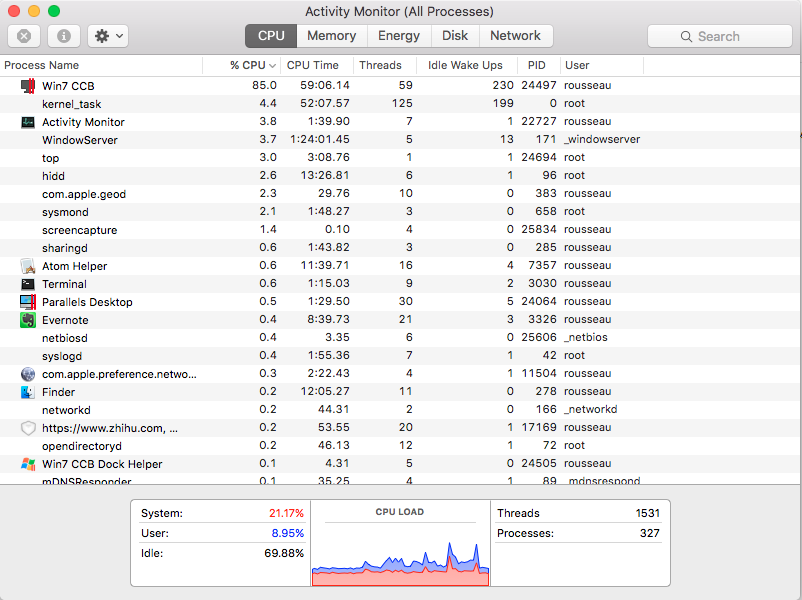
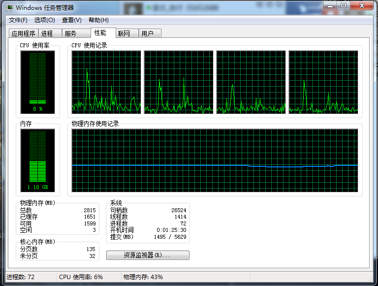
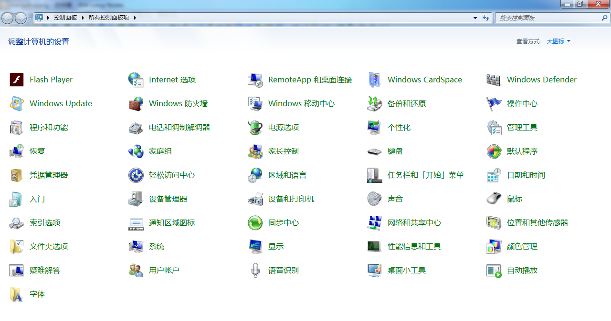
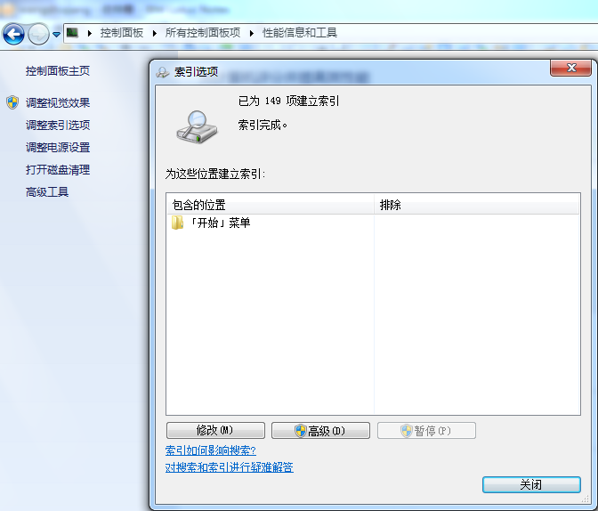
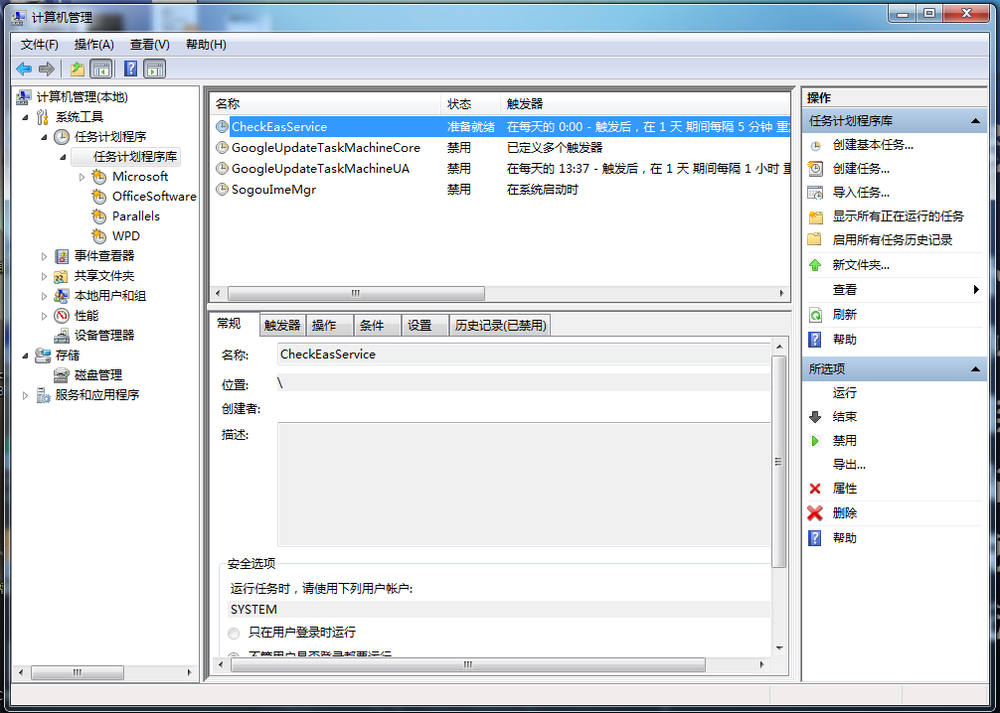
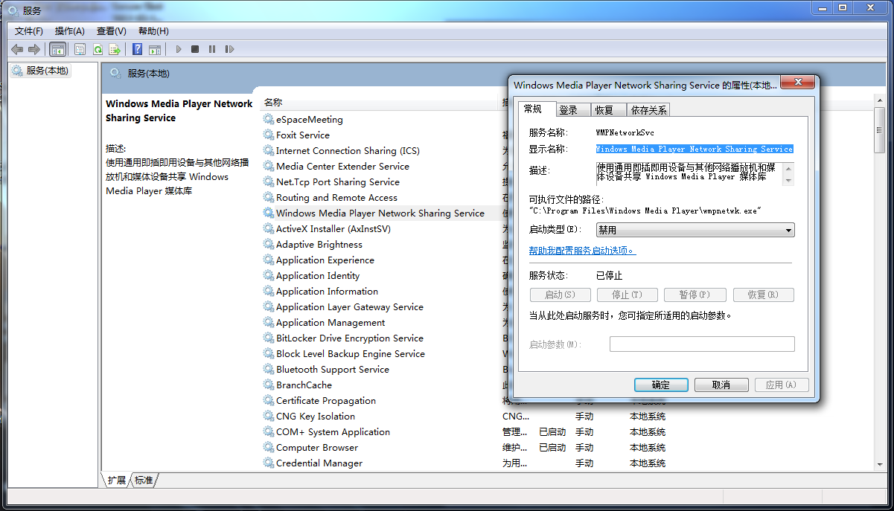

对于所有喜欢Mac操作系统的用户来说，如果办公环境必须使用Windows及Windows程序，那一定会非常崩溃，因为你很可能使用了**Parallels Desktop**来运行你的Windows虚拟机，那么你将会体验风扇狂转、机器发烫的感觉。此时，如果在终端中查看一下进程，会看到**prl_vm_app**消耗的CPU往往会在100%以上，也可以使用 Activity Monitor 查看一下。

而此时查看Windows的资源消耗情况，会发现其实没什么进程在消耗。

这种情况经常发生让我不得不为自己2011年购买的Macbook Pro担心，经过一番搜索，发现了以下几个办法，能够减少风扇狂转的频率，希望对大家能有帮助。

## 关闭 Windows 索引服务
1、在控制面板中找到“性能信息和工具”

2、选择左侧的“调整索引选项”，将能够关闭的索引位置都关闭了。

# 关闭不必要的定时任务
1、在“开始”->“计算机”上点击右键，选择管理。
2、找到**任务计划程序**，关闭一些不必要的自动更新程序，以及Windows的Defrag（磁盘碎片整理）等计划任务

# 关闭不必要的服务
1、在运行中输入**services.msc**，打开服务窗口
2、根据“启动类型”筛选出自动启动的程序，选择一些不必要禁用，特别是“Windows Media Player Network Sharing Service”

使用了这几个方法，一般能够缓解风扇狂转的情况。如果你有更好的办法，欢迎分享给我。

当然，也有用户说**Fusion**从来没出过这种情况，哪位用过的朋友能现身说法来验证一下?

参考资料：
1、[prl_vm_app @ 99.9% CPU on Mac OS X 10.7](https://forum.parallels.com/threads/prl_vm_app-99-9-cpu-on-mac-os-x-10-7.112661/page-4)

