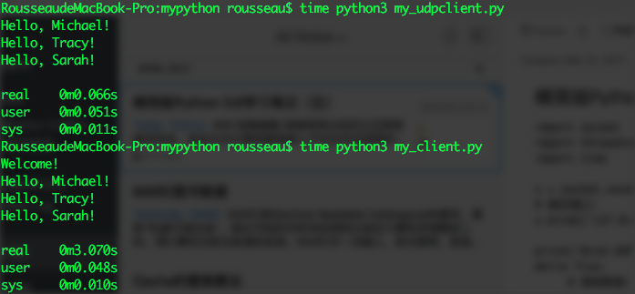

### 网络编程
网络程序出现的比互联网要早很多，实现方式主要依靠网络上不同主机间进程的通信，通信协议最重要的是TCP/IP协议。在这两个协议基础上还有很多更高级的协议，包括HTTP、SMTP等。要进行两个主机间的网络通信，必须四个元素：源地址、源端口号、目的地址、目的端口号。


#### TCP编程
Socket是网络编程一个抽象概念，通常我们用一个Socket表示“打开了一个网络链接”，而打开一个Socket需要知道目标计算机的IP地址和端口号，再指定协议类型即可。示例代码实现了一个服务端和客户端，服务端将客户端发送的内容回显给客户端，一切都是在命令行下执行。图形界面原理一样。
```python
import socket
import threading
import time

#服务端代码
s = socket.socket(socket.AF_INET, socket.SOCK_STREAM)
s.bind(('127.0.0.1', 9999))

#开始监听端口，参数表示最大连接数
s.listen(5)     
print("Waiting for connection...")

def tcplink(sock, addr):
     print('Accept new connection from %s:%s...' % addr)
     sock.send(b'Welcome!')
     while True:
          data = sock.recv(1024)
          time.sleep(1)
          if not data or data.decode('utf-8') == 'exit':
               break
          sock.send(('Hello, %s!' % data.decode('utf-8')).encode('utf-8'))
     sock.close()
     print('Connection from %s:%s closed.' % addr)

while True:
     sock, addr = s.accept()
     t = threading.Thread(target=tcplink, args=(sock, addr))
     t.start()
```
客户端代码
```python
import socket

s = socket.socket(socket.AF_INET, socket.SOCK_STREAM)
# 建立连接:
s.connect(('127.0.0.1', 9999))
# 接收欢迎消息:
print(s.recv(1024).decode('utf-8'))
for data in [b'Michael', b'Tracy', b'Sarah']:
     # 发送数据:
     s.send(data)
     print(s.recv(1024).decode('utf-8'))
s.send(b'exit')
s.close()
```

#### UDP编程
TCP建立了双方之间的可靠连接，通信双方都可以用流的方式发送数据。UDP则是面相无连接的协议，使用UDP协议时，不需要建立连接，只需要知道对方的IP和端口号，就可以直接发送数据包。但是对方是否能够收到就不知道了。它的优点是速度快。
服务端代码
```python
import socket
import threading
import time

s = socket.socket(socket.AF_INET, socket.SOCK_DGRAM)
# 绑定端口:
s.bind(('127.0.0.1', 9999))

print('Bind UDP on 9999...')
while True:
     # 接收数据:
     data, addr = s.recvfrom(1024)
     print('Received from %s:%s.' % addr)
     s.sendto(b'Hello, %s!' % data, addr)
```
客户端代码
```python
import socket
import threading
import time

s = socket.socket(socket.AF_INET, socket.SOCK_DGRAM)
for data in [b'Michael', b'Tracy', b'Sarah']:
     # 发送数据:
     s.sendto(data, ('127.0.0.1', 9999))
     # 接收数据:
     print(s.recv(1024).decode('utf-8'))
s.close()
```
做了一个简单的对比，可见UDP的传输方式比TCP快了很多。


### Web开发
随着互联网流行起来的B/S模式是Web开发的主要内容，包括客户端展现（HTML、CSS、JAVASCRIPT）以及服务端处理（静态内容、CGI、动态语言）。Python提供了很多Web开发框架，能够为我们提供Web开发的快速支持。
开始WEB开发的话我觉得最好从HTML入手，然后了解HTTP协议，这些熟悉之后逐步熟悉CSS、Javascript，然后了结合后台编程语言，完成自己编写网站的小目标。
笔者是从PHP学习开始Web开发的，接触Python的Web开发还沿用PHP的思路会产生一些迷惑。PHP从产生之初就是作为Web开发语言而设计的，PHP是作为Apache的模块来进行请求处理和响应的，与HTTP相关的很多基础处理都是由Apache完成的，mod_php模块与其对接生成类似$_POST，$_GET的对象供PHP脚本使用。
Python有所不同，Python是作为一种通用脚本处理语言产生的，所以它能够完成的工作更多，也可以作为Web开发语言，只是方式不同。如果Python作为服务端脚本语言，可以分几个层次：如果Python负责处理所有的事务，包括TCP链接、逻辑处理、内容响应，Python也是可以胜任的，但是这样开发要做的工作就非常多；如果Python只是负责生成HTML文档，前端使用Apache等，Pyhon只需要负责文档解析。实现这个层次，是因为Python提供了WSGI接口（Web Server Gateway Interface），这时Python的焦点放在接口处理和Web逻辑处理上。第三个层次就是使用Python的Web框架，现在有很多成熟的框架，包括Django、Flask等。这样，Python就主要关注Web处理，包括URL以及对应的函数处理。
先看一下使用WSGI接口编写简单的Web程序，返回一个简单的文字。
```python
# server.py
# 从wsgiref模块导入:
from wsgiref.simple_server import make_server
# 导入我们自己编写的application函数:
from hello import application

# 创建一个服务器，IP地址为空，端口是8000，处理函数是application:
httpd = make_server('', 8000, application)
print('Serving HTTP on port 8000...')
# 开始监听HTTP请求:
httpd.serve_forever()
```
```python
# hello.py

def application(environ, start_response):
     start_response('200 OK', [('Content-Type', 'text/html')])
     body = '<h1>Hello, %s!</h1>' % (environ['PATH_INFO'][1:] or 'web')
     return [body.encode('utf-8')]
```
使用WSGI的方式来进行Web开发，需要花很多精力来处理请求和响应的对应关系，这个时候可以引入框架。这里以Web.py框架为例。
```python
import web

urls = (
    '/(.*)', 'hello'
)
app = web.application(urls, globals())

class hello:        
    def GET(self, name):
        if not name:
            name = 'World'
        return 'Hello, ' + name + '!'

if __name__ == "__main__":
    app.run()
```
由此可见，使用框架后，我们可以将精力放在URL和对应的处理函数上。

### 正则表达式
正则表达式说起来是一个可以讲很久的话题，这里简单说一下 Python 中的使用。

#### re模块
Python提供re模块，包含所有正则表达式的功能。建议所有处理正则的部分都使用｀｀｀r｀｀｀开头，这样就不需要考虑转义的问题。
```python
>>> import re
>>> re.match(r'^\d{3}\-\d{3,8}$', '010-12345')
<_sre.SRE_Match object; span=(0, 9), match='010-12345'>
>>> re.match(r'^\d{3}\-\d{3,8}$', '010 12345')
>>>
```
如果匹配则返回一个Match对象，没找到则返回None。

#### 切分字符串
可以使用正则的切分字符串
```python
>>> re.split(r'\s+', 'a b   c')
['a', 'b', ‘c']
```

#### 分组
正则表达式中提供了```()```进行匹配结果的分组，如果正则表达式中定义了组，就可以使用```Match```对象的```group()```方法提取子串。```group(0)```表示的是原始字符串。
```python
>>> t = '19:05:30'
>>> m = re.match(r'^(0[0-9]|1[0-9]|2[0-3]|[0-9])\:(0[0-9]|1[0-9]|2[0-9]|3[0-9]|4[0-9]|5[0-9]|[0-9])\:(0[0-9]|1[0-9]|2[0-9]|3[0-9]|4[0-9]|5[0-9]|[0-9])$', t)
>>> m.groups()
('19', '05', '30')
```

### 常用内置模块

#### datetime
datetime是Python处理日期和时间的标准库。日期操作中，常用的包括获取当前日志、创建一个日期、计算两个日期的差值、判断日期的类型、日期与时间戳的相互转换、字符串与日期类型的相互转换，这些基本上看看例子就可以掌握。
> 在计算机中，时间实际上是用数字表示的。我们把1970年1月1日 00:00:00 UTC+00:00时区的时刻称为epoch time，记为0（1970年以前的时间timestamp为负数），当前时间就是相对于epoch time的秒数，称为timestamp。timestamp 与时区没有关系，datetime与时区有关系。
字符串'%Y-%m-%d %H:%M:%S'规定了日期和时间部分的格式。详细的说明请参考Python文档。字符串转换为日期类型后，默认是没有带时区信息的。

```python
from datetime import datetime, timedelta, timezone

# 获取当前时间
now = datetime.now()
print(now)

# 创建一个指定的日期
wt = datetime(2017,4,12,14,5,15)
print(wt)

# 将日期类型转换为时间戳
print( wt.timestamp() )

# 将时间戳转换为日期，加了一个小时
print( datetime.fromtimestamp(wt.timestamp() + 60*60 ) )

# 字符串转换为日期类型
cday = datetime.strptime('2017-4-12 18:19:59', '%Y-%m-%d %H:%M:%S')
print(cday)

# 将日期类型格式化为字符串显示
print(now.strftime('%A, %B, %d, %H:%m'))

# 日期类型也可以直接使用 + - 进行运算，引入timedelta可以计算差值
print(now - timedelta(days=1))
print(now + timedelta(days=1, hours=2))
```

#### collections
collections 是 Python 内建的一个集合模块，提供了许多有用的集合类。包括```namedtuple、deque```
tuple 可以表示不变集合，但是不方便从名称上看出用途。通过使用namedtuple函数，可以创建一个自定义的tuple对象，规定了tuple的个数，并且可以通过属性来访问元素。
使用 list 存储数据时，，按索引访问元素很快，但是插入和删除元素就很慢了，因为list是线性存储，数据量大的时候，插入和删除效率很低。deque是为了高效实现插入和删除操作的双向列表，适合用于队列和栈。deque除了实现list的```append()```和```pop()```外，还支持```appendleft()```和```popleft()```，这样就可以非常高效地往头部添加或删除元素。
参考资料：
1、[Python Web Server Gateway Interface v1.0](https://www.python.org/dev/peps/pep-0333/)
2、[Webpy 框架](http://webpy.org)


