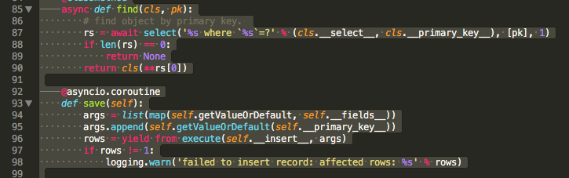
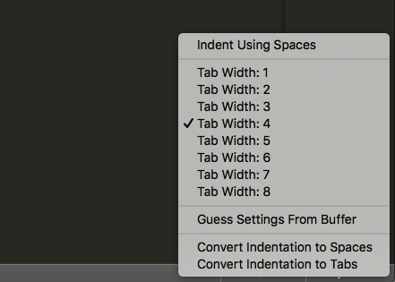

最近在学习Python，从网上粘贴的代码很多缩进都是空格，这样就会导致代码执行的时候报错，因为Python是依靠缩进来判断代码层次的。我的编辑器是Sublime Text 3看了一下，原来转换成Tab非常简单。

查看Python源码，全选之后，可以看到现在的缩进都是空格。

这时，点击右下方的“Tab size:4"这几个字，可以看到自动转换空格为Tab的选项，转换之后保存一下即可，非常方便。

