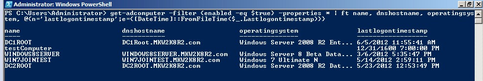

我所在的部门大概管理了300+台Windows终端，最近开始采用域的方式来进行管理。（别笑我们土，原来手工修改Windows口令太痛苦了）

现在的任务是想在域控服务器中列出纳入域管理的所有机器，以及最近登陆的时间。

可以通过PowerShell来进行查询。

```powershell
Get-ADComputer -Filter * -Property * | Format-Table Name,OperatingSystem,OperatingSystemServicePack,OperatingSystemVersion -Wrap –Auto

Import-Module ActiveDirectory
Get-ADComputer -Filter {enabled -eq $true} -properties *|select Name, DNSHostName, OperatingSystem, LastLogonDate

get-adcomputer -filter {enabled -eq $true} -properties * | ft name, dnshostname, operating system, @{n=‘lastlogontimestamp’;e={[DateTime]::FromFileTime($_.Lastlogontimestamp)}}
```
查询的结果是这样的。


参考资料：
1、[How to get all active computer list in domain with some attributes?](https://social.technet.microsoft.com/Forums/windowsserver/en-US/452bd87c-f802-447c-91fb-e98b1b6ddb0e/how-to-get-all-active-computer-list-in-domain-with-some-attributes?forum=winserverDS)
2、[Active Directory Reference Sheet](http://portal.sivarajan.com/2010/07/aduc-and-ldap-reference-sheet.html)
3、[Oldcmp工具](http://www.joeware.net/freetools/tools/oldcmp/)


