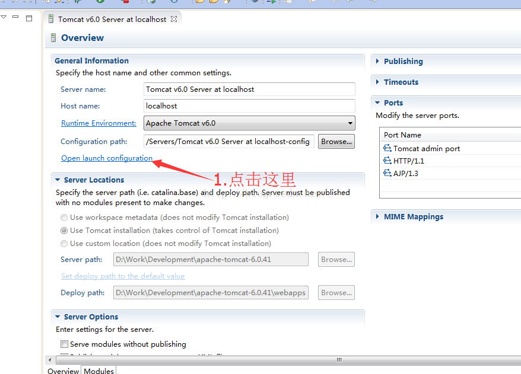
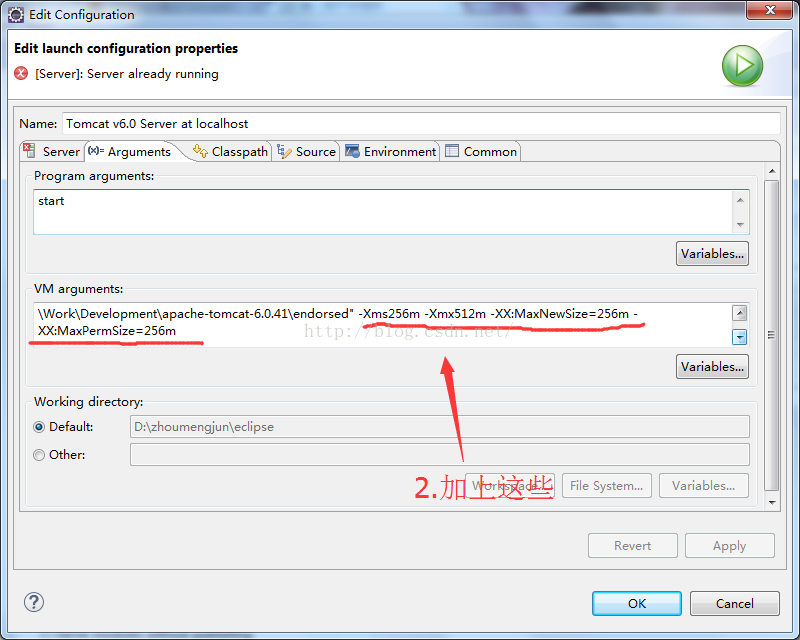

使用Eclipse(版本Indigo 3.7)调试Java项目的时候，遇到了下面的错误：
```java
Exception in thread “main” Java.lang.OutOfMemoryError: PermGen space
at java.lang.ClassLoader.defineClass1(Native Method)
at java.lang.ClassLoader.defineClassCond(Unknown Source)
```
很明显是内存溢出的错误，在Eclipse集成的Tomcat环境下，频繁进行热发布的时候会出现这个情况。了解到该原因是因为默认分配给JVM的内存为4M，而Eclipse中有BUG导致eclipse.ini中的参数无法传递给Tomcat，这样在项目加载内容较多时，很容易造成内存溢出。解决方案为增加JVM的内存空间。
有一点需要注意，因为使用的是Eclipse中集成的Tomcat，因此要在下面的界面中设置。



### 附主要的Eclipse版本代号及版本

参考资料：
1、[Eclipse中通过Tomcat运行JavaWeb项目发生内存溢出：java.lang.OutOfMemoryError: PermGen space 错误的解决方案](http://blog.csdn.net/Crazy_Java1234/article/details/51554515)
2、[Download Eclipse](https://www.eclipse.org/downloads/)
3、[Java SDK Download](http://www.oracle.com/technetwork/java/javase/downloads/index.html)


