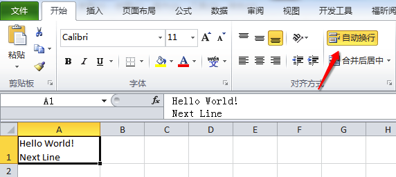

PhpSpreadsheet是PHPExcel的替代版本，PHPExcel的作者已经停止了更新，今天尝试了使用PhpSpreadsheet生成Excel的时候支持单元格内的自动换行，发现用法其实差不多。
先来看一下Excel单元格中的换行，手工输入Alt+Enter可以进行换行，实际上是选择了一个“自动换行”的属性。

下面来看PhpSpreadsheet代码

```php
error_reporting(E_ALL);
require_once "./vendor/autoload.php";

use PhpOffice\PhpSpreadsheet\Spreadsheet;
use PhpOffice\PhpSpreadsheet\Writer\Xlsx;

$spreadsheet = new Spreadsheet();
$sheet = $spreadsheet->getActiveSheet();
$value = "Hello World!" . PHP_EOL . "Next Line";
$sheet->setCellValue('A1', $value);
$sheet->getStyle('A1')->getAlignment()->setWrapText(true);

$writer = new Xlsx($spreadsheet);
$filename = __DIR__ . "/data/hello_world.xlsx";
$writer->save($filename);
```
要实现单元格换行，包括两部分：首先，需要换行的内容之间必需包括换行符，可以用```PHP_EOL```或者```\r\n```；其次，必需激活单元格的“自动换行”属性。了解了这两点，实现单元格自动换行就非常容易了。

参考资料：
1、[PhpSpreadsheet](http://phpspreadsheet.readthedocs.io/en/develop/)
2、[PHPExcel单元格内自动换行](http://www.cnblogs.com/shanmao/archive/2013/08/23/phpexcel.html)
