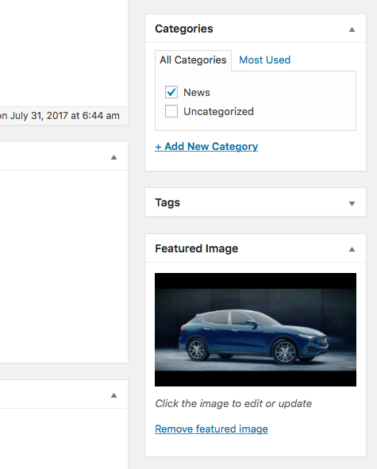
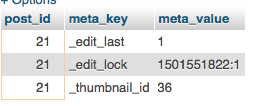

最近项目需要，分析了一下Wordpress的特色图像 Feature Image的上传、保存方式，这一分析觉得Wordpress的数据结构设计还真是有想法。
先简单说一下结论：
> Wordpress中图像物理文件保存在```wp-content/uploads```目录下，相关信息保存在 wp_posts   表中。post_type 是 attachment，post-mime-type 是 image/png。通过 post_parent 与文章关联。

我原来以为图片信息会有单独的表存放，没想到都放在 wp_posts 中，于是分析了这样做有什么好处。

### wp_posts 表
首先来看看 wp_posts 表。该表用来存放文章信息，如文章标题、正文、摘要、作者、发布时间、访问密码、评论数、修改时间、文章地址（非静态化之前的，带？和数字ID）等。这些属性都是与文章相关的，同时根据 post_type的不同，该表还能用来存储特色图像 Featured Image。

由此可以看到，Wordpress 利用 post_type 可以在该表中存储草稿、文章、页面、附件等丰富的信息，一张表就搞定了。

### wp_postmeta 表
与这张表相关联的，还有一个 wp_postmeta 表，用来存储与文章相关的元数据。这个表的表结构比较简单。


### 如何获取特色图像 Featured Image
那么，对于一个文章，是如何来获取特色图像 Featured Image的，下面来看一下。在后台的文章编辑界面，特色图像显示在这个位置。

对应的后台代码是 wp-admin/includes/meta-boxes.php

```php
/**
 * Display post thumbnail meta box.
 *
 * @since 2.9.0
 *
 * @param WP_Post $post A post object.
 */
function post_thumbnail_meta_box( $post ) {
    $thumbnail_id = get_post_meta( $post->ID, '_thumbnail_id', true );    //获取特色图像对应的ID
    echo _wp_post_thumbnail_html( $thumbnail_id, $post->ID );    //输出HTML
}
```
继续找 get_post_meta ，在wp-includes/post.php中。
```php
/**
 * Retrieve post meta field for a post.
 *
 * @since 1.5.0
 *
 * @param int    $post_id Post ID.
 * @param string $key     Optional. The meta key to retrieve. By default, returns
 *                        data for all keys. Default empty.
 * @param bool   $single  Optional. Whether to return a single value. Default false.
 * @return mixed Will be an array if $single is false. Will be value of meta data
 *               field if $single is true.
 */
function get_post_meta( $post_id, $key = '', $single = false ) {
    return get_metadata('post', $post_id, $key, $single);
}
```
继续找 get_metadata 在 wp-includes/meta.php 中。
```php
/**
 * Retrieve metadata for the specified object.
 *
 * @since 2.9.0
 *
 * @param string $meta_type Type of object metadata is for (e.g., comment, post, or user)
 * @param int    $object_id ID of the object metadata is for
 * @param string $meta_key  Optional. Metadata key. If not specified, retrieve all metadata for
 *                             the specified object.
 * @param bool   $single    Optional, default is false.
 *                          If true, return only the first value of the specified meta_key.
 *                          This parameter has no effect if meta_key is not specified.
 * @return mixed Single metadata value, or array of values
 */
function get_metadata($meta_type, $object_id, $meta_key = '', $single = false) {
    if ( ! $meta_type || ! is_numeric( $object_id ) ) {
        return false;
    }

    $object_id = absint( $object_id );
    if ( ! $object_id ) {
        return false;
    }
    //echo $object_id . ':' . $meta_type . '-' . $meta_key . '-' . $single . '<br />';
    /**
     * Filters whether to retrieve metadata of a specific type.
     *
     * The dynamic portion of the hook, `$meta_type`, refers to the meta
     * object type (comment, post, or user). Returning a non-null value
     * will effectively short-circuit the function.
     *
     * @since 3.1.0
     *
     * @param null|array|string $value     The value get_metadata() should return - a single metadata value,
     *                                     or an array of values.
     * @param int               $object_id Object ID.
     * @param string            $meta_key  Meta key.
     * @param bool              $single    Whether to return only the first value of the specified $meta_key.
     */
    $check = apply_filters( "get_{$meta_type}_metadata", null, $object_id, $meta_key, $single );
    if ( null !== $check ) {
        if ( $single && is_array( $check ) )
            return $check[0];
        else
            return $check;
    }

    $meta_cache = wp_cache_get($object_id, $meta_type . '_meta');

    if ( !$meta_cache ) {
        $meta_cache = update_meta_cache( $meta_type, array( $object_id ) );
        $meta_cache = $meta_cache[$object_id];
    }

    if ( ! $meta_key ) {
        return $meta_cache;
    }

    if ( isset($meta_cache[$meta_key]) ) {
        if ( $single )
            return maybe_unserialize( $meta_cache[$meta_key][0] );
        else
            return array_map('maybe_unserialize', $meta_cache[$meta_key]);
    }

    if ($single)
        return '';
    else
        return array();
}
```
这个函数中会根据 $meta_key 和 $object_id 、$meta_type 取出特色图像对应的ID。为了避免重复读取数据库，这里用了缓存，我们可以看 update_meta_cache 这个函数。
```php
/**
 * Update the metadata cache for the specified objects.
 *
 * @since 2.9.0
 *
 * @global wpdb $wpdb WordPress database abstraction object.
 *
 * @param string    $meta_type  Type of object metadata is for (e.g., comment, post, or user)
 * @param int|array $object_ids Array or comma delimited list of object IDs to update cache for
 * @return array|false Metadata cache for the specified objects, or false on failure.
 */
function update_meta_cache($meta_type, $object_ids) {
    global $wpdb;

    if ( ! $meta_type || ! $object_ids ) {
        return false;
    }

    $table = _get_meta_table( $meta_type );
    if ( ! $table ) {
        return false;
    }

    $column = sanitize_key($meta_type . '_id');

    if ( !is_array($object_ids) ) {
        $object_ids = preg_replace('|[^0-9,]|', '', $object_ids);
        $object_ids = explode(',', $object_ids);
    }

    $object_ids = array_map('intval', $object_ids);

    $cache_key = $meta_type . '_meta';
    $ids = array();
    $cache = array();
    foreach ( $object_ids as $id ) {
        $cached_object = wp_cache_get( $id, $cache_key );
        if ( false === $cached_object )
            $ids[] = $id;
        else
            $cache[$id] = $cached_object;
    }

    if ( empty( $ids ) )
        return $cache;

    // Get meta info
    $id_list = join( ',', $ids );
    $id_column = 'user' == $meta_type ? 'umeta_id' : 'meta_id';
    echo "SELECT $column, meta_key, meta_value FROM $table WHERE $column IN ($id_list) ORDER BY $id_column ASC" . "<br />";
    $meta_list = $wpdb->get_results( "SELECT $column, meta_key, meta_value FROM $table WHERE $column IN ($id_list) ORDER BY $id_column ASC", ARRAY_A );

    if ( !empty($meta_list) ) {
        foreach ( $meta_list as $metarow) {
            $mpid = intval($metarow[$column]);
            $mkey = $metarow['meta_key'];
            $mval = $metarow['meta_value'];

            // Force subkeys to be array type:
            if ( !isset($cache[$mpid]) || !is_array($cache[$mpid]) )
                $cache[$mpid] = array();
            if ( !isset($cache[$mpid][$mkey]) || !is_array($cache[$mpid][$mkey]) )
                $cache[$mpid][$mkey] = array();

            // Add a value to the current pid/key:
            $cache[$mpid][$mkey][] = $mval;
        }
    }

    foreach ( $ids as $id ) {
        if ( ! isset($cache[$id]) )
            $cache[$id] = array();
        wp_cache_add( $id, $cache[$id], $cache_key );
    }

    return $cache;
}
```
关键的语句在这里
```sql
SELECT post_id, meta_key, meta_value FROM wp_postmeta WHERE post_id IN (21) ORDER BY meta_id ASC
```
可以看到结果如下，_thumbnail_id 对应的就是 wp_posts 中的记录ID，从而可以取到图片对应的地址和相关信息。

> 本文内容基于 Wordpress 4.8版本

参考资料：
1、[如何设置Wordpress的特色图像](http://www.solagirl.net/how-to-setup-featured-image-in-wordpress.html)
2、[WordPress数据库表及字段详解](http://www.ecdoer.com/post/wordpress-database.html)
3、[理解和利用 WordPress 中的元数据（Metadata）](https://www.wpdaxue.com/understanding-and-working-with-metadata-in-wordpress.html)

