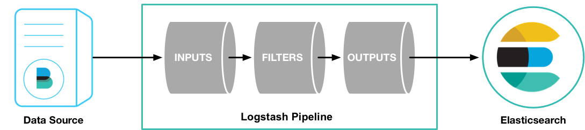
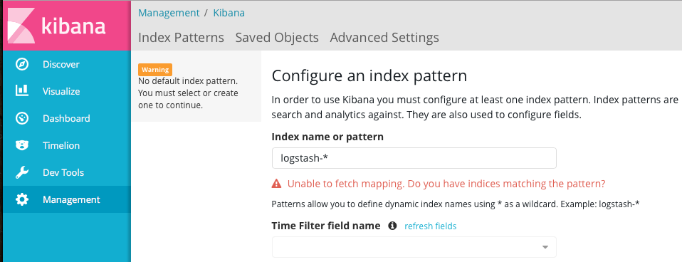

### ElasticSearch 安装
1、下载[ElasticSearch](https://www.elastic.co/downloads/elasticsearch)，本文使用的版本为 5.5.1。
2、配置
```bash
path.data: /data/es #数据路径
path.logs: /data/logs/es #日志路径
network.host: 本机地址 #服务器地址
http.port: 9200 #端口
```
如果不修改配置的话，默认的数据和日志都位于elasticsearch文件夹下。
> 默认地址会使用 192.168.0.1 的地址，此时ElasticSearch运行于开发模式，只能从本机访问。如果修改为生产地址，就会进入生产模式，并且运行 bootstrap check 。

3、启动
```bash
./bin/elasticsearch
```
> 注意，elasticsearch 不能使用 root 用户启动，使用其他用户启动，要注意有文件夹的读写权限。

我在安装过程中还出现了下面几个警告信息
```bash
[2017-08-07T09:13:59,951][WARN ][o.e.b.JNANatives         ] unable to install syscall filter: 
java.lang.UnsupportedOperationException: seccomp unavailable: requires kernel 3.5+ with CONFIG_SECCOMP and CONFIG_SECCOMP_FILTER compiled in
    at org.elasticsearch.bootstrap.SystemCallFilter.linuxImpl(SystemCallFilter.java:350) ~[elasticsearch-5.5.1.jar:5.5.1]
    at org.elasticsearch.bootstrap.SystemCallFilter.init(SystemCallFilter.java:638) ~[elasticsearch-5.5.1.jar:5.5.1]
    at org.elasticsearch.bootstrap.JNANatives.tryInstallSystemCallFilter(JNANatives.java:245) [elasticsearch-5.5.1.jar:5.5.1]
    at org.elasticsearch.bootstrap.Natives.tryInstallSystemCallFilter(Natives.java:113) [elasticsearch-5.5.1.jar:5.5.1]
    at org.elasticsearch.bootstrap.Bootstrap.initializeNatives(Bootstrap.java:111) [elasticsearch-5.5.1.jar:5.5.1]
    at org.elasticsearch.bootstrap.Bootstrap.setup(Bootstrap.java:194) [elasticsearch-5.5.1.jar:5.5.1]
    at org.elasticsearch.bootstrap.Bootstrap.init(Bootstrap.java:351) [elasticsearch-5.5.1.jar:5.5.1]
    at org.elasticsearch.bootstrap.Elasticsearch.init(Elasticsearch.java:123) [elasticsearch-5.5.1.jar:5.5.1]
    at org.elasticsearch.bootstrap.Elasticsearch.execute(Elasticsearch.java:114) [elasticsearch-5.5.1.jar:5.5.1]
    at org.elasticsearch.cli.EnvironmentAwareCommand.execute(EnvironmentAwareCommand.java:67) [elasticsearch-5.5.1.jar:5.5.1]
    at org.elasticsearch.cli.Command.mainWithoutErrorHandling(Command.java:122) [elasticsearch-5.5.1.jar:5.5.1]
    at org.elasticsearch.cli.Command.main(Command.java:88) [elasticsearch-5.5.1.jar:5.5.1]
    at org.elasticsearch.bootstrap.Elasticsearch.main(Elasticsearch.java:91) [elasticsearch-5.5.1.jar:5.5.1]
    at org.elasticsearch.bootstrap.Elasticsearch.main(Elasticsearch.java:84) [elasticsearch-5.5.1.jar:5.5.1]
[2017-08-01T14:10:57,843][WARN ][o.e.b.BootstrapChecks    ] [VAfWGGZ] max file descriptors [65535] for elasticsearch process is too low, increase to at least [65536]
[2017-08-01T14:10:57,844][WARN ][o.e.b.BootstrapChecks    ] [VAfWGGZ] max number of threads [1024] for user [maserati] is too low, increase to at least [2048]
[2017-08-01T14:10:57,844][WARN ][o.e.b.BootstrapChecks    ] [VAfWGGZ] max virtual memory areas vm.max_map_count [65530] is too low, increase to at least [262144]
[2017-08-01T14:10:57,844][WARN ][o.e.b.BootstrapChecks    ] [VAfWGGZ] system call filters failed to install; check the logs and fix your configuration or disable system call filters at your own risk
```
针对文件描述符，调成 65536```ulimit -n 65536```，如果提示没有权限，则可以在用户的 .bash_profile 中增加一行，退出用户重新登陆就可以。
针对 max number of threads 问题，修改 /etc/security/limits.d/90-nproc.conf 。
```bash
*          soft    nproc     2048
root       soft    nproc     unlimited
```
针对 max virtual memory areas ，修改 /etc/sysctl.conf。如果没有，就新增一行。
```bash
vm.max_map_count = 262144
```
针对 system_call_filter 可以，通过修改配置文件（elasticsearch.yml）关掉这个参数。
```bash
bootstrap.system_call_filter: false
```
4、访问，出现下面的结果表示启动成功。
```bash
[root@iZ627x15h6pZ cloud]# curl http://localhost:9200
{
  "name" : "VAfWGGZ",
  "cluster_name" : "elasticsearch",
  "cluster_uuid" : "J9Tm5R2zRt2PkOSwtXj5Wg",
  "version" : {
    "number" : "5.5.1",
    "build_hash" : "19c13d0",
    "build_date" : "2017-07-18T20:44:24.823Z",
    "build_snapshot" : false,
    "lucene_version" : "6.6.0"
  },
  "tagline" : "You Know, for Search"
}
```

### Logstash 安装

1、下载并解压 Logstash，本文用的 Logstash-5.5.1 版本
2、创建一个简单的配置文件 logstash_test.conf

```input { stdin { } }
output {
  stdout { codec => rubydebug }
}
```
3、启动 logstash
```bash
./bin/logstash -f logstash_test.conf
```
出现这些信息，表示启动成功了。
```bash
[2017-08-01T13:58:38,437][INFO ][logstash.pipeline        ] Pipeline main started
The stdin plugin is now waiting for input:
[2017-08-01T13:58:38,532][INFO ][logstash.agent           ] Successfully started Logstash API endpoint {:port=>9600}
```
4、与ElasticSearch配合。

### Kibana 安装
1、下载[Kibana](https://www.elastic.co/downloads/kibana)
2、修改配置
```bash
//启动端口 因为端口受限 所以变更了默认端口
server.port: 5601
//启动服务的ip
server.host: "本机ip"
//elasticsearch地址
elasticsearch.url: "http://localhost:9200”
```
3、启动程序
./bin/kibana
4、访问查看Kibana启动是否成功，并检索查看数据
[http://localhost:5601](http://localhost:5601)



参考资料：
1、[Download Logstash](https://www.elastic.co/downloads/logstash)
2、[ElasticSearch Download](https://www.elastic.co/downloads/elasticsearch)
3、[ElasticSearch 5.0启动出现的错误](http://blog.csdn.net/qq942477618/article/details/53414983)
4、[Ulimit详解](http://www.cnblogs.com/zengkefu/p/5649407.html)
5、[ELK+Filebeat 安装配置入门](http://www.cnblogs.com/jasonxuli/p/6397244.html)