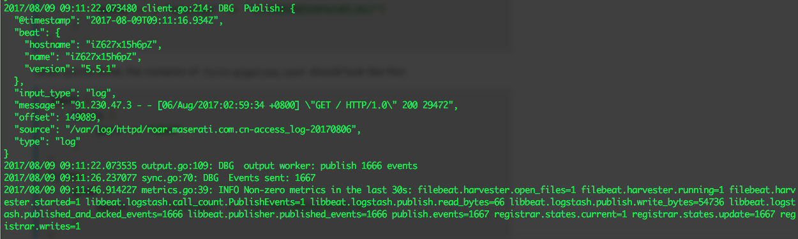

Logstash是一款开源的数据收集引擎，具备实时管道处理能力。简单来说，logstash作为数据源与数据存储分析工具之间的桥梁，结合 ElasticSearch以及Kibana，能够极大方便数据的处理与分析。通过200多个插件，logstash可以接受几乎各种各样的数据。包括日志、网络请求、关系型数据库、传感器或物联网等等。


### 安装
之前我有一篇文章[ElasticSearch + Logstash + Kibana 搭建笔记](http://www.cnblogs.com/cocowool/p/7297749.html)记录了ELK环境的搭建过程，只是简单介绍了一种安装方式，本文记录更多的细节。
> logstash 要求Java8的支持。Java9暂时不支持，本文使用的logstash版本为5.5.1。

在Linux环境中，我们可以通过包管理进行安装，例如Unbuntu中的apt、以及CentOS中的yum。也可以从[这里](https://www.elastic.co/downloads/logstash)下载对应环境的二进制版本。

### 体验Pipeline
Logstatsh最基本的Pipeline模式如下图所示，其需要两个必需参数**input**、**output**，以及一个可选参数**filter**。


```bash
cd logstash-5.5.1
bin/logstash -e 'input { stdin { } } output { stdout {} }'

[2017-08-09T15:40:03,303][INFO ][logstash.pipeline        ] Pipeline main started

hello world
2017-08-09T07:40:46.397Z iZ627x15h6pZ hello world
```
```-e```参数允许我们在命令行中直接输入配置，而不同通过```-f```参数指定配置文件。看到Pipeline main started表示logstash已经启动成功，在命令行输入一些文字后，logstash会加上日期和主机名（IP）输出到终端。这就是Logstash最基本的工作模式，接受输入，然后将信息加工后放入到输出。

### 处理日志
Logstash收购了Filebeat加入到自己的生态系统中用来处理日志，Filebeat是一个轻量化的日志收集工具，还可以感知后台logstash的繁忙程度来决定日志发送的速度。
首先下载[Filebeat](https://www.elastic.co/downloads/beats/filebeat)，解压后就可以使用。找到filebeat.yml修改如下：
```bash
filebeat.prospectors:
- input_type: log
  paths:
    - /path/to/file/logstash-tutorial.log 
output.logstash:
  hosts: ["localhost:5043"]
```
配置完成后等logstash启动后再启动Filebeat。
```bash
sudo ./filebeat -e -c filebeat.yml -d "publish"
```
接下来配置logstash，按照如下配置编写一个 filebeat.conf 文件
```input {
  beats {
    port => "5043"
  }
}
output {
  stdout { codec => rubydebug }
}
```
配置文件可以用下面的命令验证是否有问题
```sh
bin/logstash -f filebeat.conf --config.test_and_exit/
```
如果验证没有问题，就可以用这个配置文件启动 logstash 了。
```sh
bin/logstash -f filebeat.conf
```
之后再启动Filebeat，就可以在Filebeat终端窗口看到日志信息的输出，同时在logstash这边也能看到有日志输出。这就说明此时logstash已经能够正常接收beats送来的文件了。



参考资料：
1、[Logstash Reference](https://www.elastic.co/guide/en/logstash/current/index.html)
2、[Filebeat](https://github.com/elastic/beats/tree/master/filebeat)
