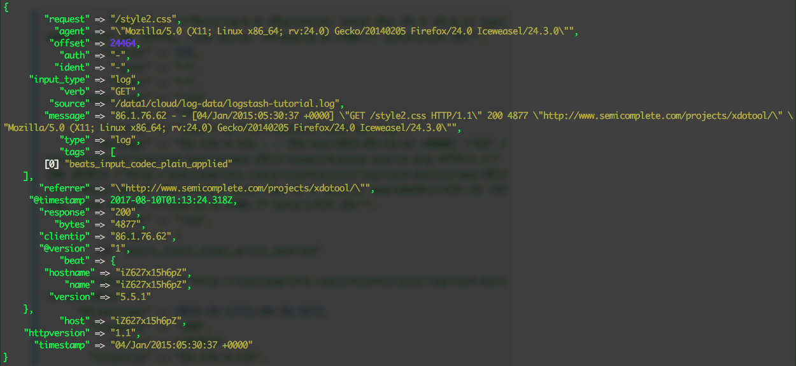
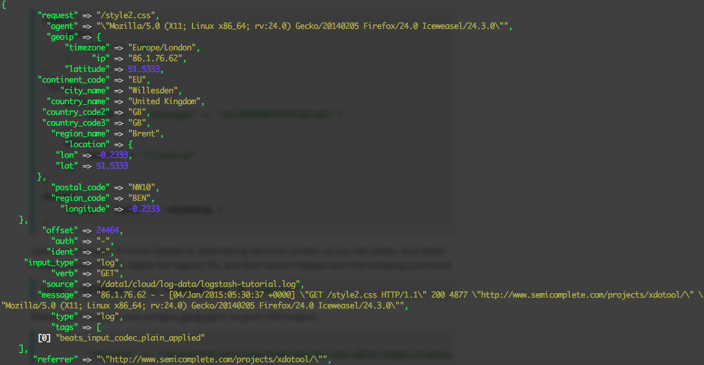
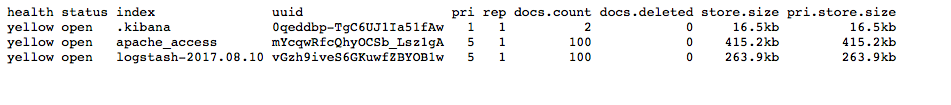
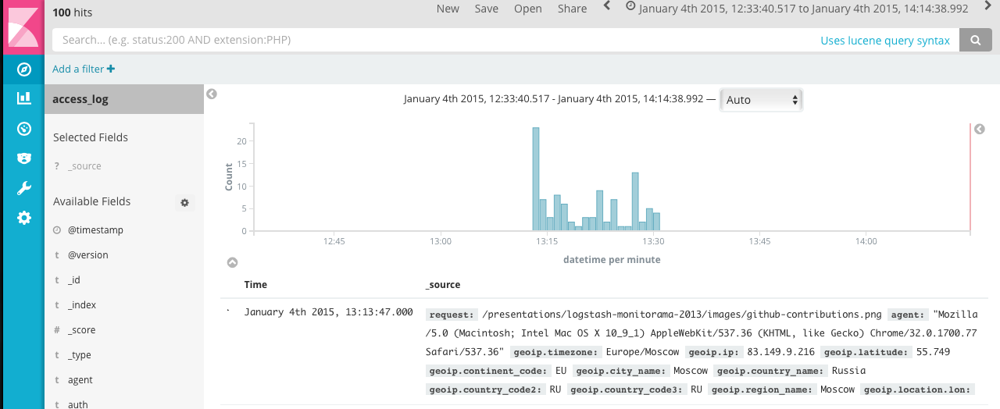
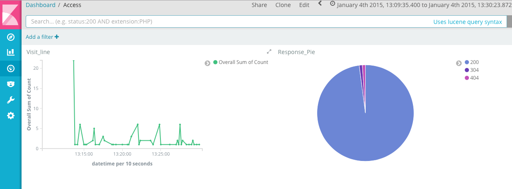

对于ELK还不太熟悉的同学可以参考我前面的两篇文章[ElasticSearch + Logstash + Kibana 搭建笔记](http://www.cnblogs.com/cocowool/p/7297749.html)、[Log stash学习笔记（一）](http://www.cnblogs.com/cocowool/p/7326527.html)，本文搭建了一套专门访问Apache的访问日志的ELK环境，能够实现访问日志的可视化分析。

### 数据源 Filebeat + Logstash
数据源对应Logstash中的Input部分，本文采用Filebeat来读取Apache日志提供给Logstash，Logstash进行日志解析输入到ES中进行存储。Filebeat的配置比较简单，参考文章[Log stash学习笔记（一）](http://www.cnblogs.com/cocowool/p/7326527.html)。需要注意的是，如果Filebeat之前发送过数据，需要执行```rm data/registry```删除缓存数据，强制filebeat从原始数据重新读取数据。
重点来看Logstash的配置
```bash
input {
  beats {
    port => "5043"
  }
}
filter {
  grok {
    match => { "message" => "%{COMBINEDAPACHELOG}" }
  }
  date {
    match => [ "timestamp", "dd/MMM/yyyy:HH:mm:ss Z" ]
    target => ["datetime"]
  }
  geoip {
    source => "clientip"
  }
}
output {
  elasticsearch {
    hosts => "47.89.30.169:9200"
    index => "access_log"
  }
  stdout { codec => rubydebug }
}
```
本文使用了grok插件，grok是Logstash默认自带的Filter插件，能够帮助我们将未结构化的日志数据转化为结构化、可查询的数据格式。grok对日志的解析基于特定的正则模式匹配，对于Apache的Access Log 访问日志，多数情况下我们都适用combined格式。

可以看到现在logstash输出的内容包括原始日志信息，以及按照日志格式解析后的各字段信息。

#### GeoIP插件
配置参考上面，使用了GeoIP插件后，可以对访问IP进行反向解析，返回地址信息。可以用于后续做图。

但是仅仅这样还不够，因为进入ES的数据会自动进行映射，而对于地理数据，需要映射为特殊的geo_point类型，本文未做详细阐述，后续会有文章专门解决这个问题。

#### timestamp
logstash默认为每次导入的数据赋予当前的时间做为时间戳，如果我们希望能够使用日志中的时间做为记录的时间戳，主要用下面的配置。
```bash
date {
    match => [ "timestamp", "dd/MMM/yyyy:HH:mm:ss Z" ]
    target => ["datetime"]
  }
```
这个配置匹配了日志中的时间，放入timestamp时间戳中，并且新创建了一个单独的datetime字段。
logstash配置完成后，首先确保ElasticSearch处于运行状态，再启动 logstash，最后启动Filebeat。这样，日志数据就会存放在ES中的**access_log**索引下。

### ElasticSearch
ElasticSearch基本上无需做配置，安装可以参考我之前的文章[ElasticSearch + Logstash + Kibana 搭建笔记](http://www.cnblogs.com/cocowool/p/7297749.html)，这里补充几个常用的API。

#### **列出可用的索引**
```bash
curl 'localhost:9200/_cat/indices?v'
```
结果如下图


#### **查询索引数据**
$DATE需要替换成具体的日期（格式YYYY.MM.DD)，本文就是logstash-2017.08.10。
```bash
curl -XGET 'localhost:9200/logstash-$DATE/_search?pretty&q=response=200’
```

### Kibana
首先在Kibana中创建Index Pattern，索引选择**access_log**，时间戳选择 timestamp 或者 datetime，然后在 Discover 中就可以看到数据了。

结合Visualize和Dashboar，可以做出按时间统计的访问曲线和返回状态饼图。


参考资料：
1、[Logstash Reference](https://www.elastic.co/guide/en/logstash/current/advanced-pipeline.html)
2、[Apache mod_log_config](http://httpd.apache.org/docs/current/mod/mod_log_config.html)
3、[Logstash: modify apache date format](https://stackoverflow.com/questions/31257595/logstash-modify-apache-date-format)
4、[Elastic Output Plugin](https://www.elastic.co/guide/en/logstash/current/plugins-outputs-elasticsearch.html#plugins-outputs-elasticsearch-template)


