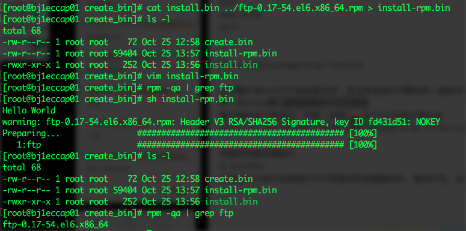
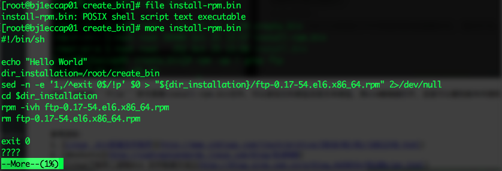

### 需求及应用场景
1、**简化操作**。一般的软件安装过程，如果想要精简步骤，我们一般会将需要在命令行中输入的命令写成一个脚本，同时将安装介质准备好。我们将脚本和安装介质上传到生产环境，然后通过执行脚本来完成安装。如果能够将这两个文件合并为一个可执行文件，那安装的过程就更简单明了。
2、**代码保护**。对于一段脚本，提供给用户使用，但是不希望用户看到脚本的内容，可以通过将脚本发布为.bin的形式。这样用户在环境中可以执行、安装，但是无法看到里面的内容，也无法修改，从而达到保护脚本内容的目的。

### 实现方法
1、本文以在Redhat系统中安装ftp命令为例说明，如何将安装脚本和安装介质整合成一个文件，简化操作。
首先，编写一个脚本，包含安装的命令。
```bash
#!/bin/sh

echo "Hello World"
dir_installation=/root/create_bin
sed -n -e '1,/^exit 0$/!p' $0 > "${dir_installation}/ftp-0.17-54.el6.x86_64.rpm" 2>/dev/null
cd $dir_installation
rpm -ivh ftp-0.17-54.el6.x86_64.rpm
rm ftp-0.17-54.el6.x86_64.rpm

exit 0
```
注意，这个脚本的关键在于```sed```，他会把exit 0后面的内容提取出来，另存为rpm包，然后执行安装，安装完成后删掉rpm。
最后，我们用```cat```命令将脚本和安装包生成一个新的文件。

这时，如果用```file```命令查看install-rpm.bin文件，可以发现它的类型还是文本类型，用vim编辑器打开，还是可以看到脚本内容的，也可进行修改。

2、对于第二个隐藏代码内容的需求，有一款工具叫做[shc](http://www.datsi.fi.upm.es/~frosal/sources/shc-3.8.9b.tgz)，可以用它来将脚本编程二进制文件。
shc的用法比较简单，下载后make生成可执行文件，然后直接对脚本进行加密，会生成两个文件。一个以.x结尾，为可执行的二进制文件。另一个以.x.c结尾，为生成的中间c文件。shc还能指定可执行脚本的过期时间。

```bash
wget http://www.datsi.fi.upm.es/~frosal/sources/shc-3.8.9b.tgz

tar xvfz shc-3.8.9b.tgz

cd shc-3.8.9b
make

./shc -v
shc parse(-f): No source file specified

shc Usage: shc [-e date] [-m addr] [-i iopt] [-x cmnd] [-l lopt] [-rvDTCAh] -f script

./shc -f install-rpm.bin
```
通过 shc 可以将脚本文件编译成二进制文件，隐藏了脚本的内容，对于一般的用户是没办法查看和修改的。当然，还是有办法可以再将二进制文件转换为纯文本的脚本的，具体的方法大家可以关注我的微信号获得。

参考资料：
1、[Linux .bin安装文件制作](http://www.cnblogs.com/itech/archive/2010/02/01/1661248.html)
2、[dos2unix](http://codingstandards.iteye.com/blog/810900)
3、[linux下制作二进制bin 文件制做方法](http://blog.sina.com.cn/s/blog_4d3833cf0100yjen.html)
4、[shc](http://www.datsi.fi.upm.es/~frosal/)
5、[How to Encrypt Your Bash Shell Script on Linux Using SHC](http://www.thegeekstuff.com/2012/05/encrypt-bash-shell-script/)


