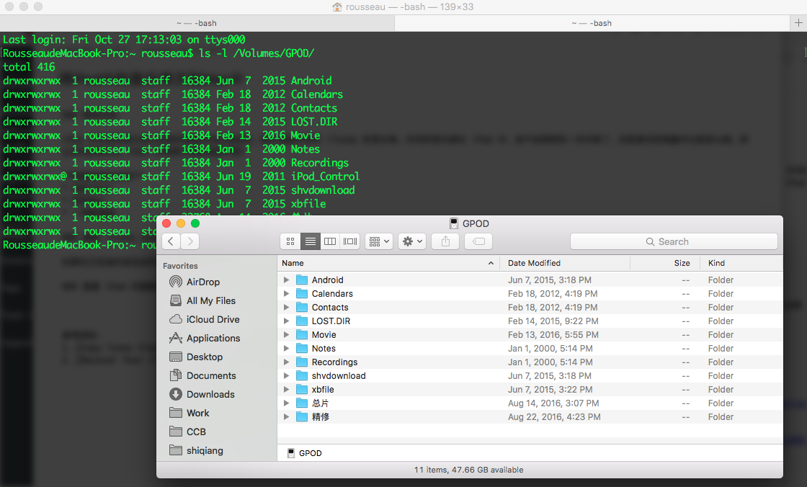
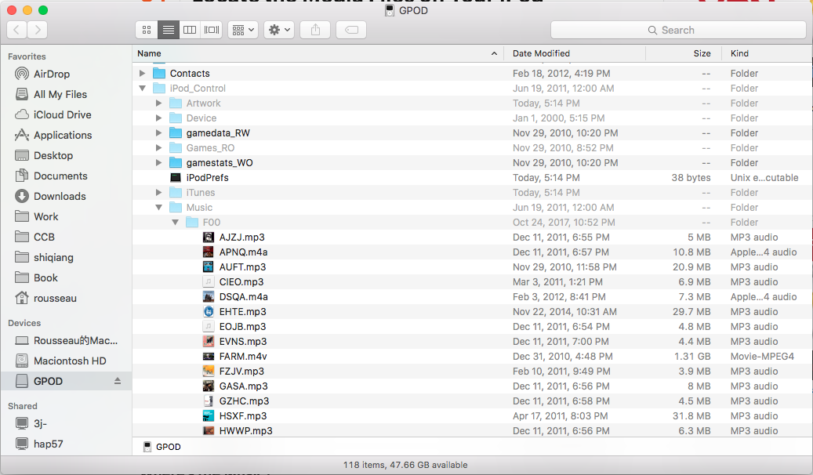
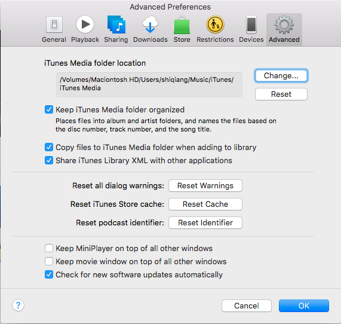

### 需求目标
iPod 中有很多音乐是从原来的电脑中同步进去的，新的电脑中没有 iTunes 的音乐库。所有的音乐都在 iPod 中，会不会突然有一天坏掉了，还是备份到电脑中比较安心啊。那么如何把音乐从 iPod 中再拷贝到新电脑中呢？

**需要准备的材料**

* 你的iPod
* 你的Mac
* 一根数据线

### 避免 iTunes 自动同步
如果你之前选的是自动同步，那么在将 iPod 连接到 Mac 之前，一定要小心，否则会自动将 iPod 中的内容删除，因为 Mac 上并没有 iPod 中的文件。

### 查看 iPod 的隐藏文件夹
iPod 连接到电脑之后，我们能够看到作为一个磁盘出现，但是我们不能找到存放音乐的文件夹。如果你使用终端查看，会发现其实有一个 iPod_Control 文件夹，它被隐藏了起来，以至 Finder 不能查看。

我们在终端中输入以下命令，就可以破解 Mac 的隐藏文件夹设置。

```bash
defaults write com.apple.finder AppleShowAllFiles TRUE
killall Finder
```
再来看一下，是不是能够看到 iPod_Control 文件夹了。第二条命令的作用是杀死所有的Finder窗口，你会看到Finder消失了，不过不用着急，很快它又会重新打开。


### 定位音频文件
iPod的音频文件存放在iPod_Control/Music下面，我们可以把这个文件夹拷贝到Mac中。注意如果把Music文件夹拷贝到桌面后，在后面添加到iTunes中时，仍然无法查看到这个隐藏文件夹。为此，我们最好新建一个文件夹，并将每个子文件夹下的文件拷贝到这个新建的文件夹下。我写了一个脚本来执行这个操作。
```bash
# 条件：假设Music文件夹拷贝到了用户的Desktop文件夹中，新建的文件夹名为new_music，也位于Desktop文件夹下。
# 打开 Terminal，进入 Desktop
cd Desktop
find ./Music/F* -type f -exec mv -v {} ./new_music/ \;
```


### 将文件重新加入 iTunes 中
接下来的事情大家应该比较熟悉了，既然我们已经将音频文件拷贝到了电脑中，接下来我们只需要添加到iTunes中就可以了。注意添加前检查一下将文件拷贝到iTunes library这个选项要选中。然后我们通过 File->Add to Library选择拷贝到Mac中的文件夹，就可以了。


### 关闭隐藏文件的显示
这步很简单，只需要关闭隐藏文件的显示，在终端下执行命令。
```bash
RousseaudeMacBook-Pro:~ rousseau$ defaults write com.apple.finder AppleShowAllFiles FALSE
RousseaudeMacBook-Pro:~ rousseau$ killall Finder
```
参考资料：
1、[Copy Tunes From Your iPod to Your Mac](https://www.lifewire.com/copy-tunes-from-ipod-to-mac-2260103)
2、[Recover Your iTunes Music Library From Your iPod](https://www.lifewire.com/restore-itunes-music-library-from-ipod-2260317)