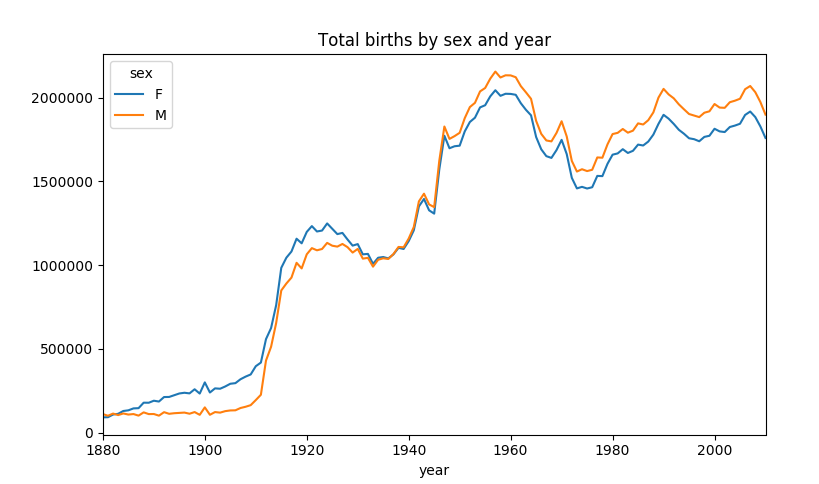

最近在看Python数据分析这本书，随手记录一下读书笔记。

### 工作环境
本书中推荐了edm和ipython作为数据分析的环境，我还是刚开始使用这种集成的环境，觉得交互方面，比传统的命令行方式提高了不少。
使用方法
```bash
#edm shell 
(edm)bash-3.2$ ipython
Python 2.7.13 |Enthought, Inc. (x86_64)| (default, Mar  2 2017, 08:20:50) 
Type "copyright", "credits" or "license" for more information.

IPython 5.3.0 -- An enhanced Interactive Python.
```

### 人口数据的例子
从 github 的网站上下载了美国的人口数据，按照书上的敲代码，到 pivot_table 这里过不去，用 help  查了一下，我这个版本的已经更新了，修改一下后就可以跑了。
```bash
In [7]: import pandas as pd
In [8]: names1880 = pd.read_csv('yob1880.txt',names=['name','sex','births'])
In [9]: names1880
Out[9]: 
           name sex  births
0          Mary   F    7065
1          Anna   F    2604
2          Emma   F    2003
3     Elizabeth   F    1939
4        Minnie   F    1746
5      Margaret   F    1578
...
1998       York   M       5
1999  Zachariah   M       5

[2000 rows x 3 columns]
In [10]: names1880.groupby('sex').births.sum()
Out[10]: 
sex
F     90993
M    110493
Name: births, dtype: int64
In [12]: years = range(1880,2011)

In [13]: pieces=[]

In [14]: columns=['name','sex','births']

In [15]: for year in years:
    ...:     path='yob%d.txt' % year
    ...:     frame=pd.read_csv(path,names=columns)
    ...:     frame['year']=year
    ...:     pieces.append(frame)
    ...:     

In [16]: names=pd.concat(pieces,ignore_index=True)
In [17]: names
Out[17]: 
              name sex  births  year
0             Mary   F    7065  1880
1             Anna   F    2604  1880
2             Emma   F    2003  1880
3        Elizabeth   F    1939  1880
4           Minnie   F    1746  1880
1690781  Zyquarius   M       5  2010
1690782      Zyran   M       5  2010
1690783      Zzyzx   M       5  2010

[1690784 rows x 4 columns]
In [25]: total_birth=names.pivot_table('births',index
    ...: ='year',columns='sex',aggfunc=sum)
In [26]: total_birth.tail()
Out[26]: 
sex         F        M
year                  
2006  1896468  2050234
2007  1916888  2069242
2008  1883645  2032310
2009  1827643  1973359
2010  1759010  1898382
In [27]: total_birth.plot(title="Total births by sex and year")
Out[27]: <matplotlib.axes._subplots.AxesSubplot at 0x11864af50>
In [31]: import matplotlib.pyplot as plt

In [32]: plt.show()
```



### 参考资料：
1、[edm](https://www.enthought.com/product/enthought-python-distribution/)
2、[pydata](https://github.com/wesm/pydata-book)
3、[matplotlib](https://matplotlib.org/index.html)