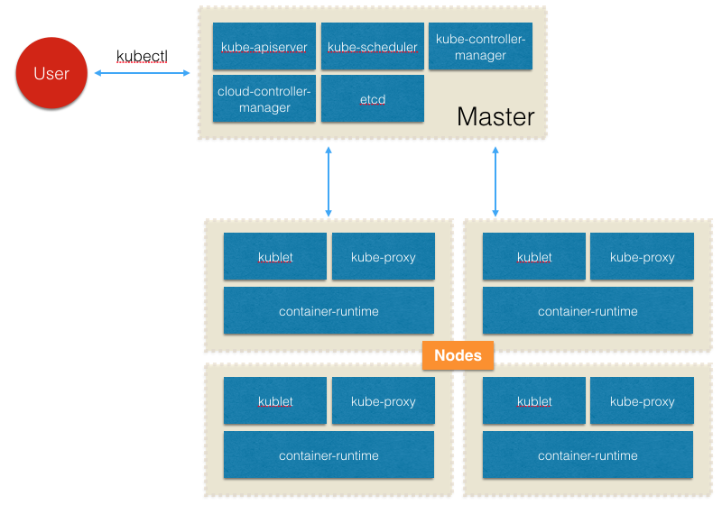
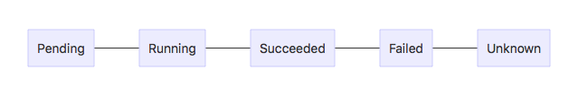

> 本文写成于2018年，虽然Kubernetes的技术发展非常快，但是

### Kubernetes是什么

Kubernetes是当今最流行的开源容器管理平台，它就是大名鼎鼎的Google Borg的开源版本。Google在2014年推出了Kubernetes，本文发布时最新的版本是1.11。Kubernetes源于希腊语，意为舵手，K8S是一个简称，因为首尾字母中间正好有8个字母。基于容器技术，Kubernetes可以方便的进行集群应用的部署、扩容、缩容、自愈机制、服务发现、负载均衡、日志、监控等功能，大大减少日常运维的工作量。
> Kubernetes is primarily targeted at applications composed of multiple containers. It therefore groups containers using pods and labels into tightly coupled and loosely coupled formations for easy management and discovery.

Kubernets所有的操作都可以通过Kubernetes API来进行，通过API来操作Kubernetes中的对象，包括Pod、Service、Volume、Namespace等等。Kubernetes的整体结构如下图所示：


#### Master
也叫做 Cluster Control Plane。

#### Node
Node 可以是一个物理机也可以是虚拟机，每个节点上都运行了可以运行 Pods 的服务。通过Master节点来进行管理。节点实际上是由云供应商提供的，Kubernetes管理中创建节点实际上只是在Kubernetes中创建一个代表节点的对象。
Node 包含以下几方面的信息：

* Addresses：包括主机名、内部IP、外部IP。
* Condition：描述运行的状态，包括OutOfDisk、Ready、MemoryPressure、PIDPressure、DiskPressure、NetworkUnavailable、ConfigOK。
* Capacity：描述节点资源的情况，包括CPU, memory and the maximum number of pods that can be scheduled onto the node.
* Info：包括内核版本、Kubernetes版本、Docker版本、OS等基础信息。

### Kubernetes 对象 Objectes
Objects是Kubernetes生态中持久化的对象，这些对象反映了集群运行的状态。这些状态包括节点上运行了什么样的应用（容器化的）、应用可以使用的资源、应用的管理策略。Kubernetes的Object是一种**意图的记录**，一旦创建了Objects，意味着你告诉K8S系统一直保持Objects处于你希望的状态。Object包含Spec和Status两个属性，Spec包含对象的一些属性，Status是对象的实际状态。
> 举例来说，Deployment 是代表集群中应用运行情况的 Object，创建一个 Deployment ，我们会指定Spec为同时运行三个实例。K8S会读取Spec，然后运行三个实例。如果运行中其中一个实例有问题，K8S会重新运行一个实例。

上面说过Kubernetes通过API来操作对象，API接收json格式的参数，但是URL的拼接方式非常不直观，因此我们可以将参数写在[yaml](http://www.yaml.org)文件中。使用API操作对象时，需要通过Names或UID来唯一区分对象，例如```/api/v1/pods/some-name```这样使用Name请求一个pod对象。Kubernetes中Names必须小于253个字符，仅能包含小写的字母、```-```和```_```。UID是Kubernetes为对象生成的唯一标识。

#### 1. Pod
> a single instance of an application in Kubernetes

Pod 是Kubernetes中可以创建和部署的最小单位。Pod包含了应用容器、存储资源、唯一的网络IP地址以及容器运行的参数。Pod内部的容器共享的网络、存储资源。Docker是Pod中最常用的容器运行环境，但仍允许用户使用其他的容器环境。
Pod使用有两种方式：一个容器一个Pod、一个Pod中运行多个容器。Pods设计的目标就是支持多个容器进程共同组合为一个服务，这种用法是一个相对高级的功能，仅有程序间存在紧耦合情况是才这么用。
> Restarting a container in a Pod should not be confused with restarting the Pod. The Pod itself does not run, but is an environment the containers run in and persists until it is deleted.

Pod的生命周期有几个状态


#### 2. Pods and Controller
Controller 在集群范围内提供Pod的创建、管理、扩容、复制、自愈等功能。

##### 2.1 Deployments
Deployment 是新一代用于 Pod 管理的对象，与 Replication Controller 相比，它提供了更加完善的功能，使用起来更加简单方便。

##### 2.2 StatefulSets
在 Kubernetes 中，Deployment 和 ReplicaSets 都是运行无状态应用的有效手段。但这两种方式对于有状态应用来说就不太合适了。StatefulSet 的目的就是给为数众多的有状态负载提供正确的控制器支持。

##### 2.3 DaemonSet
DaemonSet能够让所有（或者一些特定）的Node节点运行同一个pod。当节点加入到kubernetes集群中，pod会被（DaemonSet）调度到该节点上运行，当节点从kubernetes集群中被移除，被（DaemonSet）调度的pod会被移除，如果删除DaemonSet，所有跟这个DaemonSet相关的pods都会被删除。

##### 2.4 ReplicationController
Replication Controller，称为副本控制器。副本控制器的作用即保证集群中一个RC所关联的Pod副本数始终保持预设值。

##### 2.5 ReplicaSet
ReplicaSet 跟 ReplicationController 没有本质的不同，只是名字不一样，并且 ReplicaSet 支持集合式的 selector（ReplicationController 仅支持等式）。

##### 2.6 Job
在有些场景下，是想要运行一些容器执行某种特定的任务，任务一旦执行完成，容器也就没有存在的必要了。在这种场景下，创建pod就显得不那么合适。于是就是了Job，Job指的就是那些一次性任务。通过Job运行一个容器，当其任务执行完以后，就自动退出，集群也不再重新将其唤醒。

##### 2.7 Garbage Collection
Kubernetes进行垃圾回收管理的控制器，Kubernetes的垃圾回收由kubelet进行管理，每分钟会查询清理一次容器，每五分钟查询清理一次镜像。在kubelet刚启动时并不会立即进行GC，即第一次进行容器回收为kubelet启动一分钟后，第一次进行镜像回收为kubelet启动五分钟后。

##### 2.8 CronJob
这个比较容易理解，从字面也能看出来，是执行定时任务的控制器。

### 3. Service
Kubernetes的 Service 是一组 Pod 的逻辑抽象，这组 Pod 通过 Label 来定义。Service 的定义 yaml 如下。
```yaml
kind: Service
apiVersion: v1
metadata:
  name: my-service
spec:
  selector:
    app: MyApp
  ports:
  - protocol: TCP
    port: 80
    targetPort: 9376
```
上面的yaml定义了一组含有```app=MyApp```标签的Pod共同组成一个名为```my-service```服务。Kubernetes支持两种服务发现的模式：environment variables 和 DNS。

### 4. Volumes
我们知道容器中的文件系统是临时的，一旦容器重新启动，所有运行时对文件的操作都会丢失。Kubernetes使用Volumes来解决这个问题。不同于Docker自身的Volume，Kubernetes提供了Volume的生命周期管理，另外还提供了多种存储形式的支持。在Pod的spec中指定volume的类型以及挂载的位置。
Kubernetes支持的volume的类型：awsElasticBlockStore、azureDisk、azureFile、cephfs、configMap、csi、downwardAPI、emptyDir、fc、local、nfs。

### Add-ons

* DNS
* Ingress Controller
* Heapster
* Dashboard

### 参考资料

1. [Kubernetes Introduction](https://kubernetes.io/docs/user-journeys/users/cluster-operator/foundational/#section-1)
2. [Kubernetes Concept](https://kubernetes.io/docs/concepts/)
3. [Kubernetes Design and Architecture](https://github.com/kubernetes/community/blob/master/contributors/design-proposals/architecture/architecture.md#the-kubernetes-node)
4. [StatefulSet: Kubernetes 中对有状态应用的运行和伸缩](https://www.cnblogs.com/lykops/p/7348002.html)
5. [kubernetes DaemonSet资源对象](https://blog.csdn.net/ptmozhu/article/details/71101950)
6. [Kubernetes对象之ReplicaSet](https://www.jianshu.com/p/fd8d8d51741e)


