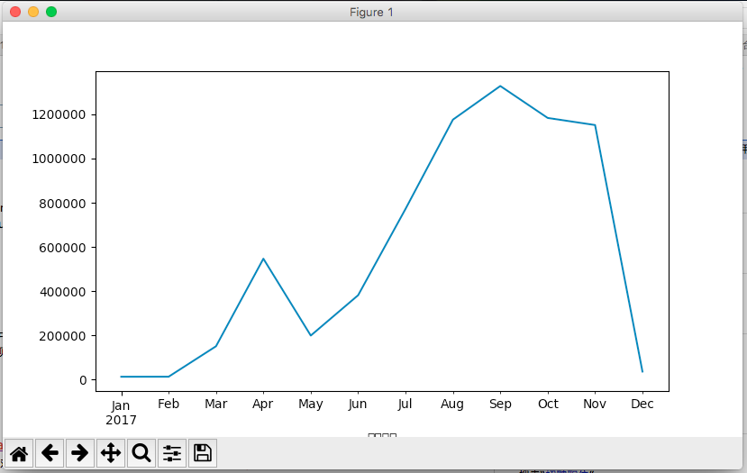

本文的例子需要一些特殊设置，具体可以参考[Pandas快速入门（一）](http://www.cnblogs.com/cocowool/p/8316595.html)

### 数据清理和转换
我们在进行数据处理时，拿到的数据可能不符合我们的要求。有很多种情况，包括部分数据缺失，一些数据的格式不正确，一些数据的标注问题等等。对于这些数据，我们在开始分析之前必须进行必要的整理、清理。
清理和转换的过程中用到最对的包括判断是否存在空值(obj.isnull)，删除空值(dropna)、填充空值(fillna)、大小写转换、文字替换(replace)等等。我这里挑几个典型的场景来学习一下。

#### 判断是否存在有空值的行，并删除行
先构建一个具有空值的DataFrame对象。
```bash
In [17]: stat = DataFrame.from_dict({"Beijing":{"People":3100,"Area":540,"GDP":3000},"Guangzhou":{"People":np.nan,"Area":370,"GDP":2500},"Shanghai":
    ...: {"People":2800,"Area":500,"GDP":3100},"Shenzhen":{"People":1800,"Area":np.nan,"GDP":2100}},orient='index')

In [18]: stat
Out[18]: 
           People   Area   GDP
Beijing    3100.0  540.0  3000
Guangzhou     NaN  370.0  2500
Shanghai   2800.0  500.0  3100
Shenzhen   1800.0    NaN  2100

In [20]: stat.isnull()
Out[20]: 
           People   Area    GDP
Beijing     False  False  False
Guangzhou    True  False  False
Shanghai    False  False  False
Shenzhen    False   True  False

In [24]: stat = stat.dropna()

In [25]: stat
Out[25]: 
          People   Area   GDP
Beijing   3100.0  540.0  3000
Shanghai  2800.0  500.0  3100
```
这样就把包含空值的行全部删除了。

#### 对标签数据进行规范化转换，对数据进行替换
本例的目的是，数据中存在一些语义标签表达不规范，按照规范的方式进行统一修改并进行替换。例如，根据Gender规范人员的称呼，对职业进行规范。
```bash
In [26]: people = DataFrame.from_dict(
    ...:     {"Xiao Zhang":{"Gender":"Male","Age":24,"Occupation":"小学老师"},
    ...:     "xiao Wang":{"Gender":"Female","Age":25,"Occupation":"大学老师"},
    ...:     "Xiao Wei":{"Gender":"Male","Age":23,"Occupation":"百度公司"},
    ...:     "Lao Shi":{"Gender":"Female","Age":55,"Occupation":"阿里巴巴"}},
    ...:     orient='index')
    ...:     

In [27]: people
Out[27]: 
            Gender  Age Occupation
Lao Shi     Female   55       阿里巴巴
Xiao Wei      Male   23       百度公司
Xiao Zhang    Male   24       小学老师
xiao Wang   Female   25       大学老师
```
第一个需求，就是把职业一栏，规范为“教师”、“公司职员”。
```bash
In [28]: map = {
    ...:     "小学老师" : "教师",
    ...:     "大学老师" : "教师",
    ...:     "百度公司" : "公司职员",
    ...:     "阿里巴巴" : "公司职员"
    ...: }

In [29]: map
Out[29]: {'大学老师': '教师', '小学老师': '教师', '百度公司': '公司职员', '阿里巴巴': '公司职员'}

In [30]: people.replace(map)
Out[30]: 
            Gender  Age Occupation
Lao Shi     Female   55       公司职员
Xiao Wei      Male   23       公司职员
Xiao Zhang    Male   24         教师
xiao Wang   Female   25         教师
```
另一个需求，根据Gender增加一列称谓。这里就不考虑已婚未婚了。
```bash
In [34]: def NormalizeName(gender):
    ...:     if( gender == "Male"):
    ...:         return "Mr "
    ...:     elif( gender == "Female" ):
    ...:         return "Mrs "
    ...:  

In [40]: people['title'] =  people['Gender'].map(NormalizeName)
In [43]: people
Out[43]: 
            Gender  Age Occupation title
Lao Shi     Female   55       公司职员  Mrs 
Xiao Wei      Male   23       公司职员   Mr 
Xiao Zhang    Male   24         教师   Mr 
xiao Wang   Female   25         教师  Mrs
```
> 对于数据量大的情况，有时候不能够在分析之前就发现数据中存在的问题，往往是分析进行到一半，突然发现有的数据格式或者质量有问题，对于这种情况，不知道大家有没有好的处理办法，让我们提前发现数据问题？


### 时间序列

#### 日期和时间数据类型
处理时间数据，经常用到Python中的 datetime 模块，该模块中的主要数据类型有。

与时间序列相关的还有很多功能，包括时区转换。如果是从文件读入的数据，可以使用```parse_dates```参数来对日期进行解析。
对于日期型的索引，可以根据日期、月份、年份、日期范围来方便的选择数据。
```bash
In [131]: jgd['2017-03':'2017-04']
Out[131]: 
                摘要   证券名称   合同编号   成交数量                成交均价     成交金额   手续费  \
成交日期                                                                         
2017-03-01    申购配号   拉芳配号  13932      1                 0.0      0.0   0.0   
2017-03-01    申购配号   康隆配号  13933      1                 0.0      0.0   0.0
```
使用 to_period 和 asfreq 方法，可以方便的将日期转换成按月、按季度、按工作日显示的索引，方便进行后续的统计汇总。我

### 画图
DataFrame对象自带一个 plot 方法，可以进行方便的绘图。
```bash
In [143]: jgd['成交金额'].resample('M').sum()
Out[143]: 
成交日期
2017-01-31      12693.80
2017-02-28      12863.00
2017-03-31     150605.00
2017-04-30     546912.00
2017-05-31     199024.57
2017-06-30     381675.01
2017-07-31     772297.30
2017-08-31    1176152.20
2017-09-30    1328378.00
2017-10-31    1183852.00
2017-11-30    1151724.65
2017-12-31      36120.00
Freq: M, Name: 成交金额, dtype: float64

n [145]: jgd['成交金额'].resample('M').sum().plot()
Out[145]: <matplotlib.axes._subplots.AxesSubplot at 0x10cc78080>
```
如下图：


### 分组统计
对于分组统计，通常的步骤是“分割、应用（统计函数）、合并”。
Groupby 是Pandas中最常用的分组函数，返回一个 DataFrameGroupBy 对象，该对象实际并不包含数据内容，记录了中间数据，当我们对分组数据进行数学运算时，pandas 再根据对象内的信息对 DataFrame 进行快速分块运算并返回结果。
1、根据某个字段分组并求和
```bash
In [171]: jgd.columns
Out[171]: 
Index(['摘要', '证券名称', '合同编号', '成交数量', '成交均价', '成交金额', '手续费', '印花税', '其他杂费',
       '发生金额', '股东帐户', '备注', '操作', '证券代码', '结算汇率', 'Unnamed: 16'],
      dtype='object')

In [172]: jgd_g1 = jgd.groupby(['证券名称','摘要'])

In [173]: jgd_g1.sum()
Out[173]: 
                成交数量        成交金额
证券名称  摘要                        
50ETF 证券买入       500     1228.00
      证券卖出     -1300     3190.20
```

### 透视表 pivot_table
pivot_table 函数提供了一个生成 Excel 样式透视表的方法。调用格式```pd.pivot_table(data,values,index,columns,aggfunc)```。

* data : 需要处理的 DataFrame 对象
* values : 一个或一组需要分组的列名
* index : a column, Grouper, array which has the same length as data, or list of them. Keys to group by on the pivot table index. If an array is passed, it is being used as the same manner as column values.
* columns : a column, Grouper, array which has the same length as data, or list of them. Keys to group by on the pivot table column. If an array is passed, it is being used as the same manner as column values.
* aggfunc : function to use for aggregation, defaulting to numpy.mean.

### 导入和导出数据

#### 从CSV导入数据
```bash
In [72]: jg = pd.read_csv('jg-2017-12-utf8.csv',parse_dates=True,index_col=0)

In [73]: jg
Out[73]: 
                摘要   证券名称   合同编号   成交数量     成交均价   成交金额   手续费   印花税  其他杂费  \
成交日期                                                                        
2017-12-01  基金资金拨出   天天发１      0      0    1.000      0  0.00  0.00  0.00   
2017-12-01    证券卖出   民丰特纸   8471  -1000    7.120   7120  5.00  7.12  0.14
```

#### 将数据写入到CSV中
```bash
In [82]: del jg['结算汇率']
In [84]: jg.to_csv('test.csv')
In [90]: cat test.csv
成交日期,摘要,证券名称,合同编号,成交数量,成交均价,成交金额,手续费,印花税,其他杂费,发生金额,股东帐户,备注,操作,证券代码
2017-12-01,基金资金拨出,天天发１,0,0,1.0,0,0.0,0.0,0.0,-36118.59,99F6983257,122.0,其他,940018
```

### 参考资料
1、利用Pandas进行数据分析
2、[十分钟搞定pandas](https://www.cnblogs.com/chaosimple/p/4153083.html)
3、[Pandas Documentation](https://pandas.pydata.org/pandas-docs/stable/generated/pandas.DataFrame.from_dict.html#pandas.DataFrame.from_dict)
4、[DataFrame Replace](https://pandas.pydata.org/pandas-docs/stable/generated/pandas.DataFrame.replace.html#pandas.DataFrame.replace)


