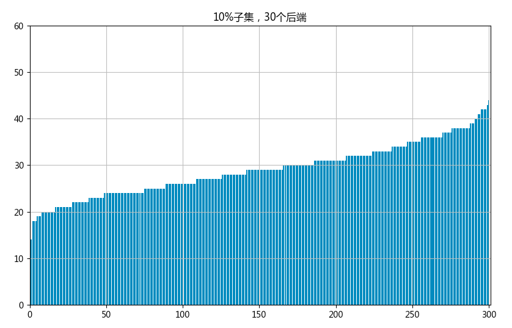
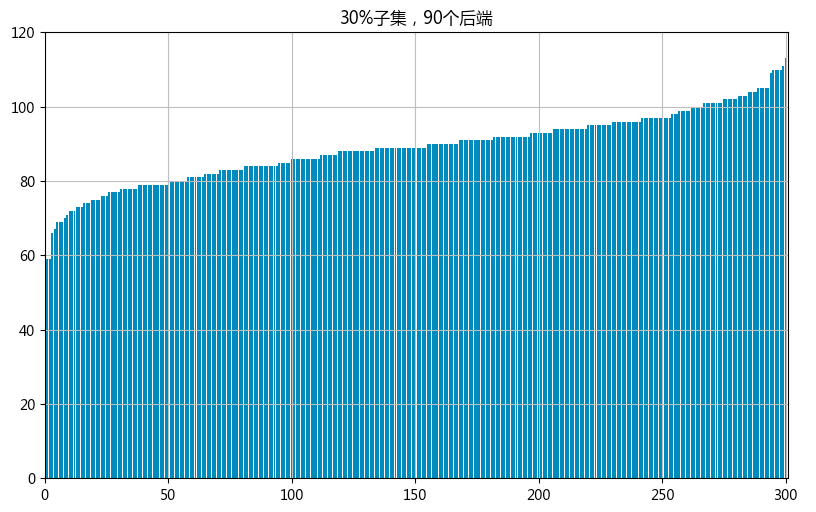
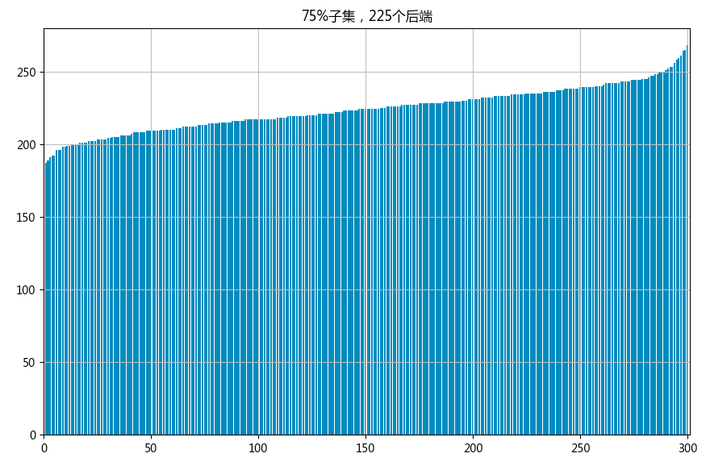

最近在读《SRE Google运维解密》第20章提到数据中心内部服务器的负载均衡方法，文章对比了几种负载均衡的算法，其中随机选择算法，非常适合用 Numpy 模拟并且用 Matplotlib 画图，下面是我的代码：
```python
# 使用 numpy 模拟 GRE 中的随机选择算法，并使用 pyplot绘图

import numpy as np
from numpy import random

r = random.randint(1,301,size = (300,225) )
a = {}
for i in r:
    for j in i:
        if(j in a.keys()):
            a[j] = a[j] + 1
        else:
            a[j] = 0

height = []
z = a.values()
for i in z:
    height.append(i)

height.sort()
x = np.arange(1,301)

plt.bar(x,height)
plt.axis([0,301,0,280])
plt.grid(True)
plt.title("75%子集，225个后端")
```
整个模拟的思路就是首先随机生成一个二维数组，然后再统计每台服务器被选中的次数，并对次数排序并画图，然后就能够出来书中的图的样式。整个代码感觉还是有些繁琐，如果有更好的想法的朋友，欢迎与我沟通改进。
刚开始还想用直方图来绘制，仔细看了之后发现图上的并不是直方图，直方图能够反映每台前端连接后端服务器的分布情况，但是未经过排序，所以无法明显的看出最大和最小的区别。所以要对数据做一下处理，排序后再重新做图。
我按照三个参数模拟了一下，感觉随机选择算法不管子集的大小如何，负载的情况都不是很均衡。子集小的情况下，能够偏出平均值50%，子集大的时候（75％）仍能偏出平均值15%左右。




参考资料：
1、[SRE Google 运维解密](SRE Google 运维解密)
2、[Python中plt.hist参数详解](https://www.cnblogs.com/python-life/articles/6084059.html)
3、[Matplotlib](https://matplotlib.org/api/_as_gen/matplotlib.pyplot.title.html#matplotlib.pyplot.title)
4、[彻底解决matplotlib中文乱码问题](http://www.cnblogs.com/xiaojikuaipao/p/8465834.html)
5、[numpy中的随机数模块](https://www.cnblogs.com/td15980891505/p/6198036.html)


