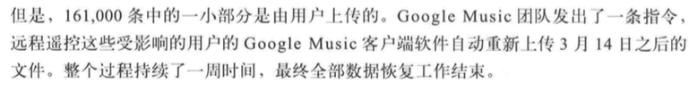

### 写在前面
最近花了一点时间阅读了《[SRE Goolge运维解密](https://book.douban.com/subject/26875239/)》这本书，对于书的内容大家可以看看豆瓣上的介绍。总体而言，这本书是首次比较系统的披露Google内部SRE运作的一些指导思想、实践以及相关的问题，对于我们运维乃至开发人员都有一定的借鉴意义。

书中的一些思想也令我印象深刻，例如SRE工程师要保证投入50%的时间在项目上、错误预算、命运之轮、事故总结等等，对于从业者有很大的启发。书中提到了很多思想，也提到了很多工具，我想不同的单位有不同的文化、制度背景，这种指导思想未必能够执行，但是书中提到的工具，却有被其他人利用的可能。因此，我就整理了书中提到的一些工具以及搜索是否有对应的开源工程，整理成下面的列表供大家参考。

如果大家发现有不全的，或者对于某个工具希望深入讨论的，欢迎给我留言。

### Google 技术栈

Borg    调度服务（2003），开源产品 Kubernetes
Borg Name Service BNS 名称解析系统
Bigtable
Blaze/[Bazel](https://www.bazel.build)构建
Rapid 发布
Midas Pacakge Management MPM 打包
Sisyphus 发布自动化框架
Chubby 强一致性存储系统
Prober 端到端检测（黑盒监控 Black Box Monitoring）
Protocol Buffer (Protobuf)
Alert Manager 报警管理服务
Dapper 分布式组件跟踪工具
Incident Command System 应急事件管理
IRC机器人
Dagger 依赖注入(Dependency Injection)工具
Protocol Buffer 数据交换格式
Auxon 自动化容量规划
gRPC Google RPC 框架
Doorman 协作性分布式客户端节流系统
Zipking 业务流追踪
Stackdriver

### 两点吐槽
一、绕口的翻译
P158:一个测试系统可以检测出一个MTTR为0的Bug。
P253:这种设计类型在服务领头人的工作量是分片的。
P327:Google几乎没有处理大规模消费者产品运行不能直接控制的客户端代码的经验。

二、强大的客户端

参考资料：
1、[Google Borgmon](http://flacro.me/google-borgmon/)
2、[Google使用Borg进行大规模集群的管理-2015](Google使用Borg进行大规模集群的管理-2015)
3、[基于 Prometheus 的数据库监控](https://juejin.im/entry/58facf91da2f60005db72841)
4、[Prometheus](Prometheus)
5、[Google Protocol Buffer 的使用和原理](https://www.ibm.com/developerworks/cn/linux/l-cn-gpb/index.html)
6、[Doorman: Global Distributed Client Side Rate Limiting](https://www.usenix.org/conference/srecon16/program/presentation/visser)
7、[SRE Book notes](https://danluu.com/google-sre-book/)
8、[Zipkin](https://zipkin.io/pages/quickstart)
9、[morgue 事故总结工具](https://github.com/etsy/morgue)
10、[Incident management at Google](https://news.ycombinator.com/item?id=13744621)
11、[TerraForm](https://www.terraform.io)