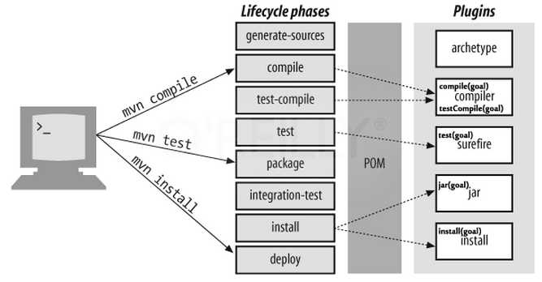

### 安装
Maven是一个Java工具，因此你的电脑上必须安装有JAVA环境（JDK或者JRE）
首先，从官方[下载 Maven](https://maven.apache.org/download.html)，我这里下载的是 3.5 的版本。
本文是在Mac环境中安装的，首先创建一个文件夹，将 tar 包解压缩。
```bash
bogon:tools rousseau$ tar -xvzf apache-maven-3.5.3-bin.tar.gz 
bogon:tools rousseau$ cd apache-maven-3.5.3/
bogon:apache-maven-3.5.3 rousseau$ ./bin/mvn -version
Apache Maven 3.5.3 (3383c37e1f9e9b3bc3df5050c29c8aff9f295297; 2018-02-25T03:49:05+08:00)
Maven home: /Users/rousseau/tools/apache-maven-3.5.3
Java version: 1.8.0_131, vendor: Oracle Corporation
Java home: /Library/Java/JavaVirtualMachines/jdk1.8.0_131.jdk/Contents/Home/jre
Default locale: en_US, platform encoding: UTF-8
OS name: "mac os x", version: "10.11.6", arch: "x86_64", family: "mac"
```
将 bin 目录加入到你的环境变量中。

### 配置
Maven的配置分三个级别：Project级别、全局 Installation 和 用户 User 级别。用户的配置可以在```${user.home}/.m2/settings.xml```文件中具体指定，这个文件不是必须的，如果没有就会使用默认配置。

#### 配置本地 Repository
默认的 Repository 位置为```${user.home}/.m2/repository/```，可通过配置文件修改。
```xml
<settings>
  ...
  <localRepository>/path/to/local/repo/</localRepository>
  ...
</settings>
```

#### 配置代理 Proxy
其它还有并发配置 Parallel Artifact Resolution Configuration、安全及部署配置 Security and Deployment Settings

### 创建工程
> 首次执行的时候需要从Maven中央仓库下载一些依赖包，所以可能会花一些时间。由于网络超时的原因，很可能不会一次成功，需要多试几次。

```bash
bogon:maven rousseau$ ~/tools/apache-maven-3.5.3/bin/mvn archetype:generate -DgroupId=com.cocowool.app -DartifactId=my-app -DarchetypeArtifactId=maven-archetype-quickstart -DinteractiveMode=false
# 工程创建后，可以查看目录结构
bogon:maven rousseau$ cd my-app/
```
生成的工程中，POM.xml 位于根目录下，```src/main/java```存放工程代码，```src/test/java```存放测试代码。

### POM 文件
POM.xml 是Maven进行工程构建的最主要的配置文件，本文中的 pom.xml 如下：
```xml
<project xmlns="http://maven.apache.org/POM/4.0.0" xmlns:xsi="http://www.w3.org/2001/XMLSchema-instance"
  xsi:schemaLocation="http://maven.apache.org/POM/4.0.0http://maven.apache.org/maven-v4_0_0.xsd">
  <modelVersion>4.0.0</modelVersion>
  <groupId>com.cocowool.app</groupId>
  <artifactId>my-app</artifactId>
  <packaging>jar</packaging>
  <version>1.0-SNAPSHOT</version>
  <name>my-app</name>
  <url>http://maven.apache.org</url>
  <dependencies>
    <dependency>
      <groupId>junit</groupId>
      <artifactId>junit</artifactId>
      <version>3.8.1</version>
      <scope>test</scope>
    </dependency>
  </dependencies>
</project>
```

### 打包
执行```mvn package```可以对工程进行打包，输出 jar 包。
```bash
bogon:my-app rousseau$ ~/tools/apache-maven-3.5.3/bin/mvn package
[INFO] Building jar: /Users/rousseau/Projects/java.my/study/maven/my-app/target/my-app-1.0-SNAPSHOT.jar
[INFO] ------------------------------------------------------------------------
[INFO] BUILD SUCCESS
[INFO] ------------------------------------------------------------------------
[INFO] Total time: 03:55 min
[INFO] Finished at: 2018-05-08T12:43:13+08:00
[INFO] ------------------------------------------------------------------------
# 生成的jar包存放在 target 目录下
bogon:my-app rousseau$ java -cp target/my-app-1.0-SNAPSHOT.jar com.cocowool.app.App
Hello World!
```

### Maven 支持的阶段
Maven主要的阶段包含以下几个



### 后记

参考资料:
1、[Maven](https://maven.apache.org)
2、[Maven in 5 Minutes](https://maven.apache.org/guides/getting-started/maven-in-five-minutes.html)
3、[Installing Apache Maven](https://maven.apache.org/install.html)
4、[Configuring Maven](https://maven.apache.org/guides/mini/guide-configuring-maven.html)


