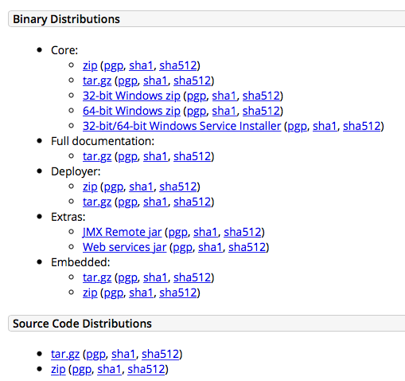
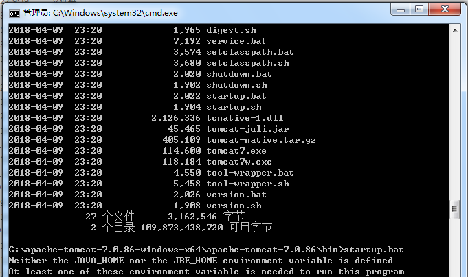
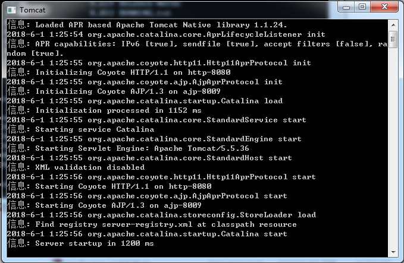
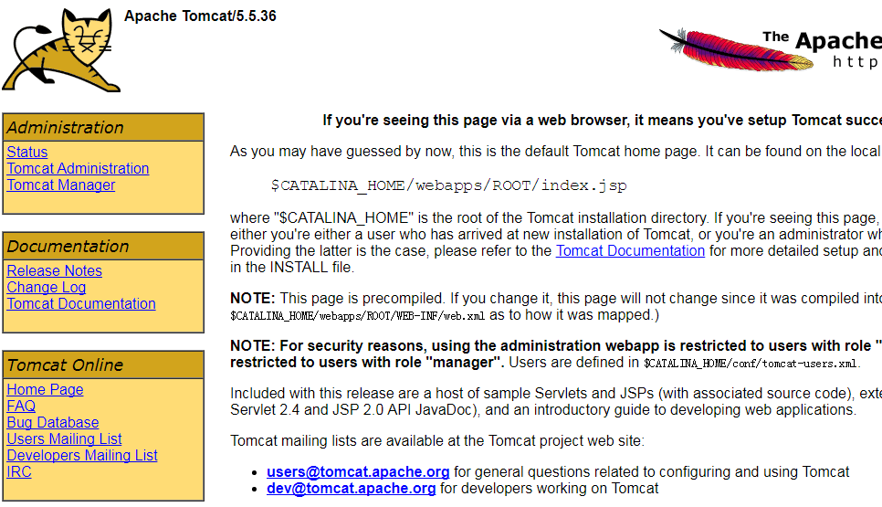

### Windows 安装
Tomcat 在官方网站中提供了两个 Windows 安装版本，一个是普通安装版，一个是解压版。普通安装版带了安装器，像我们安装其他Windows程序一样，可以通过安装界面下一步下一步直到安装完成。解压版就相当于绿色版，直接解压即可使用。因为安装版可以自动注册Windows服务，所以对于小白用户，安装版更友好一些。

zip 包就是解压后可以直接用，相当于绿色版。Installer 带了安装器，能够安装为 Windows 服务。

#### 安装 JDK

从 Oracle 网站下载合适的 JDK 或者 JRE。[JDK下载地址](http://www.oracle.com/technetwork/java/javase/downloads/index.html)

#### 以普通方式启动

Tomcat 的启动是一个 bat 脚本，在 tomcat_path\bin 目录下，可以通过双击或者在命令行窗口执行的方式启动。
双击启动时，如果遇到窗口一闪就关闭，说明Tomca没有找到JAVA运行环境，这个时候检查系统的JAVA_HOME变量是否设置了。
如果是命令行方式启动，则会看到明确的提示信息。

启动成功后，可以看到新开了一个窗口，并且有提示信息。

这时就可以通过浏览器进行访问，看到这只猫就可以了。


#### 配置 Tomcat 以服务方式启动

如果是用安装器安装的 Tomcat 那么在服务中会自动注册 Tomcat 服务，如果是用 zip 的方式，也可以注册服务，需要执行下面的命令。
```bat
cd tomcat_path\bin
service install tomcat
```
其中服务的名称可以自己定义，如果需要启动多个Tomcat，只要能够通过名字区分开就可以。举例如下：
```bat
cd tomcat_7_path\bin
service install tomcat7
cd tomcat_8_path\bin
service install tomcat8
```
> 用这种方式注册服务，需要使用管理员用户权限。后续管理的时候，也只能用管理员用户进行启停，如果需要使用普通用户权限启停，看下面一节。

#### 以普通用户方式启停服

> 使用普通用户启停，也遇到过坑，停服务的时候停不下来，可能是服务内存溢出了。这时想杀掉进城有没权限，真的是欲哭无泪。

### Linux 安装

Linux 下的安装方法也有多种，可以选择二进制包，也可以使用源码包编译安装。还可以使用 yum 源进行安装。

### 目录结构介绍


### 一些主要的配置参数
conf 目录下的 server.xml 保存了主要的服务器设置参数。

#### 修改默认端口
找到下面一段，可以修改服务器对外提供服务的端口
```xml
<Connector port="8080" protocol="HTTP/1.1"
               connectionTimeout="20000"
                redirectPort="8443" />
```

#### 修改默认网站位置
Tomcat 对于网站项目的目录结构有着自己特殊的要求，不像 php 这种解释型语言，可以随意组织目录。作为站点的文件夹中必须包含一个```WEB-INF```的子文件夹。在该子文件夹下必须有一个 web.xml 的文件。
参考资料：
1、[JDK 7 Download](http://www.oracle.com/technetwork/java/javase/downloads/jdk7-downloads-1880260.html)
2、[Tomcat Download](http://tomcat.apache.org/download-70.cgi)
3、[Tomcat安装配置](http://www.cnblogs.com/Johness/archive/2012/07/20/2600937.html)


