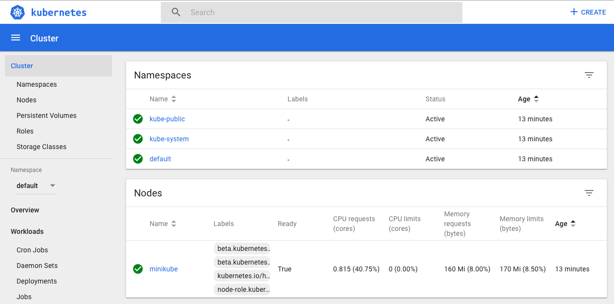
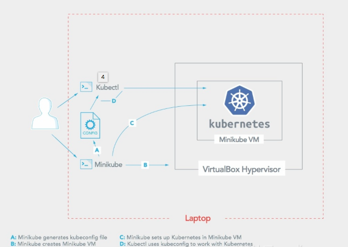

> 本文的环境如下：
操作系统： Mac OSX EI Caption
Docker：Docker version 18.03.1-ce, build 9ee9f40
Minikube：minikube version: v0.27.0
Kubernetes: v1.10.0


### Minikube 介绍
Minikube支持Kubenetes的以下特性：

* DNS
* NodePorts
* ConfigMaps and Secrets
* Dashboards
* Container Runtime: Docker, rkt and CRI-O
* Enabling CNI (Container Network Interface)
* Ingress

### Minikube 安装
因为 Google 在国内没办法访问，我使用了阿里版的 Minikube 。
Minikube运行要求安装有VirtualBox或VMWare Fusion，我用的是VirtualBox。
VirtualBox安装很简单，从[官方下载DMG](https://www.virtualbox.org)安装即可。

#### 下载安装 Minikube
```bash
curl -Lo minikube http://kubernetes.oss-cn-hangzhou.aliyuncs.com/minikube/releases/v0.27.0/minikube-darwin-amd64 && chmod +x minikube && sudo mv minikube /usr/local/bin/
```

#### 启动 Minikube
```bash
minikube start --registry-mirror=https://registry.docker-cn.com
```
> 如果你遇到这个错误，**Error restarting cluster:  restarting kube-proxy: waiting for kube-proxy to be up for configmap update: timed out waiting for the condition**
通过 minikube delete，minikube start 可以解决


#### 打开 Minikube 控制台
```bash
minikube dashboard
```
随后浏览器中会自动打开这个界面。


### 使用
Minikube在本地虚拟机环境中部署 Kubernetes。


#### 启动 Cluster

```bash
bogon:k8s rousseau$ minikube start
Starting local Kubernetes v1.10.0 cluster...
Starting VM...
Getting VM IP address...
Moving files into cluster...
Setting up certs...
Connecting to cluster...
Setting up kubeconfig...
Starting cluster components...
Kubectl is now configured to use the cluster.
Loading cached images from config file.
```
该命令创建并配置一个运行了单个Kubernetes节点的虚拟机。Minikube 启动过程中，可以用```--extra-config=component.key=value```的形式给 Kubernetes 指定参数。

#### 停止 Cluster
```bash
bogon:k8s rousseau$ minikube stop
```

#### 删除 Cluster
```bash
bogon:k8s rousseau$ minikube delete
```

#### 访问服务
```bash
minikube service [-n NAMESPACE] [--url] NAME
```

### 网络
前面的原理图说明了Minikube启动了一个虚拟机，这个虚拟机的地址是Host-Only的，要获得主机IP，执行。
```bash
bogon:k8s rousseau$ minikube ip
192.168.99.100
```

### 存储

### 简单的示例

#### 构建一个 Node 服务
构建一个简单的Node网页程序，用户访问的时候输出hello world。
```javascript
var http = require('http');

var handleRequest = function(request, response) {
  console.log('Received request for URL: ' + request.url);
  response.writeHead(200);
  response.end('Hello World!');
};
var www = http.createServer(handleRequest);
www.listen(8080);
```
可以在终端中执行```node server.js```并通过 [http://localhost:8080](http://localhost:8080) 查看效果

#### 生成镜像
编写 Dockerfile 文件
```yaml
FROM node:6.9.2
EXPOSE 8080
COPY server.js .
CMD node server.js
```
因为我们使用的是 Minikube ，不需要把镜像放到镜像仓库中，只需要放在Minikube VM中。
```bash
bogon:k8s rousseau$ eval $(minikube docker-env)
bogon:k8s rousseau$ docker build -t hello-node:v1 .
Sending build context to Docker daemon  3.072kB
Step 1/4 : FROM node:6.9.2
6.9.2: Pulling from library/node
75a822cd7888: Pull complete 
57de64c72267: Pull complete 
4306be1e8943: Pull complete 
871436ab7225: Pull complete 
0110c26a367a: Pull complete 
1f04fe713f1b: Pull complete 
ac7c0b5fb553: Pull complete 
Digest: sha256:2e95be60faf429d6c97d928c762cb36f1940f4456ce4bd33fbdc34de94a5e043
Status: Downloaded newer image for node:6.9.2
 ---> faaadb4aaf9b
Step 2/4 : EXPOSE 8080
 ---> Running in a3229e6d0438
Removing intermediate container a3229e6d0438
 ---> f8e1aa12de28
Step 3/4 : COPY server.js .
 ---> 5254ea79c7a4
Step 4/4 : CMD node server.js
 ---> Running in 060ef7e6f713
Removing intermediate container 060ef7e6f713
 ---> 2fe0fd2e98d7
Successfully built 2fe0fd2e98d7
Successfully tagged hello-node:v1
```

#### 部署
使用```kubectl```命令行部署应用。
```bash
bogon:k8s rousseau$ kubectl run hello-node --image=hello-node:v1 --port=8080
deployment.apps "hello-node" created
bogon:k8s rousseau$ kubectl get deployments
NAME         DESIRED   CURRENT   UP-TO-DATE   AVAILABLE   AGE
hello-node   1         1         1            1           26s
bogon:k8s rousseau$ kubectl get pods
NAME                          READY     STATUS    RESTARTS   AGE
hello-node-658d8f6754-7mz28   1/1       Running   0          37s
```
Pods在Kubernetes中是一组容器的集合，在这个例子中只有一个容器实例，所以看到的各项统计数字都是1。

#### 创建服务
默认情况下，Pod只能通过内部地址访问，为了让 hello-node 可以从外部访问，需要将Pod暴露为 Kubernetes 的服务。
```bash
bogon:k8s rousseau$ kubectl expose deployment hello-node --type=LoadBalancer
service "hello-node" exposed
bogon:k8s rousseau$ kubectl get services
NAME         TYPE           CLUSTER-IP       EXTERNAL-IP   PORT(S)          AGE
hello-node   LoadBalancer   10.108.143.198   <pending>     8080:32386/TCP   7s
kubernetes   ClusterIP      10.96.0.1        <none>        443/TCP          1h
```
```--type=LoadBalancer```参数表示我们希望将我们的服务暴露在外面，在云的环境中支持负载均衡情况下，只需要提供负载均衡的地址。在Minikube中，```LoadBanlancer```类型让服务可以通过```minikube service```来访问
```bash
minikube service hello-node
```
这个命令会自动打开浏览器窗口访问服务，使用本地IP。

#### 更新应用
假设我们更新了应用，输出新的一段话。
```bash
response.end('Hello World Again!');
```
生成镜像
```bash
docker build -t hello-node:v2 .
```
更新部署
```bash
kubectl set image deployment/hello-node hello-node=hello-node:v2
```
查看更新
```bash
minikube service hello-node
```
销毁服务
```bash
kubectl delete service hello-node
kubectl delete deployment hello-node
```
参考资料：
1、[Minikube - Kubernetes本地实验环境](https://yq.aliyun.com/articles/221687)
2、[Hello Minikube](https://kubernetes.io/docs/tutorials/hello-minikube/)
3、[Running Kubernetes Locally via Minikube](https://kubernetes.io/docs/setup/minikube/)
4、[Install Minikube](https://kubernetes.io/docs/tasks/tools/install-minikube/)


