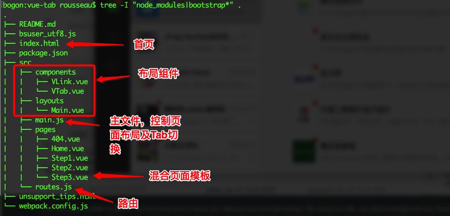

最近基于Vue、Bootstrap做了一个箭头样式的进度展示的单页应用，并且支持了对于一个本地JS文件的检索，通过这个单页应用，对于Vue的理解又深入了一些。在这里把主要的代码分享出来。
本单页应用实现了几个功能：
1、点击箭头导航栏能够切换页面内容
2、使用了渲染到方式来展示内容，内容采用混合模板
3、对步骤一中的输入文本框进行监听，根据输入的内容，从本地JS文件检索给出用户提示
期望改进的地方
1、点击Tab链接的时候，能够有页面切换效果（左右滑动）
2、文本框的提示方式改为 Suggestion

> 全部的代码可以参见[我的 github 主页](https://github.com/cocowool/vue-tab)上的项目代码，这里只分享主要的代码。

看一下页面效果

先看一下代码结构

具体的代码

### index.html

```html
<!DOCTYPE html>
<html lang="zh-CN">
<head>
    <meta charset="utf-8">
    <title>智慧园区考勤操作指引</title>
    <meta name="description" content="描述了员工如何绑定智慧园区，并通过智慧园区进行日常工作考勤。">
    <meta name="viewport" content="width=device-width, initial-scale=1, maximum-scale=1, user-scalable=no">
    <link href="./bootstrap-3.3.7/css/bootstrap.min.css" rel="stylesheet" type="text/css">
    <style type="text/css">
        @-ms-viewport     { width: device-width; }
        @-o-viewport      { width: device-width; }
        @viewport         { width: device-width; }
        
        body { padding-top:20px; padding-bottom: 20px; }
        .header, .footer { padding-right: 15px; padding-left: 15px; }
        .header { padding-bottom: 20px; border-bottom: 1px solid #e5e5e5; margin-bottom: 30px; }
        .header h3 { margin-top: 0; margin-bottom: 0; line-height: 40px; }
        .footer { padding-top: 19px; color: #777; border-top: 1px solid #e5e5e5; margin-top: 30px; }
        .jumbotron {  }
        .step-container { margin:30px 0; }

        @media (min-width: 1024px) {
            .container {
                max-width: 1000px;
            }
        }

        .container-narrow > hr { margin: 30px 0; }
        .step-container { clear: both; vertical-align: middle; display: table-cell; margin-bottom: 30px; }
        .rs-step-container { height: 40px; margin-bottom: 25px; }
        .rs-arrow {  }
        .rs-arrow .rs-step { text-align:center; cursor: pointer; display: inline-block; padding:10px 38px 10px 38px; position: relative; background-color: #e7e7e7; margin:0 3px; font-size: 14px;-webkit-user-select: none; -moz-user-select: none; -ms-user-select: none; user-select: none;  }
        .rs-arrow .rs-step:after, .rs-arrow .rs-step:before { content: " "; position: absolute; top: 0; right: -17px; width: 0; height: 0; border-top: 20px solid transparent; border-bottom: 20px solid transparent; border-left: 17px solid #e7e7e7; z-index: 2; transition: border-color 0.2s ease; }
        .rs-arrow .rs-step:before { right: auto; left: 0; border-left: 17px solid #fff;     z-index: 0; }
        .rs-arrow .rs-step:first-child:before { border: none; }
        .rs-arrow .rs-step:first-child { border-top-left-radius: 4px; border-bottom-left-radius: 4px; }
        .rs-arrow .current, .rs-arrow .active { background-color: #337ab7; color:#fff; }
        .rs-arrow .current:after, .rs-arrow .active:after { border-left-color: #337ab7;  }
        .rs-arrow .active a { color:#fff; }
        .rs-arrow div:hover { color:tomato; }        
        .rs-arrow a:hover { text-decoration: none; }
        .step-content { margin-top: 50px; }

        .fade-enter-active, .fade-leave-active { transition: opacity .5s; }
        .fade-enter, .fade-leave-to /* .fade-leave-active below version 2.1.8 */ { opacity: 0; }

        /*路由切换动画*/
        .slide-right-enter-active,
        .slide-right-leave-active,
        .slide-left-enter-active,
        .slide-left-leave-active {
            will-change: transform;
            transition: all 500ms;
            position: absolute;
        }
        .slide-right-enter {
            opacity: 0;
            transform: translate3d(-100%, 0, 0);
        }
        .slide-right-leave-active {
            opacity: 0;
            transform: translate3d(100%, 0, 0);
        }
        .slide-left-enter {
            opacity: 0;
            transform: translate3d(100%, 0, 0);
        }
        .slide-left-leave-active {
            opacity: 0;
            transform: translate3d(-100%, 0, 0);
        }
        .fade-enter-active, .fade-leave-active {
            transition: opacity 0.3s
        }

        .fade-enter, .fade-leave-active {
            opacity: 0
        }
    </style>
    <!--[if lt IE 8]>
        <script type="text/javascript">
            window.location.href='unsupport_tips.html'
        </script>
    <![endif]-->
    <!--[if lt IE 9]>
      <script src="./html5shiv.min.js"></script>
      <script src="./respond.min.js"></script>
    <![endif]-->
</head>
<body>
    <div class="container">
        <div class="header clearfix">
            <nav>
                <ul class="nav nav-pills pull-right">
                    <li><a href="javascript:void(0);" target="_blank">友情链接</a></li>
                    <li><a href="javascript:void(0);" target="_blank">友情链接</a></li>
                    <li><a href="javascript:void(0);">友情链接</a></li>
                </ul>
            </nav>
            <h3 class="text-muted" id="ccb-title" v-bind:title="message">智慧园区考勤指引</h3>
        </div>
        <div id="app">
            
        </div>
        <footer class="footer">
            <p>&copy;2018 cocowool</p>
        </footer>
    </div>    
    <script src="./jquery-3.3.1.min.js" type="text/javascript"></script>
    <script src="./bootstrap-3.3.7/js/bootstrap.min.js" type="text/javascript"></script>
    <script type="text/javascript" src="./dist/build.js"></script>
    <script type="text/javascript" src="./bsuser_utf8.js"></script>
</body>
</html>
```

### main.js
```javascript
import Vue from 'vue'

import routes from './routes'

const app = new Vue({
  el: '#app',
  data: {
    currentRoute: window.location.pathname,
  },
  watch : {
    currentRoute (to, from){
      to = routes[to] ? routes[to] : routes['/']
      from = routes[from] ? routes[from] : routes['/']
      if(to.meta.index > from.meta.index){
        this.transitionName = "slide-left"
      }else{
        this.transitionName = "slide-right"
      }
    }
  },
  methods : {
  },
  computed: {
    ViewComponent () {
      //console.log(bsuser)
      const matchingView = routes[this.currentRoute] ? routes[this.currentRoute].name : 'Home'
      return matchingView
        ? require('./pages/' + matchingView + '.vue')
        : require('./pages/Home.vue')
    }
  },
  render (h) {
    return h(this.ViewComponent)
    // return h(require('./pages/About.vue'))
  }
})

window.addEventListener('popstate', () => {
  app.currentRoute = window.location.pathname
})
```

### route.js
```javascript
export default {

  '/' : {
    name : 'Home',
    path : '/',
    meta : { index:0 }
  },
  '/step1' : {
    name : 'Step1',
    path : '/step1',
    meta : { index:1 }
  },
  '/step2' : {
    name : 'Step2',
    path : '/step2',
    meta : { index:2 }
  },
  '/step3' : {
    name : 'Step3',
    path : '/step3',
    meta : { index:3 }
  }
}
```

### Main.vue
```javascript
<template>

    <div class="step-container">
        <div class="rs-step-container rs-arrow">
            <v-tab href="/home">说明</v-tab>
            <v-tab href="/step1">第一步:查询考勤ID</v-tab>
            <v-tab href="/step2">第二步:下载APP & 绑定考勤ID</v-tab>
            <v-tab href="/step3">第三步:考勤并查看结果</v-tab>
        </div>
        <!-- <div>
            <input type="text" v-model="question" name="question">
        </div> -->
        <transition name="fade" mode="out-in" v-on:after-enter="afterEnter" appear>
            <slot></slot>
        </transition>
    </div>
</template>
<script>
import VLink from '../components/VLink.vue'
import VTab from '../components/VTab.vue'
export default {
    methods : {
        inputChanged(){
            console.log("Input CHanged")
        }
    },
    watch : {
    },
    components: {
        VLink,
        VTab
    }
}
</script>
```

### Step1.vue
```javascript
<template>

  <main-layout>
    <div class="step-content slide-left">
        <div class="form-group">
            <label for="searchItem" class="col-sm-2 control-label text-right" style="padding-top:8px;">用户名:</label>
            <div class="col-sm-8">
                <input type="text" id="searchVal" v-model="searchVal" @input="inputChanged" name="searchVal" placeholder="请输入北数考勤系统登录用户名、中文姓名或身份证号进行查询" class="form-control">
            </div>
            <div class="col-sm-2">&nbsp;</div>
        </div>
        <div class="form-group" style="margin-top:30px; clear:both; padding-top:30px;">
            <div class="col-sm-2">&nbsp;</div>
            <div class="col-sm-8">
                <table class="table table-striped" v-if="userList.length > 0">
                    <thead>
                        <tr>
                            <th>姓名</th>
                            <th>登陆用户</th>
                            <th>考勤编号</th>
                        </tr>
                    </thead>
                    <tbody>
                        <tr v-for='(item, key) in userList'>
                            <td>{{item.CNNAME}}</td>
                            <td>{{item.BSUSER}}</td>
                            <td>{{item.WHID}}</td>
                        </tr>
                    </tbody>
                </table>
            </div>
        </div>
        <div class="form-group">
            <div class="col-sm-offset-2 col-sm-10">
            </div>
        </div>
    </div>
  </main-layout>
</template>
<script>
import MainLayout from '../layouts/Main.vue'
export default {
    components : {
        MainLayout
    },
    data() {
        return {
            searchVal : '',
            userList : []
        }
    },
    props: {
        value : {
            type: String,
            default:''
        }
    },
    computed:{
    },
    methods:{
        inputChanged(event){
            this.userList = []
            var len = this.searchVal.length
            if( len > 0){
                for (var i = 0 ; i < bsuser.length ; i++){
                    if(bsuser[i].ID.substring(0,len) == this.searchVal || bsuser[i].CNNAME.substring(0,len) == this.searchVal || bsuser[i].BSUSER.substring(0,len) == this.searchVal ){
                        this.userList.push(bsuser[i])
                    }
                }
            }
        }
    }
}
</script>
```
参考资料：
1、[Fancy arrow-type progress bar](https://codepen.io/polinovskyi/pen/embZmw)
2、[Create border arrow with css](https://stackoverflow.com/questions/23428286/create-border-arrow-with-css)
3、[CSS Progress Wizard Example Page](https://www.cssscript.com/demo/responsive-step-progress-indicator-with-pure-css/)
4、[Responsive Step Progress Indicator with Pure CSS](https://www.cssscript.com/responsive-step-progress-indicator-with-pure-css/)
5、[使用 vue-router 切换页面时怎么设置过渡动画](https://blog.csdn.net/qq_33236453/article/details/79110485)
6、[基于Vue的页面切换左右滑动效果](https://www.cnblogs.com/zhengweijie/p/7149443.html)
7、[tab切换功能——vue](https://blog.csdn.net/lvkelly/article/details/75270101)
8、[解决vue在ie9中的兼容问题](https://blog.csdn.net/landl_ww/article/details/79149461)


