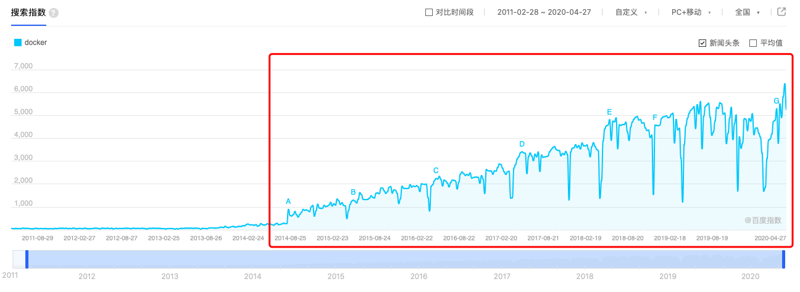
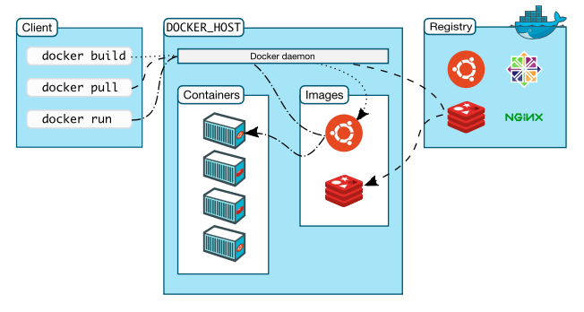

Docker 是一个应用程序开发、部署、运行的平台，使用 go 语言开发。相较于传统的主机虚拟化，Docker 提供了轻量级的应用隔离方案，并且为我们提供了应用程序快速扩容、缩容的能力。

<!-- more -->

[TOC]

## Docker与其他虚拟化方式的对比

* 虚拟机：通过在一种操作系统中运行另外一种操作系统的方式来提供不同的程序运行环境。这种方式的缺点是资源占用多，每个虚拟机都虚拟出了完整操作系统的各个部分；启动慢，虚拟机启动和正常的操作系统启动步骤一样，都要经过自检、加载等一系列步骤。
* Linux Container（简称LXC）：这是促使Docker产生的重要基础性技术。LXC实现了进程级别的资源隔离，因此相比传统的虚拟机来说，资源占用率大大减少，启动速度自然也就提高了很多。

## Docker 介绍

Docker是最早是基于LXC的一种封装，从0.9版本（2013年3月13日发布） 开始，Docker开发了libcontainer项目作为更广泛的容器驱动实现，从而替换掉了LXC，Docker是目前最流行的Linux容器解决方案。

从百度指数上看，自从2014年之后docker关键词的搜索热度开始呈现快速的增长。



Docker目前有两个版本，一个是社区版（Community Edition，缩写为CE），另外一个是企业版（Enterprise Edition，缩写为EE），企业版包含了一些收费服务。

## Docker架构

Docker是一个Client-Server应用程序，服务端包含了三个主要部分：dockerd守护进程、REST API接口层、cli接口层(管理容器、镜像、网络、存储等等)。


Docker客户端通过Unix套接字或者网络接口访问 docker daemon，从而完成容器、镜像等内容的管理。


### Docker Daemon

Docker的守护进程监听对于API的请求，并且管理Docker对象，包括容器、镜像、网络、存储等。不同守护进程之间可以互相通信，从而构成集群服务。

### Docker Client

Docker 客户端```docker```命令是与Docker交互的主要方式。

### Docker 仓库

Docker仓库保存Docker镜像，可以通过```docker pull```以及```docker push```来下载、上传镜像文件。

## Docker 对象

### **1. 镜像文件 image**

Docker把应用程序和相关的依赖打包到镜像文件中，通过镜像文件生成Docker容器，可以理解位镜像是用来构建容器的只读模版。同一个镜像文件，可以生成多个同时运行的容器实例。

通常一个镜像会依赖其他的镜像。例如我们编写的一个Node程序需要依赖Node环境，那在构建这个应用镜像时就需要依赖基础的Node镜像。

我们可以创建自己的镜像，也可以使用仓库中已经创建好的镜像。创建镜像需要创建一个```Dockerfile```文件。每个Dockerfile定义镜像文件中的一层，当定义发生变化的时候，只需要更新这一层的文件即可。

```sh
# 列出本机当前所有的镜像文件
$ docker images
# 删除镜像文件，如果有使用该镜像的容器，则需要先删除容器然后才能删除镜像
$ docker rmi 镜像ID或名称
```

### **2. 容器**

容器是一个运行状态下的镜像，通过docker命令我们可以创建、启动、停止、删除容器。容器本身也是一个文件，可以通过`docker ps -a`查看本地创建的所有容器文件。

```bash
# 查看本地所有的容器文件
$ docker ps -a
# 运行ubuntu并进入命令行
$ docker run -i -t ubuntu /bin/bash
```
上面的命令实际上经过了6个步骤：

1. 如果本地没有**ubuntu**镜像，那么首先执行```docker pull ubuntu```镜像文件到本地；
2. 自动创建一个容器，相当于命令```dock container create```；
3. Docker分配一块文件系统给容器；
4. Docker创建网络接口、分配网络地址；
5. 启动容器，并且执行```/bin/bash```命令；
6. 我们可以在bash中执行命令，执行exit后，退出ubuntu的命令行，同时容器关闭。

### **3. 网络**
Docker的网络子系统是可插拔的，支持bridge、host、overlay、macvlan、none等网络模式。熟悉虚拟机的同学可能对这些有概念，想要了解更多参考[这里](https://docs.docker.com/network/network-tutorial-standalone/)。

### **4. 存储**
默认情况下，容器中的应用生成的所有文件都存放在一个可写的容器层，意味着这些数据的生命周期和容器保持一致，一旦容器重启数据就丢了。另外，这些文件与容器高度关联，想要将这些文件分享给其他的容器或者设备非常困难。
为此，Docker提供了两种方案解决数据问题：**Volumes**、**bind mount**。不管使用哪种方式，容器内看起来都是一样的，或者作为一个文件夹存在、或者作为一个文件存在。


上图说明了不同方式的区别，**Volumes**是存在本地文件系统中的一部分，其他应用程序不能对这个文件系统进行修改，Linux下在```/var/lib/docker/volumes```。这是数据持久化的最好方案。**Bind Mount**允许将主机中任何位置的数据挂载，这些数据的读写没有收到保护。**tmps**是存储在主机内存中的数据。

## 常用的Docker命令

```sh
# 运行friendlyhello，并将容器的80端口映射到本机的4000端口
$ docker run -p 4000:80 friendlyhello

# 运行一个mysql容器，并在运行结束后删除
$ docker pull mysql
$ docker run --name mysql -d -p 3306:3306 -e MYSQL_ROOT_PASSWORD=123456 mysql

# 查看已经创建的容器
$ docker ps

# 查看容器的信息
$ docker inspect image-id

# 执行容器中的命令
$ docker exec -it container-name bash

# 挂载宿主机文件或目录到容器，下面将sh-valley目录挂载到容器的/home/go目录下
$ docker run -it -v /Users/shiqiang/Projects/sh-valley:/home/go golang bash

# 删除所有本地镜像文件
$ docker rmi -f $(docker images -q)

# 停止所有正在运行的容器
$ docker stop $(docker images -q)
```

## 参考资料：

1. [Docker Overview](https://docs.docker.com/engine/docker-overview/)
2. [Linux Namespaces机制——实现](https://www.cnblogs.com/lisperl/archive/2012/05/03/2480573.html)
3. [Linux namespaces](https://en.wikipedia.org/wiki/Linux_namespaces)
4. [cgroups](https://en.wikipedia.org/wiki/Cgroups)
5. [Docker入门教程](http://www.ruanyifeng.com/blog/2018/02/docker-tutorial.html)
6. [Difference between LXC and libcontainer](https://stackoverflow.com/questions/34152365/difference-between-lxc-and-libcontainer)
7. [Open Container Initiative](https://www.opencontainers.org)


