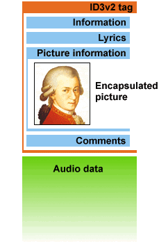

### 什么是ID3
MP3是音频文件最流行的格式，它的全称是 MPEG layer III。但是这种格式不支持对于音频内容的描述信息，包括歌曲名称、演唱者、专辑等等。
因此在1996年，Eric Kemp在**Studio 3**项目中提出了ID3的解决方案。ID3全称是Identity of MP3，其解决方案是在音频文件末尾附加一串数据，包含关于歌曲的名称、歌手、图片的信息。为了方便检测，数据的长度固定为128bytes。这个版本的解决方案称为 ID3v1。
Michael Mutschler 在 1997 对格式进行了微小的调整，压缩了Comment字段，增加了Track信息，这个版本被称为ID3v1.1。
1998年，Martin Nilsson & Michael Mutschler牵头，多个贡献者一起发起了ID3v2的工作。这个班的结构和ID3v1完全不同，数据的长度不再固定，位置也从尾部移到了头部，并且引入了Unicode支持。ID3v2的第一个版本是ID3v2.2，2000年发布了ID3v2.4。

### ID3v1
附着在音频数据之后，长度为128bytes，每个字段最大支持30个字符。

具体的字段信息

在数据开始之前，总是有三个字符```TAG```，这样和上面的字段加起来，正好是128bytes。如果Artist字段内容不足30个字符，不足的部分用0填充。

### ID3v2
ID3v2是加在音频数据前面的一组数据，每项具体的数据称为frame(例如歌曲名称)。可以包含任意类型的数据，每个frame最大支持16MB，整个tag大小最大支持256MB。存储编码支持Unicode，这样就不会产生乱码问题。
Tag数据放在音频数据之前还有一个好处，对于流式访问可以首先获得歌曲信息并展现给用户。

列举一些特性：

* The ID3v2 tag is a container format, just like IFF or PNG files, allowing new frames (chunks) as evolution proceeds.
* Residing in the beginning of the audio file makes it suitable for streaming.
* Has an 'unsynchronization scheme' to prevent ID3v2-incompatible players to attempt to play the tag.
* Maximum tag size is 256 megabytes and maximum frame size is 16 megabytes.
* Byte conservative and with the capability to compress data it keeps the files small.
* The tag supports Unicode.
* Isn't entirely focused on musical audio, but also other types of audio.
* Has several new text fields such as composer, conductor, media type, BPM, copyright message, etc. and the possibility to design your own as you see fit.
* Can contain lyrics as well as music-synced lyrics (karaoke) in almost any language.
* Is able to contain volume, balance, equalizer and reverb settings.
* Could be linked to CD-databases such as CDDB and FreeDB.
* Is able to contain images and just about any file you want to include.
* Supports enciphered information, linked information and weblinks.

### 使用 Python 读取ID3 信息
我写了一个 Python 脚本可以用来读取 ID3v1 的信息。实际操作过程中发现两个问题：
**1、ID3v1的信息没有编码字段，所以有的时候同样的Mp3，在不同的系统环境中播放，会显示乱码。针对这个问题，打算再写一篇文章说一下如何探测编码。**
**2、iTunes应该是优先使用ID3v2的信息**
我把脚本放到了 github 上，感兴趣的同学可以通过[https://github.com/cocowool/py-id3](https://github.com/cocowool/py-id3)查看。

```python
# Read ID3v1 tag information
import os
import string
import base64
import chardet

def parse(fileObj, version = 'v1'):
fileObj.seek(0,2)
# ID3v1's max length is 128 bytes
if(fileObj.tell() < 128):
return False
fileObj.seek(-128,2)
tag_data = fileObj.read()

if(tag_data[0:3] != b'TAG'):
return False
return getTag(tag_data)

# Detect the encoding and decode
def decodeData(bin_seq):
# print(bin_seq)
result = chardet.detect(bin_seq)
# print(result)
if(result['confidence'] > 0):
try:
return bin_seq.decode(result['encoding'])
except UnicodeDecodeError:
return 'Decode Failed'


# Get ID3v1 tag data
def getTag(tag_data):
# STRIP_CHARS = compat.b(string.whitespace) + b"\x00"
STRIP_CHARS = b"\x00"

tags = {}
tags['title'] = tag_data[3:33].strip(STRIP_CHARS)

if(tags['title']):
tags['title'] = decodeData(tags['title'])

tags['artist'] = tag_data[33:63].strip(STRIP_CHARS)
if(tags['artist']):
tags['artist'] = decodeData(tags['artist'])

tags['album'] = tag_data[63:93].strip(STRIP_CHARS)
if(tags['album']):
tags['album'] = decodeData(tags['album'])

tags['year'] = tag_data[93:97].strip(STRIP_CHARS)
# if(tags['year']):
# tags['year'] = decodeData(tags['year'])

tags['comment'] = tag_data[97:127].strip(STRIP_CHARS)
#@TODO Need to analyze comment to verfiy v1 or v1.1
if(tags['comment']):
tags['comment'] = decodeData(tags['comment'])

tags['genre'] = ord(tag_data[127:128])

return tags

# Set ID3v1 tag data
def setTag():
pass
```
**本文为作者原创，如果您觉得本文对您有帮助，请随意打赏，您的支持将鼓励我继续创作。**

参考资料：
1、[ID3.org](http://id3.org/Home)
2、[Wiki ID3](https://en.wikipedia.org/wiki/ID3)
3、[Python open() 函数](http://www.runoob.com/python/python-func-open.html)
4、[使用Python读取和写入mp3文件的id3v1信息](https://www.cnblogs.com/pcode/archive/2013/04/01/2992690.html)
5、[Python 模块](https://www.liaoxuefeng.com/wiki/0014316089557264a6b348958f449949df42a6d3a2e542c000/0014318447437605e90206e261744c08630a836851f5183000)


