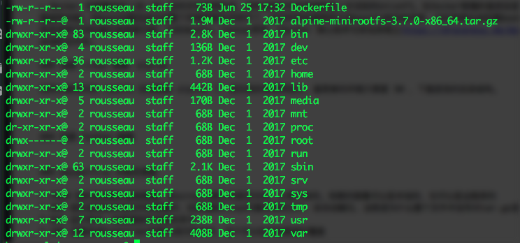

> 本文讲解如何在本地构建一个基础的Docker Python环境镜像，并扩展这个基础镜像构建Python运行环境，之后再构建自己的Python应用。


### 创建基础镜像
Docker 提供了[两种方法](https://docs.docker.com/develop/develop-images/baseimages/#create-a-full-image-using-tar)来创建基础镜像，一种是通过引入**tar**包的形式，另外一种是通过一个空白的镜像来一步一步构建，本文使用的是第二种方法，既```FROM scratch```
```scratch```是Docker保留镜像，镜像仓库中的任何镜像都不能使用这个名字，使用```FROM scratch```表明我们要构建镜像中的第一个文件层。
如果我们有一个**Linux下可执行的二进制文件**，可以构建一个简单的镜像，仅执行这个二进制。下面是Dockerfile。
```yaml
FROM scratch
ADD hello /
CMD ["/hello"]
```
> 注意因为Docker是基于Linux的虚拟机，所以二进制应该是在Linux可运行的，作者在Mac下编译了一个简单的c程序，在运行的时候会遇到下面的错误。
```standard_init_linux.go:190: exec user process caused "exec format error"```
查看这个文件的信息是```hello: Mach-O 64-bit executable x86_64```

构建的过程很简单，执行如下命令。
```bash
$ docker build -t chello:0.1 .
```
通过 docker images 命令可以本地的镜像。
```bash
$ docker images
REPOSITORY                TAG                 IMAGE ID            CREATED             SIZE
chello                    0.1                 0ffaacaa21e5        36 minutes ago      8.43kB
```
这样就是一个基础的镜像，但是如果需要基础镜像发挥更多的作用，我们还需要其他的工作。Docker中的容器运行在操作系统中，共享了操作系统的内核。对于在Mac、Windows平台下，则是基于Linux虚拟机的内核。而Linux内核仅提供了进程管理、内存管理、文件系统管理等一些基础的管理模块。除此之外，我们还需要一些Linux下的管理工具，包括```ls、cp、mv、tar```以及应用程序运行依赖的一些包。因此我们就需要首先构建一个Minimal的操作系统镜像，在此基础上构建Python环境，再构建应用镜像。这样就实现了镜像文件分层，今后如果我们需要更新Python版本，那么只需要对这一层进行更新就可以。
> Docker 的镜像实际上由一层一层的文件系统组成，这种层级的文件系统就是上文说到的UnionFS。在Docker镜像的最底层是bootfs。这一层与我们典型的Linux/Unix系统是一样的，包含boot加载器和内核。当boot加载完成之后整个内核就都在内存中了，此时内存的使用权已由bootfs转交给内核，此时系统也会卸载bootfs。Docker在bootfs之上的一层是rootfs（根文件系统）。rootfs就是各种不同的操作系统发行版，比如Ubuntu，Centos等等。[Docker 核心技术与实现原理](https://draveness.me/docker)这篇文章，作者阅读了 rootfs 的规范，指出构建rootfs一些必须的文件夹。


### 创建 Linux 镜像：alpine
目前比较流行的 rootfs 应该就是 alpine 了，因为他的体积特别小，最简单的环境只需要 5M ，下面是他的目录结构，下载地址在[这里](https://alpinelinux.org/downloads/)。

下载了 alpine 之后，我们构建 Dockerfile
```yaml
FROM scratch
ADD alpine-minirootfs-3.8.0_rc8-x86_64.tar.gz /
CMD ["/bin/sh"]
```
构建镜像
```bash
bogon:alpine rousseau$ docker build -t alpine:3.8 .
Sending build context to Docker daemon  4.148MB
Step 1/3 : FROM scratch
 ---> 
Step 2/3 : ADD alpine-minirootfs-3.8.0_rc8-x86_64.tar.gz /
 ---> dc4ab7451b42
Step 3/3 : CMD ["/bin/sh"]
 ---> Running in 6a878a1394a4
Removing intermediate container 6a878a1394a4
 ---> 4e0b9a3dffba
Successfully built 4e0b9a3dffba
Successfully tagged alpine:3.8
```
运行
```bash
bogon:alpine rousseau$ docker run -i -t alpine:3.8 /bin/sh
/ # ls
bin    dev    etc    home   lib    media  mnt    proc   root   run    sbin   srv    sys    tmp    usr    var
/ # uname -a
Linux 9e6234b63505 4.9.87-linuxkit-aufs #1 SMP Wed Mar 14 15:12:16 UTC 2018 x86_64 Linux
```

### Dockerfile 中相关参数

* FROM 指的是依赖的基础镜像，如scratch表示的是空白的，从零开始的。依赖的镜像可以是本地的，也可以是远程库的
* ADD 指的是添加本地文件到镜像中，如果遇到linux可解压格式文件，会自动解压，这就是为什么整个文件中没有对tar.gz进行显式解压
* RUN 运行命令，如安装软件的相关命令
* CMD 设置启动Container时默认执行的命令，这个可以在启动容器时覆盖

### 相关的命令
```bash
# 查看容器的日志
$ docker logs b4ce4d2d7cb6
standard_init_linux.go:190: exec user process caused "exec format error"
```
参考资料：
1、[Create Base Image](https://docs.docker.com/develop/develop-images/baseimages/)
2、[How can I make my own base image for Docker?](https://stackoverflow.com/questions/18274088/how-can-i-make-my-own-base-image-for-docker)
3、[Moby Project](https://github.com/moby/moby)
4、[Docker-library python](https://github.com/docker-library/python/blob/master/2.7/alpine3.7/Dockerfile)
5、[Ubuntu 16.04 LTS](https://cloud-images.ubuntu.com/releases/16.04/release/)
6、[alpine](http://gliderlabs.viewdocs.io/docker-alpine/)
7、[alpine download](https://alpinelinux.org/downloads/)
8、[Docker 核心技术与实现原理](https://draveness.me/docker)
9、[BusyBox](https://busybox.net/about.html)


