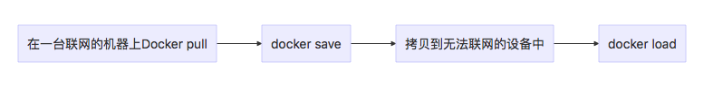

## 镜像的存出和载入
如果你的生产环境不能连通互联网，而你又希望从互联网上获取镜像。你就需要借助 docker save命令，可以将镜像导出为 tar 文件。使用 docker load 命令，可以将tar文件导入镜像库。整个流程是这样的:


### 存出镜像
先用 docker images 查看本地的镜像，然后使用 docker save 可以将镜像保存为tar文件。
```bash
$ docker images
REPOSITORY                                      TAG                 IMAGE ID            CREATED             SIZE
docker.elastic.co/elasticsearch/elasticsearch   6.3.1               fa7212eab151        2 weeks ago         783MB
alpine                                          3.8                 4e0b9a3dffba        2 weeks ago         4.41MB
rs-rootfs                                       0.1                 8d7cc52f0b8e        2 weeks ago         942kB
chello                                          0.1                 0ffaacaa21e5        2 weeks ago         8.43kB
bashtest                                        0.2                 109fb224038d        2 weeks ago         4.15MB
bashtest                                        0.1                 2c411bd2be86        2 weeks ago         4.15MB
alpine                                          3.7                 bf17a07bd8a7        2 weeks ago         4.14MB
hello-node                                      v1                  c95a898a2382        3 weeks ago         655MB
jenkinsci/blueocean                             latest              359cfdd876c8        2 months ago        440MB
hello-world                                     latest              e38bc07ac18e        3 months ago        1.85kB
frolvlad/alpine-python2                         latest              a8dc2527e0b3        3 months ago        51.9MB
alpine                                          latest              3fd9065eaf02        6 months ago        4.15MB
node                                            6.9.2               faaadb4aaf9b        19 months ago       655MB
$ docker save -o elasticsearch.tar docker.elastic.co/elasticsearch/elasticsearch:6.3.1
$ ls -lh elasticsearch.tar 
-rw-------  1 rousseau  staff   756M Jul 16 08:55 elasticsearch.tar
```

### 载入镜像
尝试先把本地镜像库中的镜像删除，然后通过load载入镜像。
```bash
$ docker rmi fa7212eab151
Untagged: docker.elastic.co/elasticsearch/elasticsearch:6.3.1
Untagged: docker.elastic.co/elasticsearch/elasticsearch@sha256:178051b116c91ae525369f3468aec167fb2c1cd90456e86c717cb1d135b8595e
Deleted: sha256:fa7212eab151480a2f27491b4a4f987fb587b94f7531409631fa3bb0811e9273
Deleted: sha256:4ef53057ef48035881a80a481c7ea8d8722885180c21fde3aa6391fc846eb3e2
Deleted: sha256:819b25b6519e51c4b6158fbf69eaf2202dfc1665d1f3513c01057782755b866b
Deleted: sha256:572682d02d3ac5f7622de248990d0d8fd0d634eefb70720c9b50367998cfb987
Deleted: sha256:0af1f6a985f53cca0c0b6afdc349641d41196b4064daf9fe9833a1f6af150c65
Deleted: sha256:f2620642608b97bef66f349cc53d7c96d3f962ce94c5d3617c3269c1444082b9
Deleted: sha256:a5920f10fe632bec52bbac5778514ec8a484824df0554487fa37c778717d03a2
Deleted: sha256:30e66cbe95d84b73a110895ca38a07bd2982445207769d457a69e96bc0957d3f
Deleted: sha256:bcc97fbfc9e1a709f0eb78c1da59caeb65f43dc32cd5deeb12b8c1784e5b8237
$ docker images
REPOSITORY                TAG                 IMAGE ID            CREATED             SIZE
alpine                    3.8                 4e0b9a3dffba        2 weeks ago         4.41MB
rs-rootfs                 0.1                 8d7cc52f0b8e        2 weeks ago         942kB
chello                    0.1                 0ffaacaa21e5        2 weeks ago         8.43kB
bashtest                  0.2                 109fb224038d        2 weeks ago         4.15MB
bashtest                  0.1                 2c411bd2be86        2 weeks ago         4.15MB
alpine                    3.7                 bf17a07bd8a7        2 weeks ago         4.14MB
hello-node                v1                  c95a898a2382        3 weeks ago         655MB
jenkinsci/blueocean       latest              359cfdd876c8        2 months ago        440MB
hello-world               latest              e38bc07ac18e        3 months ago        1.85kB
frolvlad/alpine-python2   latest              a8dc2527e0b3        3 months ago        51.9MB
alpine                    latest              3fd9065eaf02        6 months ago        4.15MB
node                      6.9.2               faaadb4aaf9b        19 months ago       655MB
$ docker load -i elasticsearch.tar 
bcc97fbfc9e1: Loading layer [==================================================>]  208.2MB/208.2MB
8f826d39fe4c: Loading layer [==================================================>]  343.4MB/343.4MB
3e419e8be9df: Loading layer [==================================================>]  3.584kB/3.584kB
3cfabbe08a15: Loading layer [==================================================>]  23.28MB/23.28MB
2a161ac3381b: Loading layer [==================================================>]  311.3kB/311.3kB
c509aa7073b4: Loading layer [==================================================>]  217.7MB/217.7MB
62bea52fec7a: Loading layer [==================================================>]   7.68kB/7.68kB
95aa6851545e: Loading layer [==================================================>]  9.728kB/9.728kB
Loaded image: docker.elastic.co/elasticsearch/elasticsearch:6.3.1
$ docker images
REPOSITORY                                      TAG                 IMAGE ID            CREATED             SIZE
docker.elastic.co/elasticsearch/elasticsearch   6.3.1               fa7212eab151        2 weeks ago         783MB
alpine                                          3.8                 4e0b9a3dffba        2 weeks ago         4.41MB
rs-rootfs                                       0.1                 8d7cc52f0b8e        2 weeks ago         942kB
chello                                          0.1                 0ffaacaa21e5        2 weeks ago         8.43kB
bashtest                                        0.2                 109fb224038d        2 weeks ago         4.15MB
bashtest                                        0.1                 2c411bd2be86        2 weeks ago         4.15MB
alpine                                          3.7                 bf17a07bd8a7        2 weeks ago         4.14MB
hello-node                                      v1                  c95a898a2382        3 weeks ago         655MB
jenkinsci/blueocean                             latest              359cfdd876c8        2 months ago        440MB
hello-world                                     latest              e38bc07ac18e        3 months ago        1.85kB
frolvlad/alpine-python2                         latest              a8dc2527e0b3        3 months ago        51.9MB
alpine                                          latest              3fd9065eaf02        6 months ago        4.15MB
node                                            6.9.2               faaadb4aaf9b        19 months ago       655MB
```


## 参考资料

1. [Docker镜像的创建、存出、载入](https://www.cnblogs.com/zhangmingcheng/p/5720792.html)


