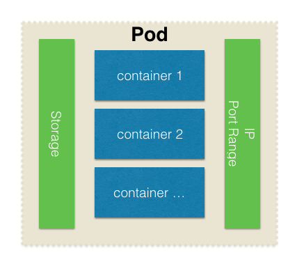
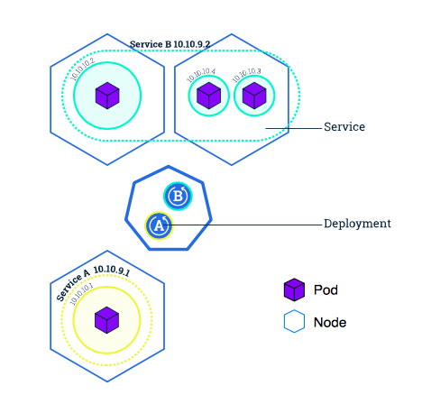
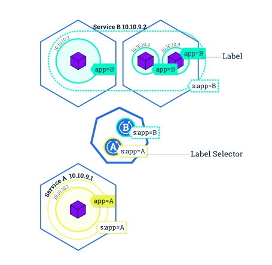

> 本文环境为Kubernetes V1.11，操作系统版本为 CentOs 7.3，Kubernetes集群安装可以参考[kubeadm安装kubernetes V1.11.1 集群](https://www.edulinks.cn/2018/07/24/20180724-kubeadm-install-kubernetes/) 。想要了解更多 Kubernetes 相关知识，可以阅读 [Kubernetes 系列学习文章](http://edulinks.cn/2020/10/16/20201016-kubernetes-articles/)。

## 目标

* 了解Kubernetes Pod
* 了解Kubernetes Node
* 学习如何调试部署问题
* 了解如何通过Service暴露应用

## Kubernetes Pods
在Kubernetes中创建一个Deployment 部署就会在Node上创建一个Pod，Pod是Kubernetes中对于一组容器以及与容器相关的资源的集合。Pod中的容器会共享IP和端口资源。
> A Pod is a group of one or more application containers (such as Docker or rkt) and includes shared storage (volumes), IP address and information about how to run them.


## Kubernetes Nodes
Pod总是运行在Node上，Node可以是物理机也可以是虚拟机。在之前的[Kubernetes基础的文章](https://www.cnblogs.com/cocowool/p/k8s_base_concept.html)中，一个Node包含的组件有Kubelet、容器环境以及kube-proxy。结构如下图所示：


## kubectl － Kubernetes的CLI管理工具
kubectl是kubernetes的命令行管理工具。这里主要介绍在获取信息方面的一些功能。kubectl运行的时候，默认会在default的命名空间下查找资源，如果我们需要在自己的命名空间下查找资源，需要指定```--namespace=xxx```参数。

### kubectl get

#### 获取命名空间
```bash
$ kubectl get namespaces
NAME          STATUS    AGE
default       Active    2m
kube-public   Active    2m
kube-system   Active    2m
```

#### 获取Pods
```bash
$ kubectl get pods
NAME                                   READY     STATUS    RESTARTS   AGE
kubernetes-bootcamp-5dbf48f7d4-4k8zz   1/1       Running   0          3m
```

#### 获取Pods详细信息

```bash
$ kubectl describe pods
Name:           kubernetes-bootcamp-5dbf48f7d4-4k8zz
Namespace:      default
Node:           host01/172.17.0.45
Start Time:     Tue, 17 Jul 2018 03:02:04 +0000
Labels:         pod-template-hash=1869049380
                run=kubernetes-bootcamp
```

### kubectl log

#### 查看日志
```bash
$ kubectl logs $POD_NAME
Kubernetes Bootcamp App Started At: 2018-07-17T03:02:05.794Z | Running On:kubernetes-bootcamp-5dbf48f7d4-4k8zz

Running On: kubernetes-bootcamp-5dbf48f7d4-4k8zz | Total Requests: 1 | App Uptime: 527.706 seconds | Log Time: 2018-07-17T03:10:53.500Z
```

### kubectl exec

#### 在Pod中执行命令
```bash
$ kubectl exec $POD_NAME env
PATH=/usr/local/sbin:/usr/local/bin:/usr/sbin:/usr/bin:/sbin:/bin
HOSTNAME=kubernetes-bootcamp-5dbf48f7d4-4k8zz
KUBERNETES_PORT=tcp://10.96.0.1:443
KUBERNETES_PORT_443_TCP=tcp://10.96.0.1:443
KUBERNETES_PORT_443_TCP_PROTO=tcp
KUBERNETES_PORT_443_TCP_PORT=443
KUBERNETES_PORT_443_TCP_ADDR=10.96.0.1
KUBERNETES_SERVICE_HOST=10.96.0.1
KUBERNETES_SERVICE_PORT=443
KUBERNETES_SERVICE_PORT_HTTPS=443
NPM_CONFIG_LOGLEVEL=info
NODE_VERSION=6.3.1
HOME=/root
```

#### 启动容器中的bash
```bash
$ kubectl exec -ti $POD_NAME bash
root@kubernetes-bootcamp-5dbf48f7d4-4k8zz:/# cat server.js
```

## Kubernetes Service
在K8S集群中，Pod有用独立的IP，也具有独立的生命周期。一旦某个Node节点发生故障，ReplicationController会将该节点上的Pod迁移到集群中其他Node节点上。对于有多个Pod，为前端应用提供相同的服务，这时前端其实不关心调用的后台具体哪个Pod，这时就要用到Service。
> A Service in Kubernetes is an abstraction which defines a logical set of Pods and a policy by which to access them.

Kubernetes中的Service是集群中一组Pod以及访问策略的抽象。可以通过YAML、JSON定义，目标Pods通常通过LabelSelector定义。通过```type```字段，服务定义了应用暴露的几种方式：

* ClusterIP，默认的方式，通过集群IP来对外提供服务，这种方式只能在集群内部访问。
* NodePort，利用NAT技术在Node的指定端口上提供对外服务。外部应用通过**:**的方式访问。
* LoadBalancer，利用外部的负载均衡设施进行服务的访问。
* ExternalName，这是1.7版本之后 kube-dns 提供的功能。
服务提供了在一组Pods之间分配流量的功能，同时也是因为服务这个抽象层的存在，Kubernetes才能够在不影响应用的情况下进行扩缩容。通常Service通过label和selector来确定可操作的对象。label可以在对象创建时指定，也可以在运行时修改。



### 查看服务状态
```bash
$ kubectl get services
NAME         TYPE        CLUSTER-IP   EXTERNAL-IP   PORT(S)   AGE
kubernetes   ClusterIP   10.96.0.1    <none>        443/TCP   44s
```

### 对外部暴露服务
```bash
$ kubectl expose deployment/kubernetes-bootcamp --type="NodePort" --port 8080
service "kubernetes-bootcamp" exposed
$ kubectl get servicesNAME                  TYPE        CLUSTER-IP      EXTERNAL-IP   PORT(S)     AGE
kubernetes            ClusterIP   10.96.0.1       <none>        443/TCP     2m
kubernetes-bootcamp   NodePort    10.99.175.225   <none>        8080:32172/TCP   5s
```

### 查看服务详细信息
```bash
$ kubectl describe service/kubernetes-bootcamp
Name:                     kubernetes-bootcamp
Namespace:                default
Labels:                   run=kubernetes-bootcamp
Annotations:              <none>
Selector:                 run=kubernetes-bootcamp
Type:                     NodePort
IP:                       10.99.175.225
Port:                     <unset>  8080/TCP
TargetPort:               8080/TCP
NodePort:                 <unset>  32172/TCP
Endpoints:                172.18.0.2:8080
Session Affinity:         None
External Traffic Policy:  Cluster
Events:                   <none>
```
这个例子中Node没有外部IP，所以显示为空。利用内部IP测试。
```bash
$ curl 172.17.0.11:32172
Hello Kubernetes bootcamp! | Running on: kubernetes-bootcamp-5c69669756-hmc69 | v=1
```

### 通过标签查询Pod和Service
```bash
$ kubectl get pods -l run=kubernetes-bootcamp
NAME                                   READY     STATUS    RESTARTS   AGE
kubernetes-bootcamp-5c69669756-hmc69   1/1       Running   0          8m
$ kubectl get services -l = run=kubernetes-bootcamp
error: name cannot be provided when a selector is specified
$ kubectl get services -l run=kubernetes-bootcamp
NAME                  TYPE       CLUSTER-IP      EXTERNAL-IP   PORT(S)    AGE
kubernetes-bootcamp   NodePort   10.99.175.225   <none>        8080:32172/TCP   6m
```

### 新增标签
```bash
$ kubectl label pod $POD_NAME app=v1
pod "kubernetes-bootcamp-5c69669756-hmc69" labeled
$ kubectl describe pods $POD_NAME
Name:           kubernetes-bootcamp-5c69669756-hmc69
Namespace:      default
Node:           minikube/172.17.0.11
Start Time:     Tue, 17 Jul 2018 05:20:35 +0000
Labels:         app=v1
                pod-template-hash=1725225312
                run=kubernetes-bootcamp
$ kubectl get pods -l app=v1
NAME                                   READY     STATUS    RESTARTS   AGE
kubernetes-bootcamp-5c69669756-hmc69   1/1       Running   0          11m
```

### 删除服务
```bash
$ kubectl get services
NAME                  TYPE        CLUSTER-IP      EXTERNAL-IP   PORT(S)     AGE
kubernetes            ClusterIP   10.96.0.1       <none>        443/TCP     12m
kubernetes-bootcamp   NodePort    10.99.175.225   <none>        8080:32172/TCP   10m
$ kubectl delete service -l run=kubernetes-bootcamp
service "kubernetes-bootcamp" deleted
$ kubectl get services
NAME         TYPE        CLUSTER-IP   EXTERNAL-IP   PORT(S)   AGE
kubernetes   ClusterIP   10.96.0.1    <none>        443/TCP   12m
```

## 参考资料：

1. [Viewing Pods and Nodes](https://kubernetes.io/docs/tutorials/kubernetes-basics/explore/explore-intro/)
2. [Kubernetes基础](https://www.cnblogs.com/cocowool/p/k8s_base_concept.html)
3. [Using a Service to Expose Your App](https://kubernetes.io/docs/tutorials/kubernetes-basics/expose/expose-intro/)


