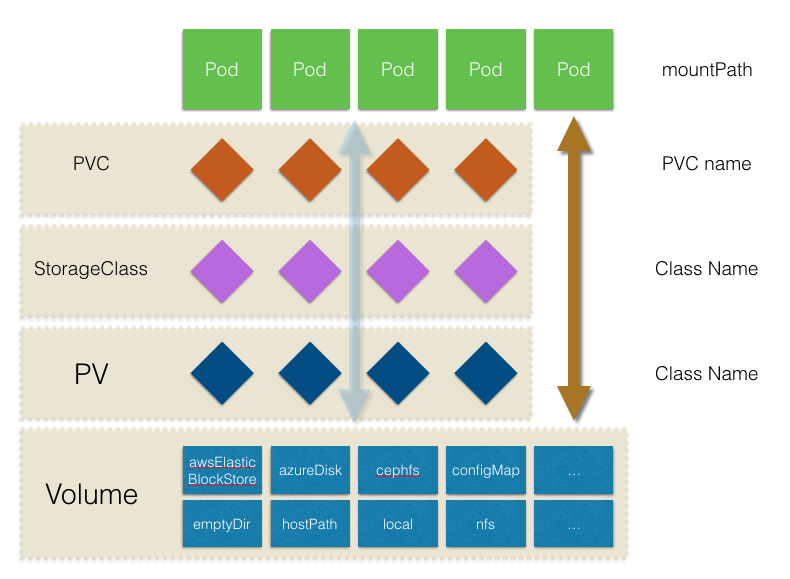

> 本文环境为Kubernetes V1.11，操作系统版本为 CentOs 7.3，Kubernetes集群安装可以参考[kubeadm安装kubernetes V1.11.1 集群](https://www.edulinks.cn/2018/07/24/20180724-kubeadm-install-kubernetes/) 。想要了解更多 Kubernetes 相关知识，可以阅读 [Kubernetes 系列学习文章](http://www.edulinks.cn/2020/10/16/20201016-kubernetes-articles/)。

容器中的存储都是临时的，因此Pod重启的时候，内部的数据会发生丢失。实际应用中，我们有些应用是无状态，有些应用则需要保持状态数据，确保Pod重启之后能够读取到之前的状态数据，有些应用则作为集群提供服务。这三种服务归纳为无状态服务、有状态服务以及有状态的集群服务，其中后面两个存在数据保存与共享的需求，因此就要采用容器外的存储方案。

Kubernetes中存储中有四个重要的概念：Volume、PersistentVolume PV、PersistentVolumeClaim PVC、StorageClass。掌握了这四个概念，就掌握了Kubernetes中存储系统的核心。我用一张图来说明这四者之间的关系。


* Volumes是最基础的存储抽象，其支持多种类型，包括本地存储、NFS、FC以及众多的云存储，我们也可以编写自己的存储插件来支持特定的存储系统。Volume可以被Pod直接使用，也可以被PV使用。普通的Volume和Pod之间是一种静态的绑定关系，在定义Pod的同时，通过```volume```属性来定义存储的类型，通过```volumeMount```来定义容器内的挂载点。
* PersistentVolume。与普通的Volume不同，PV是Kubernetes中的一个资源对象，创建一个PV相当于创建了一个存储资源对象，这个资源的使用要通过PVC来请求。
* PersistentVolumeClaim。PVC是用户对存储资源PV的请求，根据PVC中指定的条件Kubernetes动态的寻找系统中的PV资源并进行绑定。目前PVC与PV匹配可以通过```StorageClassName```、```matchLabels```或者```matchExpressions```三种方式。
* StorageClass。

## Volumes

Docker提供了[Volumes](https://docs.docker.com/engine/admin/volumes/)，Volume 是磁盘上的文件夹并且没有生命周期的管理。Kubernetes 中的 Volume 是存储的抽象，并且能够为Pod提供多种存储解决方案。Volume 最终会映射为Pod中容器可访问的一个文件夹或裸设备，但是背后的实现方式可以有很多种。

### Volumes的类型

* [cephfs](https://github.com/kubernetes/examples/tree/master/staging/volumes/cephfs/)
* configMap
* emptyDir
* hostPath
* local
* nfs
* persistentVolumeClaim

### emptyDir
emptyDir在Pod被分配到Node上之后创建，并且在Pod运行期间一直存在。初始的时候为一个空文件夹，当Pod从Node中移除时，emptyDir将被永久删除。Container的意外退出并不会导致emptyDir被删除。emptyDir适用于一些临时存放数据的场景。默认情况下，emptyDir存储在Node支持的介质上，不管是磁盘、SSD还是网络存储，也可以设置为```Memory```。
```yaml
apiVersion: v1
kind: Pod
metadata:
  name: tomcat-ccb
  namespace: default
  labels:
    app: tomcat
    node: devops-103
spec:
  containers:
  - name: tomcat
    image: docker.io/tomcat
    volumeMounts:
    - name: tomcat-storage
      mountPath: /data/tomcat
    - name: cache-storage
      mountPath: /data/cache
    ports:
    - containerPort: 8080
      protocol: TCP
    env:
      - name: GREETING
        value: "Hello from devops-103"
  volumes:
  - name: tomcat-storage
    hostPath:
      path: /home/es
  - name: cache-storage
    emptyDir: {}
```

### hostPath
hostPath就是将Node节点的文件系统挂载到Pod中，在之前的例子中也可以看到用法。
```yaml
apiVersion: v1
kind: Pod
metadata:
  name: test-pd
spec:
  containers:
  - image: k8s.gcr.io/test-webserver
    name: test-container
    volumeMounts:
    - mountPath: /test-pd
      name: test-volume
  volumes:
  - name: test-volume
    hostPath:
      # directory location on host
      path: /data
      # this field is optional
      type: Directory
```

### local
> A local volume represents a mounted local storage device such as a disk, partition or directory.

local类型作为静态资源被PersistentVolume使用，不支持Dynamic provisioning。与hostPath相比，因为能够通过PersistentVolume的节点亲和策略来进行调度，因此比hostPath类型更加适用。local类型也存在一些问题，如果Node的状态异常，那么local存储将无法访问，从而导致Pod运行状态异常。使用这种类型存储的应用必须能够承受可用性的降低、可能的数据丢失等。
```yaml
apiVersion: v1
kind: PersistentVolume
metadata:
  name: www
spec:
  capacity:
    storage: 100Mi
  volumeMode: Filesystem
  accessModes: ["ReadWriteOnce"]
  persistentVolumeReclaimPolicy: Delete
  storageClassName: local-storage
  local:
    path: /home/es
  nodeAffinity:
    required:
      nodeSelectorTerms:
      - matchExpressions:
        - key: kubernetes.io/hostname
          operator: In
          values:
          - devops-102
          - devops-103
```
对于使用了PV的Pod，Kubernetes会调度到具有对应PV的Node上，因此PV的节点亲和性 nodeAffinity 属性是必须的。
> PersistentVolume nodeAffinity is required when using local volumes. It enables the Kubernetes scheduler to correctly schedule Pods using local volumes to the correct node.

## Persistent Volumes

Persistent Volumes 提供了一个抽象层，向用户屏蔽了具体的存储实现形式。

* PersistentVolume PV：集群管理员提供的一块存储，是Volumes的插件。类似于Pod，但是具有独立于Pod的生命周期。具体存储可以是NFS、云服务商提供的存储服务。
* PersistentVolumeClaim PVC：PVC是用户的存储请求，PVC消耗PV资源。
生命周期：

* 供给
  * 静态供给
  * 动态供给：动态供给的请求基于StorageClass，集群针对用户的PVC请求，可以产生动态供给。

* 绑定 Binding
* 使用
* 在用对象保护：对于正在使用的PV提供了保护机制，正在使用的PV如果被用户删除，PV的删除会推迟到用户对PV的使用结束。
* 重用 Reclaim 策略
  * 保留 Retain：保留现场，Kubernetes等待用户手工处理数据。
  * 删除 Delete：Kubernetes会自动删除数据
  * 重用：这个策略已经不推荐使用了，应该使用 Dynamic Provisioning 代替。

* 扩容。主要是对于一些云存储类型，例如gcePersistentDisk、Azure Disk提供了扩容特性，在1.11版本还处于测试阶段。
PersistenVolume 这个功能目前是通过Plugin插件的形式实现的，目前的版本V1.11.1有19中，特别关注了一下HostPath。
> HostPath (Single node testing only – local storage is not supported in any way and WILL NOT WORK in a multi-node cluster)

### Persistent Volumes 的一些属性

* Capacity：一般情况PV拥有固定的容量
* Volume Mode：在1.9版本中是alpha特性，允许设置 filesystem 使用文件系统（默认），设置 raw 使用裸设备。
* Access Modes
* Class：可以设置成StorageClass的名称。具有Class属性的PV只能绑定到还有相同CLASS名称的PVC上。没有CLASS的PV只能绑定到没有CLASS的PVC上。
* Reclaim Policy

### 状态

* Available：未被任何PVC使用
* Bound：绑定到了PVC上
* Released：PVC被删掉，资源未被使用
* Failed：自动回收失败

## PersistentVolumeClaims
```yaml
kind: PersistentVolumeClaim
apiVersion: v1
metadata:
  name: myclaim
spec:
  accessModes:
    - ReadWriteOnce
  volumeMode: Filesystem
  resources:
    requests:
      storage: 8Gi
  storageClassName: slow
  selector:
    matchLabels:
      release: "stable"
    matchExpressions:
      - {key: environment, operator: In, values: [dev]}
```
一些属性

* Access Modes
* Volume Modes
* Resources
* Selector：PVC可以通过标签选择器选择PV资源。可以包含两个字段```matchLabels```和```matchExpressions```。
* storageClassName 类似标签选择器，通过storagClassName 来确定PV资源。

## Storage Class
StorageClass为管理员提供了一种描述存储类型的方法。通常情况下，管理员需要手工创建所需的存储资源。利用动态容量供给的功能，就可以实现动态创建PV的能力。动态容量供给 Dynamic Volume Provisioning 主要依靠StorageClass。
```yaml
kind: StorageClass
apiVersion: storage.k8s.io/v1
metadata:
  name: local-storage
provisioner: kubernetes.io/no-provisioner
volumeBindingMode: WaitForFirstConsumer
```


## 参考资料：

1. [Kubernetes Storage](https://kubernetes.io/docs/concepts/storage/volumes)
2. [Configure a Pod to Use a PersistentVolume for Storage](https://kubernetes.io/docs/tasks/configure-pod-container/configure-persistent-volume-storage/)
3. [Persistent Volumes](https://kubernetes.io/docs/concepts/storage/persistent-volumes/#claims-as-volumes)
4. [kubernetes存储系统介绍(Volume、PV、dynamic provisioning)](https://blog.csdn.net/liukuan73/article/details/60089305)
5. [Kubernetes 1.4 新特性 持久卷](https://blog.csdn.net/qq_26923057/article/details/52713463)
6. [DockOne微信分享（一零三）：Kubernetes 有状态集群服务部署与管理](http://dockone.io/article/2016?utm_source=tuicool&utm_medium=referral)


