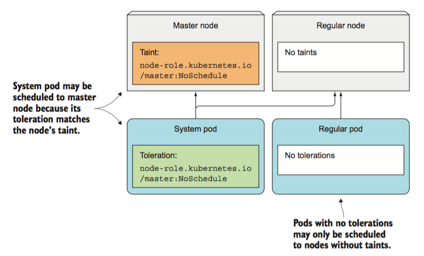

> 本文的演练环境为基于 Virtualbox 搭建的 Kubernetes 集群，具体搭建步骤可以参考 [kubeadm安装kubernetes V1.11.1 集群](https://www.edulinks.cn/2018/07/24/20180724-kubeadm-install-kubernetes/) 。想要了解更多 Kubernetes 相关知识，可以阅读 [Kubernetes 系列学习文章](http://www.edulinks.cn/2020/10/16/20201016-kubernetes-articles/)。

节点亲和性是描述Pods如何分配到一个或一组节点的策略，亲和性的相关资料可以参考[Kubernetes中的亲和性与反亲和性](https://www.cnblogs.com/cocowool/p/kubernetes_affinity.html)。与亲和性规则不同， Taints 描述节点拒绝一个或一组Pods的策略。其实现原理为首先通过```kubectl taint```命令为Node定义一些瑕疵，然后在Pod的描述文件中指定它的容忍度，即不能够容忍哪些瑕疵，这样在调度的时候Pod将不会被调度到哪些有瑕疵的Node上。可以看下图，只有Taint和Toleration匹配的时候，Pod才会调度到对应的节点上。


## 1. 设置与解除Taint
Taints包含一个key、value和effect，格式为```<key>=<value>:<effect>```。
为Node设置taint的命令如下：
```bash
kubectl taint nodes node1 key=value:NoSchedule
```
执行这个命令后，除非Pod具有相应的toleration，否则不会被调度到node1上。
通过下面的命令，可以删除这个策略。
```bash
kubectl taint nodes node1 key:NoSchedule-
```
taint支持的effect包括：

* NoSchedule 表示不能容忍taint的Pod不会被调度到这个节点，属于刚性的限制
* PreferNoSchedule 与上一条相同的效果，但是是柔性的限制，如果集群中没有其他更合适的Node，则会调度到这个节点
* NoExcute 上两条只是影响调度，这条还会对正在运行的Pod产生影响，如果在节点上增加一条 taint，那么如果已经运行的Pod没有设置对应的toleration，则会被立即驱逐

## 2. 定义 Toleartions
为Pod定义toleration的方法如下：
```yaml
tolerations:
- key: "key"
  operator: "Equal"
  value: "value"
  effect: "NoSchedule"
```
```yaml
tolerations:
- key: "key"
  operator: "Exists"
  effect: "NoSchedule"
```
上面两个例子表示如果某个Node存在```key=value```的瑕疵或者存在```key```的瑕疵，Pod将不会调度到这样的节点。effect也有三个选项：

* NoSchedule
* NoExecute
* PreferNoScheduled，软性的限制，避免向有瑕疵的节点调度，但不是强制条件
> 在书写tolerations的时候有两种特殊情况：一是key为空operator为Exists，这种情况匹配所有的keys、values和effects，即对所有的瑕疵都无法忍受；二是effect为空，匹配所有key的瑕疵。

可以向单个Pod和Node增加多个tolerations和taints，Kubernetes采用类似过滤器的方式进行处理，首先遍历Node上的Taints，并与Pod的tolerations做匹配，如果有匹配的项目则忽略，最后根据剩下为匹配到的taints做判断：

* 如果至少有一个未匹配到的taints的效果是NoSchedule，则Pod不会被调度到Node上
* 如果仅有一个未匹配到的taints的效果是PreferNoSchedule，则尽量不向这个Node调度
* 如果至少有一个未匹配到的taints的效果是NoExecute，则Pod不会被调度到Node上，已经在Node上运行的Pod会被驱逐。通常，一个NoExcute添加到节点后，不能容忍的Pod会被立即驱逐，可以通过```tolerationSeconds```设置延时驱逐。

## 3. 例子
Taints和tolerations是避免Pods部署到Node，以及从Node中驱离Pod的灵活方法，有一些应用场景：

### 3.1 调度场景
控制Pod的调度。例如专用节点 Dedicated Nodes ，对于Kubeadm创建的集群，默认Master节点是tainted，即普通的Pod不会部署到这个节点；例如特殊硬件的节点（GPU），只希望需要使用GPU的应用部署到上面；在节点出问题时，对节点上的Pod进行驱逐（alpha特性）

### 3.2 配置节点故障后Pod重新调度的时间
例如下面的配置文件，对于notReady和unreachable状态的节点，其上的Pod等待300秒，如果仍未恢复，则会停止执行。
```yaml
...
tolerations:
- effect: NoExcute
  key: node.alpha.kubernetes.io/notReady
  operator: Exists
  tolerationSeconds: 300
- effect: NoExecute
  key: node.alpha.kubernetes.io/unreachable
  operator: Exists
  tolerationSeconds: 300
```
> 在1.12版本中 TaintNodesByCondition 特性已经提升为 beta。

## 参考资料

1. [Kubernetes Taints and tolerations](https://kubernetes.io/docs/concepts/configuration/taint-and-toleration/)
2. [Kubernetes in action](Kubernetes in action)


