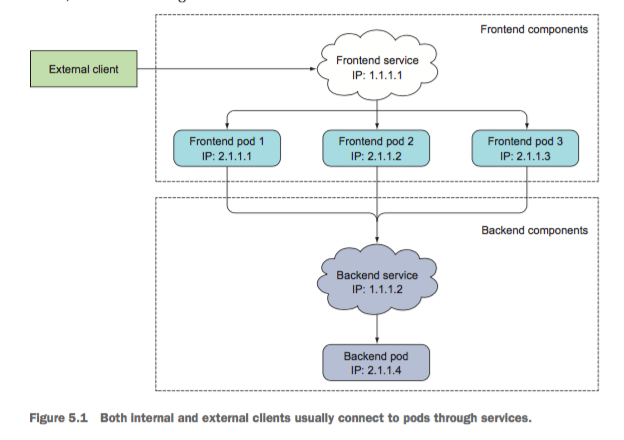

> 本文的试验环境为CentOS 7.3，Kubernetes集群为1.11.2，安装步骤参见[kubeadm安装kubernetes V1.11.1 集群](https://www.edulinks.cn/2018/07/24/20180724-kubeadm-install-kubernetes/)

### Service 介绍

我们通过Pod、Deployment等可以将应用发布到Kubernetes平台中，但是如果我们如何才能访问我们部署的应用呢？有一个办法就是通过节点的IP加上节点的端口来访问这个节点上的容器应用，但是如果我们有多个跨节点的相通应用时该怎么办呢？特别是应用发生扩容、缩容时应该如何处理，这时我们就需要利用```Service```来实现。
在Kubernetes中，Service是一种资源，提供了我们访问单个或多个容器应用的能力。每个服务在其生命周期内，都拥有一个固定的IP地址和端口。每个服务对应了后台的一个或多个Pod，通过这种方式，客户端就不需要关心Pod所在的位置，方便后端进行方便的Pod扩容、缩容等操作。
可以通过下面的示意图来理解Service的作用。

由此可知，服务可以被外部的客户访问，也可以被内部的客户访问。Service通过创建时指定的标签选择器来决定用户的请求转发到后台的哪些Pods中。看一下Service创建的具体例子。

```yaml
apiVersion: v1
kind: Service
metadata:
  name: tomcat-svc
spec:
  sessionAffinity: ClientIP # 该参数可以设置相同IP的请求总是定位到同一个Pod
  ports:
  - port: 8080
    targetPort: 8080
  selector:
    app: tomcat
```
这个例子定义了一个Service名为tomcat-svc，端口为8080，该服务会将用户的请求转发到后台带有app=tomcat标签的Pods上。
```bash
kubectl get svc
```
> 我们在测试服务是否正常的时候，不能使用ping命令。因为Kubernetes中实现服务时，并不支持ping。因此不能使用ping的方式检查服务是否正常，应当使用telnet或者nc等命令进行测试。

> Pod中的应用访问Service有两种方式，一种是通过向Pod中注入环境变量的方式，这种方式缺点很明显，必须首先创建Service，Pod内的应用才能通过环境变量访问；另一种方式是通过DNS的方式，这种方式非常灵活。


### Service 与 endpints
Endpoints 是组成Service的一组IP地址和端口资源。
```bash
kubectl get endpoints kubia
```
默认情况下创建Service的时候，会创建一个同名的Endpoints资源，通过```kubectl descirbe svc svc-name```可以看到这个服务对应的Endpoints。
如果创建Service的时候，不指定Pod的选择器，则不会创建Endpoints资源。也可以手工创建Endpoints类型。创建时需要注意名称要与Service的名称一致。
```yaml
apiVersion: v1
kind: Endpoints
metadata: 
  name: external-service
subsets:
  - addresses:
    - ip: 11.11.11.11
    - ip: 22.22.22.22
    ports:
    - port: 80
```

### Service 的类型

* NodePort
* Loadbalance
* Ingress

### 实例解析

#### 1. 创建内部服务
创建用于内部访问的服务很简单，创建后服务将在生命周期内拥有固定的IP和端口。
```yaml
apiVersion: v1
kind: Service
metadata:
  name: tomcat-svc
spec:
  sessionAffinity: ClientIP # 该参数可以设置相同IP的请求总是定位到同一个Pod
  ports:
  - port: 8080
    targetPort: 8080
  selector:
    app: tomcat
```
客户每次链接Service时，都会对应到后端的一个Pod上，如果客户需要链接所有的后端Pod呢，可以使用headless service。通过这种方式，Kubernetes内部的DNS服务会将Service对应的所有IP返回。
```yaml
apiVersion: v1
kind: Service
metadata:
  name: tomcat-headless
spec:
  clusterIP: None
  ports:
  - port: 8080
    targetPort: 8080
  selector:
    app: tomcat
```
> 或者可以在客户端通过程序调用Kubernetes API的方式获取地址列表。


#### 2. 为外部服务创建一个内部别名
容器内部的应用要访问外部应用时，可以直接在容器内访问外部服务地址，也可以通过创建一个外部服务的别名进行转发，这样相当于将内外部调用关系解耦了，每次外部发生变化的时候，可以不用修改应用的代码。
```yaml
apiVersion: v1
kind: Service
metadata:
  name: external-service
spec:
  type: ExternalName
  externalName: api.baidu.com
  ports:
  - port: 80
```

#### 3. 向外部暴露内部服务
向外部暴露内部服务有三种方式：

* NodePort
* LoadBalancer
* Ingress，7层负载均衡

##### 3.1 NodePort 方式
创建这种方式的Service，内部可以通过ClusterIP进行访问，外部用户可以通过NodeIP:NodePort的方式单独访问每个Node上的实例。这种方式有很多问题，直接访问节点的地址和端口需要在客户端记录很多信息，Pod发生迁移后这些信息没办法动态更新，节点的防火墙及节点所在网络区域的防火墙策略配置会比较麻烦。
```yaml
apiVersion: v1
kind: Service
metadata:
  name: nodeport
spec:
  type: NodePort
  ports:
  - port: 80
    targetPort: 8080
    nodePort: 30123
  selector:
    app: httpd
```
端口如果忽略，Kubernetes会自动生成。
```bash
$ kubectl get svc nodeport
```
> 获取一些信息

```kubectl get nodes -o jsonpath='{.items[*].status.addresses[?(@.type="InternalIP")].address}'

```

#### 3.2 load balancer 方式
这种方式一般需要云供应商的支持，或者一些本地资源如F5的支持。这里不做过多介绍了。

#### 3.3 Ingress 方式
LoadBalancer要求的IP资源较多，每个负载均衡服务都需要一个IP，Ingress可以只用一个IP，通过URL来判断需要访问的服务。Ingress工作在HTTP层，配置与使用更加灵活。目前为止还是一个beta特性。
目前有很多Ingress的支持：

* Kubernetes提供的基于GCE、Nginx的Ingress控制器
* [F5提供的控制器](http://clouddocs.f5.com/products/connectors/k8s-bigip-ctlr/latest)
* Kong提供的[Kong Ingress Controller for Kubernetes](https://konghq.com/blog/kubernetes-ingress-controller-for-kong/)
* [Traefik](https://github.com/containous/traefik)提供收费的解决方案
* NGINX提供的[NGINX Ingress Controller for Kubernetes](https://www.nginx.com/products/nginx/kubernetes-ingress-controller)
* 基于HAProxy的[HAProxy Ingress Controller for Kubernetes](https://www.haproxy.com/blog/haproxy_ingress_controller_for_kubernetes/)
* Istio提供的[Control Ingress Traffic](https://istio.io/docs/tasks/traffic-management/ingress/)
使用过程中的最佳实践：

* 总是添加 Readiness 探测
* 不要在探测中使用关闭的逻辑

### 参考资料

1. [Kubernetes in action](Kubernetes in action)
2. [JSONPath Support](https://kubernetes.io/docs/reference/kubectl/jsonpath/)


