Wireshark是一款开源的可视化网络抓包分析工具，本文对Wireshark的使用进行了介绍，并且以HTTP三次握手的过程来具体分析如何使用Wireshark。

<!-- more -->

目录

* [1. Wireshark介绍](#1-wireshark介绍)
  * [1.1 客户端界面](#11-客户端界面)
  * [1.2 Display Filter 的常用方法](#12-display-filter-的常用方法)
  * [1.3 界面上一些小TIPS](#13-界面上一些小tips)

* [2. 使用Wireshark分析TCP三次握手过程](#2-使用wireshark分析tcp三次握手过程)
  * [2.1 三次握手原理](#21-三次握手原理)
  * [2.2 第一次握手](#22-第一次握手)
  * [2.3 第二次握手](#23-第二次握手)
  * [2.4 第三次握手](#24-第三次握手)
  * [2.5 为什么是三次握手](#25-为什么是三次握手)

* [3. 请求数据的过程](#3-请求数据的过程)
* [4. 分析四次挥手过程](#4-分析四次挥手过程)
  * [4.1 理论基础](#41-理论基础)
  * [4.2 实例分析](#42-实例分析)

* [参考资料](#参考资料)

## 1. Wireshark介绍

### 1.1 客户端界面

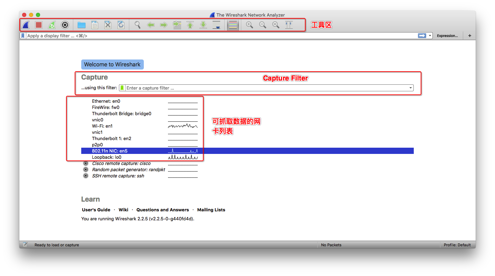
打开Wireshark后，能够看到三个区域。最上方是工具栏区域，可以开始捕获、停止捕获等操作。中间是Cpature Filter区域，能够在开始捕获前指定过滤规则。下方是可以捕获的网络设备，双击其中一个设备后就开始进行网络流量的捕获。
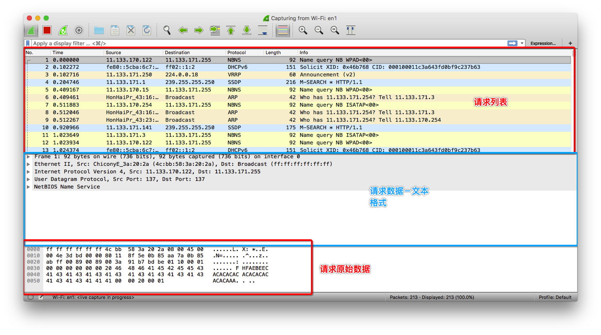
结果的展示主要分三个区域，最上方是请求和响应列表，每一条记录表示一次请求或响应的交互。中间是对选中的交互解析后的结果。最下方是原始的数据格式。
在请求列表上方，我们可以指定 Display Filter，用于筛选已经捕获到的数据。

### 1.2 Display Filter 的常用方法
待补充

### 1.3 界面上一些小TIPS
左边的实线连起来的表示同一次会话发生的各个阶段。
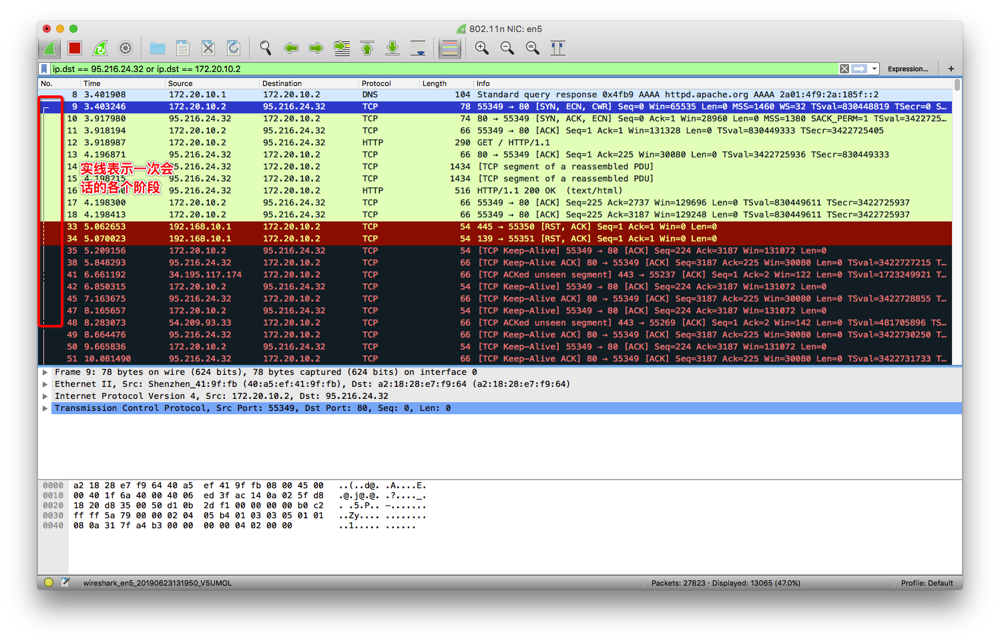
对勾表示选中项目对应的请求。
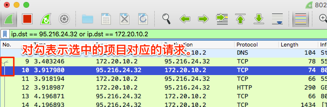
HTTP请求选中后，能够看到对应的请求和响应。
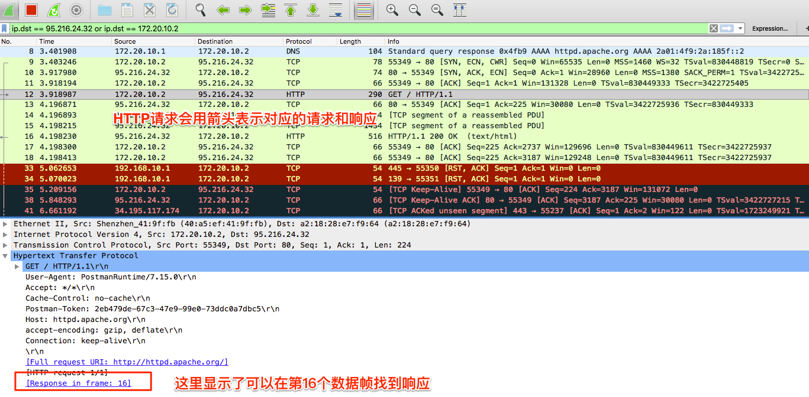
Wireshark会帮我们将多次请求合并。
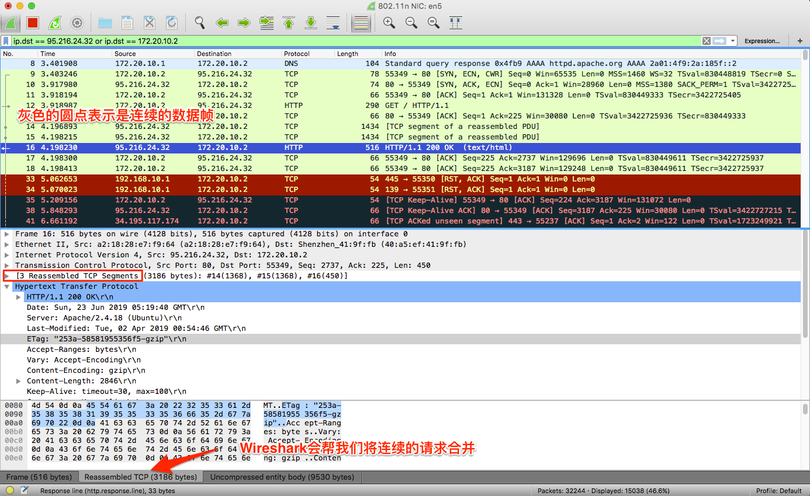
在选中的项目上右键选择Follow->HTTP Stream可以将这次请求的所有相关的请求列出，帮助我们快速过滤。

## 2. 使用Wireshark分析TCP三次握手过程

### 2.1 三次握手原理
先来看一下基本的原理。
第一次握手：建立连接时，客户端发送SYN到服务器，并进入SYN_SENT状态。
第二次握手：服务器收到请求后，回送SYN+ACK信令到客户端，此时服务器进入SYN_RECV状态。
第三次握手：客户端收到SYN+ACK包，向服务器发送确认ACK包，客户端进入ESTABLISHED状态，服务器收到请求后也进入ESTABLISHED状态，完成三次握手，此时TCP连接成功，客户端与服务器开始传送数据。
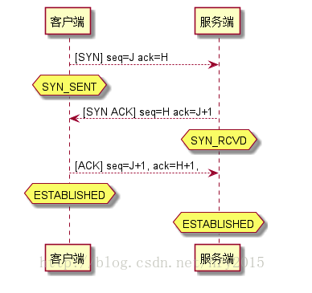

### 2.2 第一次握手
第一次握手：建立连接时，客户端发送SYN到服务器，并进入SYN_SENT状态。
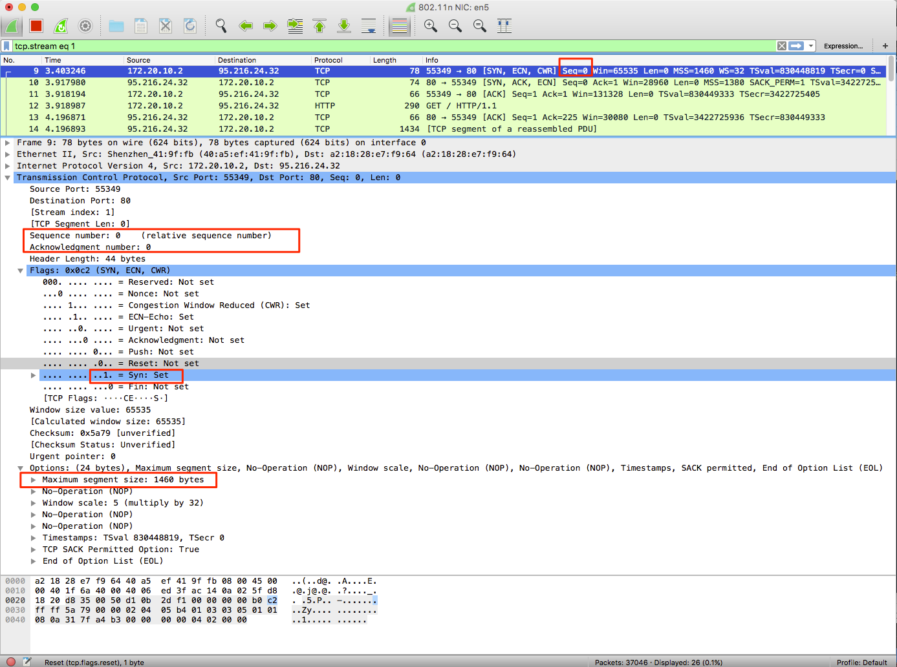

> SYN ：标志位，表示请求建立连接。
Seq = 0 ：初始建立连接值为0，数据包的相对序列号从0开始，表示当前还没有发送数据。
Ack =0：初始建立连接值为0，已经收到包的数量，表示当前没有接收到数据。
WIN = 8192 来自Window size: 8192。
MSS = 1460 来自 Maximum segment size: 1460 byte ，最长报文段，TCP包所能携带的最大数据量，不包含TCP头和Option。一般为MTU值减去IPv4头部(至少20字节)和TCP头部(至少20字节)得到。
WS = 4 来自windows scale : 2 (multiply by 4)： 窗口扩张，放在TCP头之外的Option，向对方声明一个shift count，作为2的指数，再乘以TCP定义的接收窗口，得到真正的TCP窗口。

### 2.3 第二次握手
第二次握手：服务器收到请求后，回送SYN+ACK信令到客户端，此时服务器进入SYN_RECV状态。
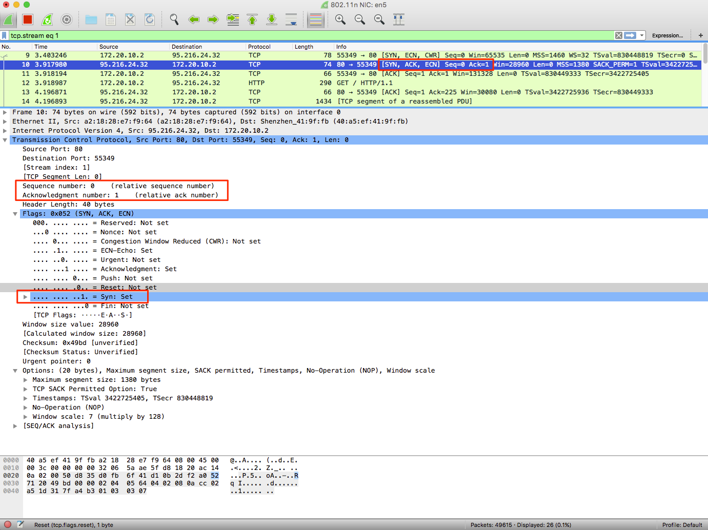

> Seq = 0 ：初始建立值为0，表示当前还没有发送数据
Ack = 1 : 表示当前端成功接收的数据位数，虽然客户端没有发送任何有效数据，确认号还是被加1，因为包含SYN或FIN标志位。尽管客户端没有发送任何有效数据，确认号还是被加1，这是因为接收的包中包含SYN或FIN标志位（并不会对有效数据的计数产生影响，因为含有SYN或FIN标志位的包并不携带有效数据。

### 2.4 第三次握手
第三次握手：客户端收到SYN+ACK包，向服务器发送确认ACK包，客户端进入ESTABLISHED状态，服务器收到请求后也进入ESTABLISHED状态，完成三次握手，此时TCP连接成功，客户端与服务器开始传送数据。
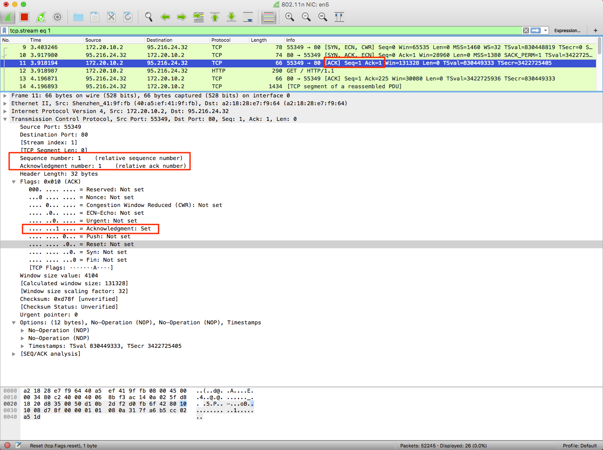

> ACK ：标志位，表示已经收到记录
Seq = 1 ：表示当前已经发送1个数据
Ack = 1 : 表示当前端成功接收的数据位数，虽然客户端没有发送任何有效数据，确认号还是被加1，因为包含SYN或FIN标志位。尽管客户端没有发送任何有效数据，确认号还是被加1，这是因为接收的包中包含SYN或FIN标志位（并不会对有效数据的计数产生影响，因为含有SYN或FIN标志位的包并不携带有效数据)

### 2.5 为什么是三次握手
这个问题的本质是, 信道不可靠, 但是通信双发需要就某个问题达成一致. 而要解决这个问题, 无论你在消息中包含什么信息, 三次通信是理论上的最小值. 所以三次握手不是TCP本身的要求, 而是为了满足”在不可靠信道上可靠地传输信息”这一需求所导致的.
也是为了最小的代价验证会话双方的收发功能正常:

* 第一次握手成功：说明客户端的数据可以被服务端收到，说明客户端的发功能可用，说明服务端的收功能可用。但客户端自己不知道数据是否被接收。
* 第二次握手成功：说明服务端的数据可以被客户端收到，说明服务端的发功能可用，说明客户端的收功能可用。同时客户端知道自己的数据已经正确到达服务端，自己的发功能正常。但是服务端自己不知道数据是否被接收。
* 第三次握手成功：说明服务端知道自己的数据已经正确到达客户端端，自己的发功能正常。至此服务成功建立。

## 3. 请求数据的过程
客户端和服务端建立连接后，开始传输数据。下图中首先是客户端发起一个GET请求，服务端收到请求后首先返回确认信息。待服务端处理完成后，将数据返回给客户端，客户端对收到的数据进行确认，完成一次数据交互的过程。
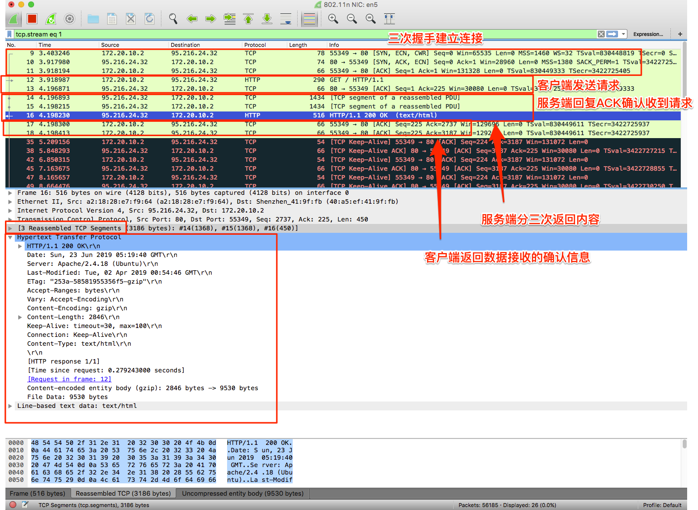
交互过程中，SEQ表示发送的数据，LEN表示发送的数据长度，下一次的SEQ就等于当前SEQ加上LEN。ACK表示接收的数据位。客户端和服务端分别计算自己的增长值。对应上图最后一次服务端返回数据时SEQ是2737，LEN是450。客户端对接收数据做了两次返回确认，第一次ACK是2737，表示还没有完成数据接收。第二次ACK是3187，等于服务端SEQ＋LEN（2737+450）表示已经完成了全部数据的接收。

## 4. 分析四次挥手过程

### 4.1 理论基础
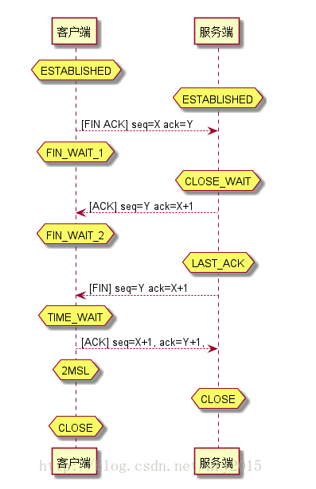

1. 第一次挥手：客户端 发送一个[FIN+ACK]，表示自己没有数据要发送了，想断开连接，并进入FIN_WAIT_1状态（不能再发送数据到服务端，但能够发送控制信息ACK到服务端）。
2. 第二次挥手：服务端收到FIN后，知道不会再有数据从客户端传来，发送ACK进行确认，确认序号为收到序号+1（与SYN相同，一个FIN占用一个序号），服务端进入CLOSE_WAIT状态。
3. 第三次挥手：服务端发送FIN给对方，表示自己没有数据要发送了，服务端进入LAST_ACK状态，然后直接断开TCP会话的连接，释放相应的资源。
4. 第四次挥手：客户端收到了服务端对FIN的ACK后，进入FIN_WAIT2状态（等待服务端完成资源释放的一系列工作：然后释放你为创建这个连接所分配的资源，并通知我你关闭了）; 客户端收到了服务端的FIN信令后，进入TIMED_WAIT状态，并发送ACK确认消息。客户端在TIMED_WAIT状态下，等待2MSL一段时间，没有数据到来的，就认为对面已经收到了自己发送的ACK并正确关闭了进入CLOSE状态，自己也断开了到服务端的TCP连接，释放所有资源。当服务端收到客户端的ACK回应后，会进入CLOSE状态，并关闭本端的会话接口，释放相应资源。TIME_WAIT状态持续2MSL(MSL是数据分节在网络中存活的最长时间）。
网络上比较主流的文章都说关闭TCP会话是四次挥手，但是实际上为了提高效率通常合并第二、三次的挥手，即三次挥手。

### 4.2 实例分析
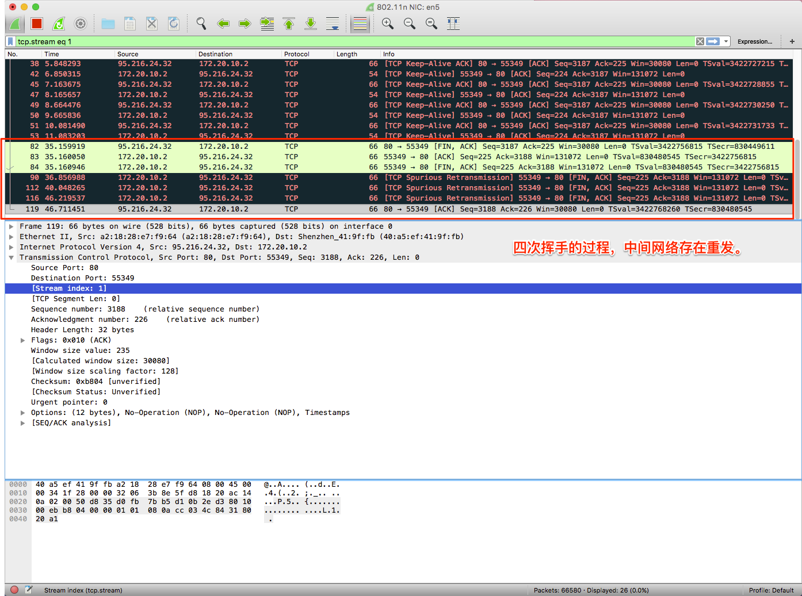
关闭连接需要四次握手。
客户端向服务端发送FIN为1的报文，服务端返回确认，关闭客户端与服务端通信的部分。
服务端向客户端发送FIN为1的报文，客户端返回确认，关闭服务端与客户端通信的部分。

> 本文分析的过程是基于最简单的网络交互模式，实际上目前HTTPS已经广泛普及，而且网络交互中会发生各种各样的意外情况，对于这些情况的分析就需要更多的网络知识。相信本文能够作为一个很好的入门，帮助大家了解网络协议。

## 参考资料

1. [从 Wireshark 看一次请求的过程](https://segmentfault.com/a/1190000014210812)
2. [wireshark找到与http请求对应的响应数据](https://blog.csdn.net/buyaore_wo/article/details/69787715)
3. [网络系列二 通过wireshark学习三次握手、四次挥手、数据传输](https://blog.csdn.net/hry2015/article/details/79006671)

