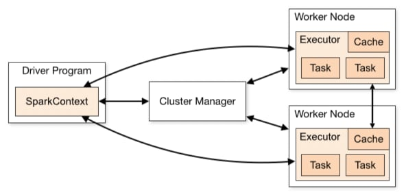

目录

* [简介](#简介)
* [特性](#特性)
* [Spark运行模式](#spark运行模式)
* [Mac本地安装](#mac本地安装)


> 本文基于 Spark 2.4.1 进行演示，相关代码可以在我的[Github](Github)上看到。


## 简介
Spark是一个分布式集群计算系统，类似Hadoop提供了强大的分布式计算能力，相比过去的批量处理系统，提供了处理更大规模数据的能力。Spark提供了Java、Python、Scala、R接口。除常见的MapReduce运算外，还支持图、机器学习、SparkSQL等计算方式。

## 特性

* 高效 Speed，因为很多数据都在内存中，相比Hadoop，其处理更为高效。
* 易用 Usability，Spark提供了80多个高级运算符。
* 通用 Generality，提供了大量的库，包括SQL、DataFrames、MLib、GraphX、Spark Streaming。
* 兼容 Runs everywhere，基于jvm能够兼容不同类型的操作系统。

## Spark运行模式

* local : 主要用于开发调试Spark应用程序
* Standlone : 利用Spark自带的资源管理与调度器运行Spark集群，采用Master/Slave结构，为解决单点故障，可以采用Xookeeper实现高可靠(High Availability, HA)
* Apache Mesos : 运行在著名的Mesos资源管理框架基础之上，该集群运行模式将资源管理管理交给Mesos,Spark只负责运行任务调度和计算
* Hadoop YARN : 集群运行在Yarn资源管理器上，资源管理交给YARN，Spark只负责进行任务调度和计算

## Mac本地安装
首先从Spark官方网站下载合适的版本，解压到安装目录，本文使用的是 2.4.1。
配置环境变量```~/.bash_profile```
```bash
export SPARK_HOME=/Users/shiqiang/Projects/tools/spark-2.4.1-bin-hadoop2.7
export PATH=${PATH}:${SPARK_HOME}/bin
```
本机的安装目录
```~/Project/tools```
在Mac系统管理中打开Mac远程登录设置，允许安装用户远程登录。
启动命令
```bash
$ ./sbin/start-all.sh
$ jps
21731 Jps
21717 Worker
21515 Master
```
使用JPS命令可以看到Master和Worker已经启动。也可以单独启动master```./sbin/start-master.sh```，单独启动Worker```./bin/spark-class org.apache.spark.deploy.worker.Worker spark://localhost:7077```

停止服务的方式也非常简单

```bash
$ ./sbin/stop-all.sh
```

## Spark 组成
* SparkCore : 将分布式数据抽象为弹性分布式数据集（RDD），实现了应用任务调度、RPC、序列化和压缩，并为运行在其上的上层组件提供API。
* SparkSQL : Spark Sql 是Spark来操作结构化数据的程序包，可以让我使用SQL语句的方式来查询数据，Spark支持 多种数据源，包含Hive表，parquest以及JSON等内容。
* SparkStreaming : 是Spark提供的实时数据进行流式计算的组件。
* MLib : 提供常用机器学习算法的实现库。
* GraphX : 提供一个分布式图计算框架，能高效进行图计算。
* BLinkDB : 用于在海量数据上进行交互式SQL的近似查询引擎。
* Tachyon : 以内存为中心高容错的的分布式文件系统。

## Spark组件


每个Spark应用都由一个驱动器程序(drive program)来发起集群上的各种并行操作。驱动器程序包含应用的main函数，驱动器负责创建SparkContext,SparkContext可以与不同种类的集群资源管理器(Cluster Manager)，例如Hadoop YARN，Mesos进行通信，获取到集群进行所需的资源后，SparkContext将得到集群中工作节点(Worker Node)上对应的Executor(不同的Spark程序有不同的Executor,他们之间是相互独立的进程，Executor为应用程序提供分布式计算以及数据存储功能)，之后SparkContext将应用程序代码发送到各Executor,最后将任务(Task)分配给executors执行。

* ClusterManager:在Standalone模式中即为Master节点（主节点），控制整个集群，监控Worker.在YARN中为ResourceManager
* Worker:从节点，负责控制计算节点，启动Executor或Driver。在YARN模式中为NodeManager,负责计算节点的控制。
* Driver:运行Application的main()函数并创建SparkContect。
* Executor:执行器，在worker node上执行任务的组件、用于启动线程池运行任务。每个Application拥有独立的一组Executor。
* SparkContext:整个应用的上下文，控制应用的生命周期。
* RDD：Spark的计算单元，一组RDD可形成执行的有向无环图RDD Graph。
* DAG Scheduler:根据作业(Job)构建基于Stage的DAG，并提交Stage给TaskScheduler。
* TaskScheduler:将任务(Task)分发给Executor。
* SparkEnv:线程级别的上下文，存储运行时的重要组件的引用。


SparkEnv内构建并包含如下一些重要组件的引用。
1. MapOutPutTracker:负责Shuffle元信息的存储。
2. BroadcastManager:负责广播变量的控制与元信息的存储。
3. BlockManager:负责存储管理、创建和查找快。
4. MetricsSystem:监控运行时性能指标信息。
5. SparkConf:负责存储配置信息。

## Spark整体流程
1. Client提交应用。  
2. Master找到一个Worker启动Driver。
3. Driver向Master或者资源管理器申请资源，之后将应用转化为RDD Graph。
4. 再由DAGSchedule将RDD Graph转化为Stage的有向无环图提交给TaskSchedule。  
5. 再由TaskSchedule提交任务给Executor执行。  
6. 其它组件协同工作，确保整个应用顺利执行。 

参考资料：
1. [Spark Documentation](http://spark.apache.org/docs/latest/)
2. [Spark学习之路 （一）Spark初识](https://www.cnblogs.com/qingyunzong/p/8886338.html)
3. [mac本地搭建Spark](https://blog.csdn.net/xiaoyu_BD/article/details/82703671)
4. [Spark简要教程系列（一） Mac安装Spark](https://blog.csdn.net/a595130080/article/details/53350076)
5. [Spark中文指南(入门篇)-Spark编程模型(一)](https://www.cnblogs.com/miqi1992/p/5621268.html)


