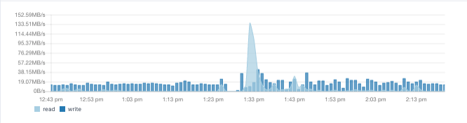

本文向大家介绍了Elasticsearch监控中需要关注的几个方面，通过阅读本文，你能够了解到在ES的日常使用和运维中，应该重点关注哪几个方面以及如何获取一些重要的指标。

<!-- more -->

[TOC]

>  毫无疑问Elasticsearch是当今最流行的搜索引擎，诞生于2010年，基于Apache Lucene开发，支持多种客户端查询。

## 1. Elasticsearch使用场景

Elasticsearch有着丰富的使用场景。

* 日志收集和归集

* 收集和索引大量的数据

* 收集和管理监控指标和事件数据

* 日志分析、海量数据和指标数据

* 全文检索

## 2. ES集群监控的重要性

正因为ES如此重要，它几乎已经成为众多应用中的基础设施，如果ES集群管理不当或配置错误，将会造成响应缓慢或者集群崩溃，这都会对应用的体验造成巨大的影响。

通过监控我们能够随时掌握集群的状态，包括数据量的增长、请求访问的效率等等。ES集群比较重要的指标包括以下五个方面：


* Cluster健康状态

* 请求响应性能

* 索引处理性能

* 操作系统本身的健康状态

* JVM健康状态

## 3. 集群健康状态

ES集群由一个或多个节点组成，每个节点在一台独立的主机上，向集群中增加节点可以实现集群的横向扩展。集群中的数据以索引的形式保存，每个索引包含一系列的文档。以日志归集的场景为例，一个索引可以用来保存某些Apache服务器一天的访问日志，每条访问日志就是索引中的一个文档。

ES集群中将索引再细分为分区Shard，避免索引增长超过单个节点容量的限制。ES通过分区副本的方式，来为数据增加冗余保护，避免单个节点故障后的数据丢失。默认情况下，每个索引划分为3个分区，每个分区有1个副分区。

> 分区也被称为分片，副分区也被称为副本，本文沿用分区和副分区的说法。

选择合适的分区数量非常重要，分区太少会降低搜索效率，并且影响数据在节点间的分布。如果存在热点分区，集群中的所有节点会向存有数据的分区发起大量的请求。

通过```_cluster/health```API，我们能够快速了解到ES集群的状态，包括集群节点数量，活动分区数量，正在迁移的分区(relocating_shards)。通过`/_cluster/health?level=indices`还能看到索引级别更加详细的信息，这个API会在集群信息里添加一个索引清单，列出每个索引的细节（状态、分片数、为分配分片数等等）。

```json
GET /_cluster/health?pretty
{
  "cluster_name" : "single-node-cluster",
  "status" : "green",
  "timed_out" : false,
  "number_of_nodes" : 1,
  "number_of_data_nodes" : 1,
  "active_primary_shards" : 0,
  "active_shards" : 0,
  "relocating_shards" : 0,
  "initializing_shards" : 0,
  "unassigned_shards" : 0,
  "delayed_unassigned_shards" : 0,
  "number_of_pending_tasks" : 0,
  "number_of_in_flight_fetch" : 0,
  "task_max_waiting_in_queue_millis" : 0,
  "active_shards_percent_as_number" : 100.0
}
```

正在重分配和初始化的分区显示出集群正在进行新建分片的平衡，当一个节点加入或者从集群中移除的时候会发生重平衡 rebalancing，此时集群的性能会受到影响。ES集群的指标需要持续的监控，这样我们才可以通过调整配置获得更好的性能。例如对于集群中有节点突然离开的情况，可以增加节点分区重分配的延时，如果这个时候节点又加入了集群，则不会引起性能的下降。


**集群健康的重要指标**

| 指标名称         | 指标描述                                                     |
| ---------------- | ------------------------------------------------------------ |
| Status           | 集群的状态：红色表示集群分区没有被分配；黄色表示只有主分区完成了分配；绿色表示所有的分区都分配了。 |
| Nodes            | 集群中所有节点的数量，包括正常的节点和异常的节点。           |
| 活动分区数       | 集群中活动分区的数量。                                       |
| 正在迁移分区数   | 集群中由于节点离开造成正在迁移的分区数量                     |
| 正在创建的分区数 | 集群添加索引后正在创建的分区数                               |
| 未分配的分区数   | 表示实际应该在集群中，但是还没有创建或分配的分区数           |

## 4. 查询性能

通过监控系统处理请求的数量和搜索响应时间来判断集群的性能，ES集群收到请求时分为两个阶段，首先是查询解析并将请求分配到含有请求索引数据的节点，第二阶段从所有节点取回数据并合并后返回给用户。通过`/index_name/_stats`可以查看每个索引的统计数据，


| 指标名称                                                   | 指标描述                       |
| ---------------------------------------------------------- | ------------------------------ |
| 正在进行查询的数量 Number of queries currently in progress | 集群中正在进行的查询数         |
| 正在进行取数的数量 Number of fetches currently in progress | 集群中处于祛暑阶段的进程数量   |
| 查询总数                                                   | 集群处理的查询总数             |
| 查询总耗时                                                 | 集群查询总耗时                 |
| 取数总数                                                   | 集群中处于取数状态的总数       |
| 取数总耗时                                                 | 集群中处于取数状态的查询总耗时 |

## 5. 索引性能

索引中的文档发生更新、添加或删除时，ES集群需要不断更新索引并在所有的节点上刷新索引。这些操作都是ES集群内部控制的，我们除了配置刷新间隔之外，无法改动其他的参数。

集群还会定期向磁盘写入新的段文件、将较小的段文件合并成较大的段文件，但是这些操作都没有提供参数可供我们调整。


通过监控文档的索引速度和合并时间可以帮助我们提前发现可能使集群性能变差的问题。将这些指标与每个节点的运行状况并行考虑，可以为找到系统潜在问题或优化性能提供重要线索。


索引速度的指标可以从`/_nodes/stats`API获取，并且可以在节点、索引或分区级别汇总。这个API能提供丰富的信息，在`merges`和`refresh`下的数据能为性能分析提供重要指标。


| 指标名称   | 指标描述                 |
| ---------- | ------------------------ |
| 总刷新次数 |                          |
| 刷新时间   | 总的刷新时间，单位是毫秒 |
| 当前合并数 | 当前正在被处理的合并数   |
| 总合并数   | 发生合并的总数           |
| 总合并时间 | 发生合并总的耗时         |

## 6. 节点状态监控：内存、磁盘和CPU

ES集群中的每个节点都需要访问并使用系统内存、磁盘和CPU，来响应集群对节点的数据请求。

ES是一个严重依赖内存的应用，因此需要密切关注每个节点的内存使用情况。如果配置修改不当，也可能会影响内存的分配和使用，因此从整体上关注系统的历史运行情况非常重要。


为发现问题，我们需要持续监控节点的CPU使用情况，并分析出现的峰值。CPU的消耗和Java虚拟机（JVM）的垃圾回收进程密切相关。


最后，磁盘的读写情况也能反映系统的健康情况。如果磁盘读写非常频繁，那么说明系统的性能不太理想。因为磁盘读写是一项非常耗时昂贵的操作，性能优异的系统会尽量减少磁盘的读写。



以上这些指标都是节点级别的监控指标，显示了当前实例或当前机器的运行状态。可以通过```/_cat/nodes```端点来获取这些信息。


```sh
/_cat/nodes?v&h=id,disk.total,disk.used,disk.avail,disk.used_percent,ram.current,ram.percent,ram.max,cpu
```


**节点监控的重要指标**

| 指标名称     | 指标描述                       |
| ------------ | ------------------------------ |
| 磁盘总容量   | 宿主机上磁盘总的容量           |
| 磁盘使用率   | 宿主机上磁盘的使用率           |
| 可用磁盘空间 | 宿主机上磁盘可用空间           |
| 磁盘使用率   | 宿主机上磁盘已经被使用的百分比 |
| 当前内存占用 | 当前内存占用情况               |
| 内存使用率   | 当前占用内存占总内存的比例     |
| 可用内存     | 宿主机上的内存容量             |
| CPU使用率    | 宿主机CPU使用率                |

## 7. JVM监控

ES是Java开发程序，运行在Java虚拟机（JVM）环境上。JVM在堆`heap`中分配管理内存，并使用垃圾回收器`GC`定期清理内存。

如果应用程序需要使用超过堆大小内存，则应用程序将被迫开始使用交换空间。虽然这可以防止系统崩溃，但会对集群性能造成严重破坏。因此需要监控可用堆空间来保证系统具有足够容量应对业务请求。

JVM将内存划分为不同的区域，我们需要关注每个区域的使用情况，防止溢出的风险。

垃圾回收器`GC`在正常情况下会帮助我们保持系统正常运转，如果发现异常的垃圾回收，则可能需要调整GC机制。


上图显示了一个正常的垃圾回收曲线。

可以从`/_nodes/stats`端点获取JVM指标。

**重要的JVM指标**

| 指标名称   | 指标描述                 |
| ---------- | ------------------------ |
| 内存使用率 | 堆内存和堆外内存使用情况 |
| 线程数     | 当前使用线程数以及最大数 |
| 内存回收   | 内存回收的次数和时间     |

## 8. 总结

最后总结下ES需要关注的十大指标

* 集群状态：节点和分区
* 搜索性能：请求延迟
* 搜索性能：请求速率
* 索引性能：刷新时间
* 索引性能：合并时间
* 节点状态：内存使用率
* 节点状态：磁盘使用率
* 节点状态：CPU使用率
* JVM状态：堆空间使用率和GC回收情况
* JVM状态：JVM大小

## 参考资料

1. [Elasticsearch学习之集群常见状况处理（干货）](https://www.cnblogs.com/sunfie/p/11148704.html)
2. [Top 10 Elasticsearch Metrics to Monitor](https://sematext.com/blog/top-10-elasticsearch-metrics-to-watch/)
